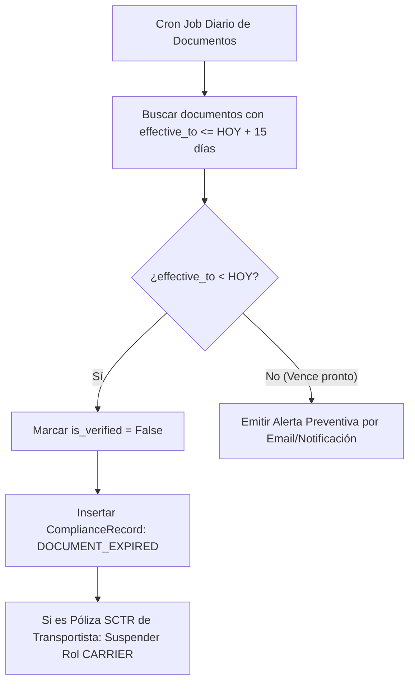

# 10. Documentación Legal de Cumplimiento y Registro Histórico

## Gestión de Expedientes Digitales

Para operar con la empresa, los proveedores y transportistas deben adjuntar documentación legal y regulatoria obligatoria (Ficha RUC, Licencias de Funcionamiento, Pólizas de Seguro SCTR/MATPEL, Certificados ISO).

La Fase 025 implementa el expediente digital mediante `BusinessPartnerDocumentModel` y la trazabilidad de auditoría de cumplimiento en `BusinessPartnerComplianceRecordModel`.

---

## Esquema del Documento (`BusinessPartnerDocumentModel`)

```python
class DocumentType(str, Enum):
    FICHA_RUC = "FICHA_RUC"
    LICENCIA_FUNCIONAMIENTO = "LICENCIA_FUNCIONAMIENTO"
    POLIZA_SCTR = "POLIZA_SCTR"                # Seguro Complementario de Trabajo de Riesgo
    POLIZA_SOAT = "POLIZA_SOAT"                # Seguro Obligatorio Accidentes de Tránsito
    REGISTRO_MTC = "REGISTRO_MTC"              # Registro de Transporte MTC
    CERTIFICADO_CALIDAD = "CERTIFICADO_CALIDAD"# ISO 9001, HACCP, BASC
    PODER_REGISTRAL = "PODER_REGISTRAL"        # Vigencia de Poderes SUNARP

class BusinessPartnerDocumentModel(Base):
    __tablename__ = "business_partner_documents"

    id = Column(UUID(as_uuid=True), primary_key=True, default=uuid.uuid4)
    business_partner_id = Column(UUID(as_uuid=True), ForeignKey("business_partners.id", ondelete="CASCADE"), nullable=False, index=True)
    
    document_type = Column(SQLEnum(DocumentType), nullable=False)
    document_number = Column(String(100), nullable=True)
    
    file_storage_path = Column(String(500), nullable=False) # S3 URI / Blob Storage path
    file_hash = Column(String(64), nullable=False)          # SHA-256 del archivo adjunto
    
    effective_from = Column(Date, nullable=False)
    effective_to = Column(Date, nullable=True)             # None si no vence
    
    is_verified = Column(Boolean, nullable=False, default=False)
    verified_by = Column(UUID(as_uuid=True), nullable=True)
    verified_at = Column(DateTime(timezone=True), nullable=True)

    created_at = Column(DateTime(timezone=True), nullable=False, server_default=func.now())
```

---

## Registro Histórico de Cumplimiento (`BusinessPartnerComplianceRecordModel`)

Cualquier cambio de estatus de cumplimiento legal, vencimiento de póliza o acción disciplinaria se registra de forma **inmutable** en la tabla `business_partner_compliance_records`:

```python
class ComplianceEventType(str, Enum):
    DOCUMENT_EXPIRED = "DOCUMENT_EXPIRED"
    STATUS_CHANGED = "STATUS_CHANGED"
    BLOCKED_BY_SECURITY = "BLOCKED_BY_SECURITY"
    UNBLOCKED_BY_ADMIN = "UNBLOCKED_BY_ADMIN"
    EVALUATION_FAILED = "EVALUATION_FAILED"

class BusinessPartnerComplianceRecordModel(Base):
    __tablename__ = "business_partner_compliance_records"

    id = Column(UUID(as_uuid=True), primary_key=True, default=uuid.uuid4)
    business_partner_id = Column(UUID(as_uuid=True), ForeignKey("business_partners.id", ondelete="CASCADE"), nullable=False, index=True)
    
    event_type = Column(SQLEnum(ComplianceEventType), nullable=False)
    previous_compliance_status = Column(String(30), nullable=False)
    new_compliance_status = Column(String(30), nullable=False)
    
    reason = Column(Text, nullable=False)
    triggered_by_user_id = Column(UUID(as_uuid=True), nullable=False)
    recorded_at = Column(DateTime(timezone=True), nullable=False, server_default=func.now())
```

---

## Monitoreo Automático de Vencimiento de Documentos

Un job de fondo (cron/heartbeat) evalúa diariamente la vigencia de los documentos:


