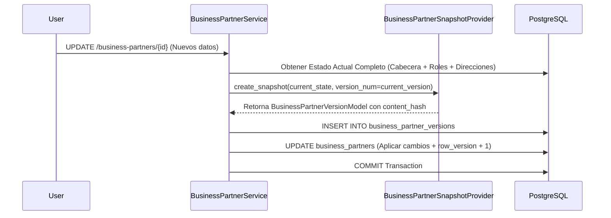

# 12. Snapshots Inmutables y Versionado de Expedientes

## Concepto de Versionado Inmutable

En un entorno ERP auditado, las modificaciones en la razón social, RUC, cuentas bancarias o direcciones fiscales de un socio de negocio deben conservar una traza histórica **inmutable y no repudiable**.

La Fase 025 implementa la generación automática de snapshots determinísticos en JSONB respaldados por la entidad `BusinessPartnerVersionModel` y el servicio `BusinessPartnerSnapshotProvider`.

---

## Definición del Esquema (`BusinessPartnerVersionModel`)

```python
class BusinessPartnerVersionModel(Base):
    __tablename__ = "business_partner_versions"

    id = Column(UUID(as_uuid=True), primary_key=True, default=uuid.uuid4)
    business_partner_id = Column(UUID(as_uuid=True), ForeignKey("business_partners.id", ondelete="CASCADE"), nullable=False, index=True)
    
    version_number = Column(Integer, nullable=False) # 1, 2, 3...
    snapshot_payload = Column(JSONB, nullable=False) # Copia completa en JSONB canónico
    content_hash = Column(String(64), nullable=False) # SHA-256 en hexadecimal
    
    change_reason = Column(String(255), nullable=False)
    created_at = Column(DateTime(timezone=True), nullable=False, server_default=func.now())
    created_by = Column(UUID(as_uuid=True), nullable=False)

    __table_args__ = (
        UniqueConstraint("business_partner_id", "version_number", name="uq_bp_version_num"),
    )
```

---

## Implementación de `BusinessPartnerSnapshotProvider`

Para garantizar que dos ejecuciones sobre la misma estructura de datos generen exactamente la misma cadena hash SHA-256, el serializador aplica **ordenamiento determinístico de llaves (sorted keys)** y formateo estandarizado de fechas (ISO 8601 UTC).

```python
import json
import hashlib
from typing import Dict, Any

class BusinessPartnerSnapshotProvider:
    @classmethod
    def generate_canonical_json(cls, partner_data: Dict[str, Any]) -> str:
        """
        Serializa un diccionario a una representación JSON canónica determinística.
        """
        return json.dumps(
            partner_data,
            sort_keys=True,
            ensure_ascii=True,
            default=str # Convierte UUIDs y datetimes a string ISO
        )

    @classmethod
    def compute_sha256_hash(cls, canonical_json_str: str) -> str:
        """
        Calcula el hash de integridad SHA-256 en hexadecimal.
        """
        return hashlib.sha256(canonical_json_str.encode("utf-8")).hexdigest()

    @classmethod
    def create_snapshot(
        cls, 
        partner_aggregate: Dict[str, Any], 
        version_num: int, 
        change_reason: str,
        user_id: uuid.UUID
    ) -> BusinessPartnerVersionModel:
        canonical_str = cls.generate_canonical_json(partner_aggregate)
        hash_val = cls.compute_sha256_hash(canonical_str)

        return BusinessPartnerVersionModel(
            version_number=version_num,
            snapshot_payload=json.loads(canonical_str),
            content_hash=hash_val,
            change_reason=change_reason,
            created_by=user_id
        )
```

---

## Flujo de Trabajo de Versionado en Modificaciones



### Garantía Forense
Si surge una disputa legal sobre una transacción pasada (ej. una Orden de Compra emitida hace 6 meses), el ERP puede reconstruir con precisión matemática la ficha del proveedor en la fecha exacta de emisión consultando la versión del snapshot correspondiente a su `content_hash`.
