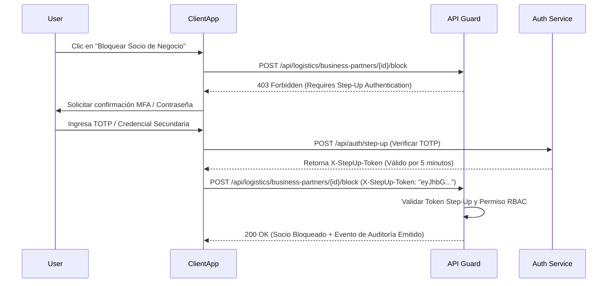

# 14. Matriz de Permisos RBAC y Autenticación Step-Up

## Control de Acceso Basado en Roles (RBAC)

La seguridad del módulo de Socios de Negocio se rige por un esquema granular de permisos con prefijo `logistics.`.

---

## Matriz Granular de Permisos RBAC

| Permiso RBAC | Descripción Operativa | Roles Típicos Asignados |
|--------------|-----------------------|-------------------------|
| `logistics.business_partners.create` | Permite registrar nuevos socios de negocio en la organización. | Comprador, Asistente de Ventas, Admin Logística |
| `logistics.business_partners.read` | Permite consultar fichas, listados y reportes de socios. | Todos los usuarios logísticos y comerciales |
| `logistics.business_partners.update` | Modificación de razón social, datos de contacto y direcciones. | Especialista de Homologación, Admin |
| `logistics.business_partners.activate` | Cambia el estado de un socio de `DRAFT` o `SUSPENDED` a `ACTIVE`. | Supervisor de Compras, Gerente Comercial |
| `logistics.business_partners.block` | Bloqueo preventivo global del socio (`BLOCKED`). **(Requiere Step-Up)** | Oficial de Cumplimiento, Admin Seguridad |
| `logistics.business_partner_roles.manage` | Asignación, actualización y suspensión de roles individuales. | Jefe de Compras, Jefe de Despacho |
| `logistics.business_partner_evaluations.create` | Registro de evaluaciones periódicas de desempeño. | Auditor de Calidad, Jefe de Compras |
| `logistics.business_partner_documents.verify` | Aprobación y verificación legal de expedientes digitales. | Asesor Legal, Oficial de Cumplimiento |

---

## Requerimiento de Step-Up Authentication

Ciertas operaciones en el ciclo de vida de un socio poseen un riesgo de alto impacto para la continuidad operativa de la empresa. Por ejemplo, bloquear sin justificación a un proveedor principal de insumos detendría las órdenes de compra y la línea de producción.

Para estas operaciones de alto riesgo, el sistema exige **Autenticación Elevada (Step-Up Authentication)**.

---

## Operaciones Sujetas a Step-Up Authentication

1. **Bloqueo General de Socio (`POST /.../block`):** Desactiva la operatividad completa de todos los roles.
2. **Exención de Verificación de Duplicado (`override_duplicate_warning`):** Forzar la creación de un socio cuando el motor detectó un `HIGH_PROBABILITY_DUPLICATE`.
3. **Modificación de Cuentas Bancarias y Cuenta de Detracciones:** Cambio en las cuentas CCI de transferencia para evitar estafas por suplantación de identidad (Business Email Compromise - BEC).
