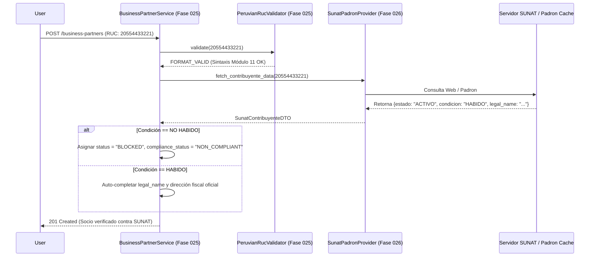

# 19. Contrato de Integración Futura con Fase 026 (Padrones SUNAT / RENIEC)

## Alcance de la Integración

La **Fase 025** resuelve la estructura maestra local y la validación sintáctica matemática (Módulo 11) de los RUCs peruanos. La **Fase 026 (Consulta Externa de Padrones)** extenderá este comportamiento conectando el backend con los servicios web oficiales de la SUNAT y RENIEC o padrones reducidos sincronizados.

---

## Interfaz de Servicio Requerida (`SunatPadronProviderInterface`)

La Fase 025 define la interfaz abstracta que la Fase 026 deberá implementar:

```python
from abc import ABC, abstractmethod
from pydantic import BaseModel
from typing import Optional

class SunatContribuyenteDTO(BaseModel):
    ruc: str
    razon_social: str
    estado_contribuyente: str # ACTIVO, BAJA DE OFICIO, BAJA DEFINITIVA
    condicion_domicilio: str   # HABIDO, NO HABIDO, NO HALLADO
    ubigeo: Optional[str]
    direccion_fiscal: Optional[str]
    es_agente_retencion: bool

class SunatPadronProviderInterface(ABC):
    @abstractmethod
    async def fetch_contribuyente_data(self, ruc: str) -> Optional[SunatContribuyenteDTO]:
        """
        Consulta externa en tiempo real o en caché local del padrón de la SUNAT.
        """
        pass
```

---

## Flujo de Trabajo en la Fase 026



---

## Reglas de Autocompletado y Seguridad

1. **Auto-llenado de Razón Social:** Si el cliente no especifica la razón social exacta, el backend la autocompletará directamente con el valor oficial devuelto por el padrón de la SUNAT.
2. **Bloqueo Automático Preventivo:** Si la SUNAT reporta la condición de **NO HABIDO** o estado **BAJA DEFINITIVA**, el socio se registrará con `status = BLOCKED`, impidiendo la emisión de órdenes de compra en la Fase 031.
