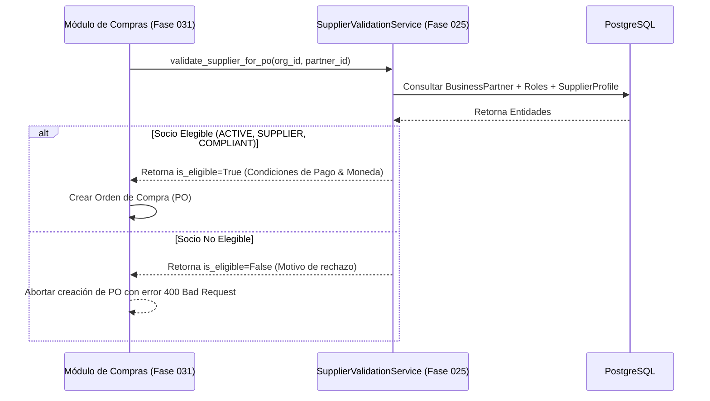

# 20. Contrato de Integración Futura con Fase 031 (Gestión de Compras)

## Propósito del Contrato Downstream

La **Fase 031 (Órdenes de Compra y Aprovisionamiento)** consumirá la API y entidades de la Fase 025 para validar la vigencia operativa, condiciones de pago e identificadores tributarios de los proveedores antes de aprobar y emitir cualquier Orden de Compra (PO).

---

## Servicio de Validación `SupplierValidatorForPurchaseOrder`

```python
class SupplierPurchaseValidationDTO(BaseModel):
    is_eligible: bool
    supplier_partner_id: uuid.UUID
    partner_code: str
    legal_name: str
    payment_condition: str
    currency_code: str
    rejection_reason: Optional[str] = None

class SupplierValidationService:
    def __init__(self, db: AsyncSession):
        self.db = db

    async def validate_supplier_for_po(
        self, 
        organization_id: uuid.UUID, 
        supplier_partner_id: uuid.UUID
    ) -> SupplierPurchaseValidationDTO:
        # 1. Obtener el socio de negocio
        partner = await self._get_partner(organization_id, supplier_partner_id)
        if not partner:
            return SupplierPurchaseValidationDTO(
                is_eligible=False, 
                rejection_reason="El socio de negocio especificado no existe."
            )

        # 2. Validar Estado Global
        if partner.status != PartnerStatus.ACTIVE:
            return SupplierPurchaseValidationDTO(
                is_eligible=False, 
                rejection_reason=f"El socio {partner.partner_code} está en estado {partner.status}."
            )

        # 3. Validar Estado de Cumplimiento Legal
        if partner.compliance_status == "NON_COMPLIANT":
            return SupplierPurchaseValidationDTO(
                is_eligible=False, 
                rejection_reason="El socio registra incumplimiento de expedientes legales o evaluaciones."
            )

        # 4. Validar existencia y vigencia del Rol SUPPLIER
        supplier_role = next((r for r in partner.roles if r.role_type == PartnerRoleType.SUPPLIER), None)
        if not supplier_role or supplier_role.status != RoleStatus.ACTIVE:
            return SupplierPurchaseValidationDTO(
                is_eligible=False, 
                rejection_reason="El socio no posee un rol de Proveedor (SUPPLIER) activo."
            )

        profile = supplier_role.supplier_profile
        return SupplierPurchaseValidationDTO(
            is_eligible=True,
            supplier_partner_id=partner.id,
            partner_code=partner.partner_code,
            legal_name=partner.legal_name,
            payment_condition=profile.payment_condition,
            currency_code=profile.currency_code
        )
```

---

## Diagrama de Integración en Emisión de Orden de Compra


