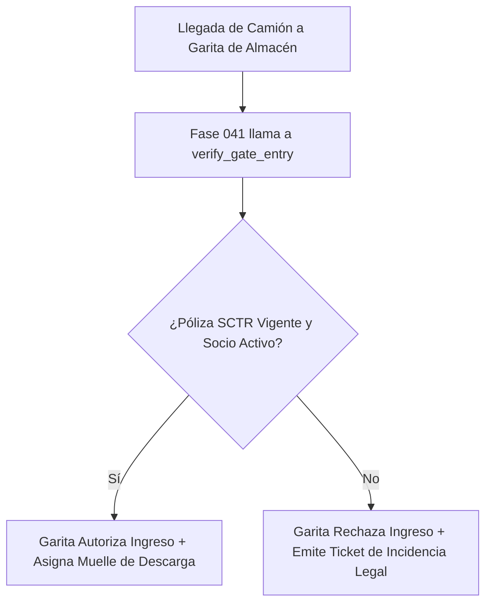

# 21. Contrato de Integración Futura con Fase 041 (Recepción de Mercadería y Citas)

## Control de Acceso a Almacén por Cumplimiento

La **Fase 041 (Recepción de Mercadería e Ingesta de Lotes)** administra el ingreso físico de camiones y proveedores a los almacenes de la empresa.

Para autorizar la creación de una cita de recepción o permitir el ingreso por la garita de control, la Fase 041 debe verificar que el transportista y el proveedor cumplan con la documentación legal obligatoria (Ficha RUC, Póliza SCTR activa, Inspección MTC).

---

## Interfaz de Verificación de Recepción (`PartnerReceptionCheckService`)

```python
class ReceptionGateCheckResultDTO(BaseModel):
    can_enter_facility: bool
    supplier_status: str
    carrier_status: str
    missing_documents: list[str]
    blocking_reason: Optional[str] = None

class PartnerReceptionCheckService:
    async def verify_gate_entry(
        self, 
        supplier_partner_id: uuid.UUID, 
        carrier_partner_id: Optional[uuid.UUID]
    ) -> ReceptionGateCheckResultDTO:
        missing_docs = []
        
        # 1. Verificar Proveedor
        supplier = await self.repo.get_by_id(supplier_partner_id)
        if not supplier or supplier.status != "ACTIVE":
            return ReceptionGateCheckResultDTO(
                can_enter_facility=False,
                supplier_status="INACTIVE",
                carrier_status="N/A",
                missing_documents=[],
                blocking_reason="El proveedor no se encuentra activo."
            )

        # 2. Verificar Documentos Obligatorios del Proveedor
        supplier_docs = await self.doc_repo.get_active_documents(supplier_partner_id)
        if not any(d.document_type == "FICHA_RUC" and d.is_verified for d in supplier_docs):
            missing_docs.append("FICHA_RUC_PROVEEDOR")

        # 3. Verificar Transportista (si fue especificado)
        if carrier_partner_id:
            carrier = await self.repo.get_by_id(carrier_partner_id)
            if not carrier or carrier.status != "ACTIVE":
                return ReceptionGateCheckResultDTO(
                    can_enter_facility=False,
                    supplier_status="ACTIVE",
                    carrier_status="INACTIVE",
                    missing_documents=missing_docs,
                    blocking_reason="El transportista asignado está suspendido o inactivo."
                )
            
            # Verificar Póliza SCTR / Registro MTC del Transportista
            carrier_docs = await self.doc_repo.get_active_documents(carrier_partner_id)
            if not any(d.document_type == "POLIZA_SCTR" and d.effective_to >= date.today() for d in carrier_docs):
                missing_docs.append("POLIZA_SCTR_VENCIDA_TRANSPORTISTA")

        if missing_docs:
            return ReceptionGateCheckResultDTO(
                can_enter_facility=False,
                supplier_status=supplier.status,
                carrier_status="ACTIVE" if carrier_partner_id else "N/A",
                missing_documents=missing_docs,
                blocking_reason="Faltan documentos legales o pólizas SCTR vigentes."
            )

        return ReceptionGateCheckResultDTO(
            can_enter_facility=True,
            supplier_status="ACTIVE",
            carrier_status="ACTIVE" if carrier_partner_id else "N/A",
            missing_documents=[]
        )
```

---

## Flujo en Garita de Recepción


