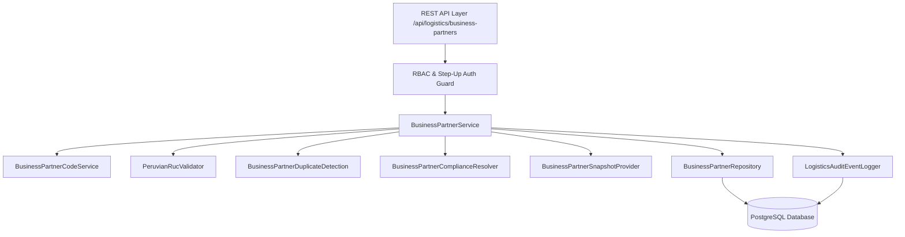

# Fase 025 — Crear Socios de Negocio (Backend)

## Resumen Ejecutivo

La **Fase 025** establece la capa maestra centralizada para la gestión de **Socios de Negocio (Business Partners)** dentro del ecosistema logístico y ERP de la plataforma. Tradicionalmente, los sistemas legados segregan proveedores, clientes y transportistas en tablas y microservicios completamente independientes, provocando duplicidad de datos, inconsistencias en identificadores fiscales (RUC/DNI) e imposibilidad de obtener una vista de 360 grados de entes comerciales multipropósito.

Esta fase introduce el modelo unificado `BusinessPartnerModel`, diseñado con un enfoque **Multi-Rol Extensible**. Una entidad legal única (persona natural o jurídica) mantiene una sola identidad canónica con sus datos básicos, identificadores tributarios, direcciones, contactos y documentos de cumplimiento legal, pudiendo asumir de forma concurrente o incremental los roles de **Proveedor (SUPPLIER)**, **Cliente (CUSTOMER)** y/o **Transportista (CARRIER)**, cada uno respaldado por su respectivo perfil relacional 1:1.

```
+-----------------------------------------------------------------------------------+
|                              ORGANIZATION BOUNDARY                                |
|                                                                                   |
|                           +-----------------------+                               |
|                           | BusinessPartnerModel  |                               |
|                           | (partner_code, RUC)   |                               |
|                           +-----------+-----------+                               |
|                                       |                                           |
|         +-----------------------------+-----------------------------+             |
|         | 1:N                         | 1:N                         | 1:N         |
|  +------v-------+              +------v-------+              +------v-------+     |
|  | Role:        |              | Role:        |              | Role:        |     |
|  | SUPPLIER     |              | CUSTOMER     |              | CARRIER      |     |
|  +------+-------+              +------+-------+              +------+-------+     |
|         | 1:1                         | 1:1                         | 1:1         |
|  +------v-------+              +------v-------+              +------v-------+     |
|  | Supplier     |              | Customer     |              | Carrier      |     |
|  | Profile      |              | Profile      |              | Profile      |     |
|  +--------------+              +--------------+              +--------------+     |
+-----------------------------------------------------------------------------------+
```

---

## Arquitectura del Dominio Maestro

El módulo está estructurado bajo principios de **Domain-Driven Design (DDD)** e **Inmutabilidad Auditada**. El aggregate root `BusinessPartner` encapsula las reglas de negocio de validación de identificadores fiscales, normalización de códigos correlativos, estados operativos por rol, evaluación de cumplimiento y control de concurrencia optimista (`row_version`).

### Diagrama de Arquitectura y Componentes



---

## Modelo Entidad-Relación (16 Tablas Master)

El esquema relacional de la Fase 025 consta de **16 tablas especializadas** vinculadas a la organización y al socio de negocio central:

```mermaid
erDiagram
    business_partners ||--o{ business_partner_roles : "posee roles"
    business_partners ||--o{ business_partner_tax_identifications : "registra identificadores"
    business_partners ||--o{ business_partner_addresses : "ubica direcciones"
    business_partners ||--o{ business_partner_contacts : "vincula contactos"
    business_partners ||--o{ business_partner_evaluations : "recibe evaluaciones"
    business_partners ||--o{ business_partner_documents : "adjunta documentos"
    business_partners ||--o{ business_partner_compliance_records : "mantiene historial cumplimiento"
    business_partners ||--o{ business_partner_bank_accounts : "asocia cuentas bancarias"
    business_partners ||--o{ business_partner_versions : "almacena snapshots"
    business_partners ||--o{ business_partner_duplicates : "registra posibles duplicados"
    
    business_partner_roles ||--o| business_partner_supplier_profiles : "extiende 1:1"
    business_partner_roles ||--o| business_partner_customer_profiles : "extiende 1:1"
    business_partner_roles ||--o| business_partner_carrier_profiles : "extiende 1:1"
    
    business_partner_evaluations ||--o{ business_partner_evaluation_details : "detalla criterios"
    business_partner_sequences ||--|| organization : "controla correlativo"
```



### Resumen de las 16 Tablas

| # | Tabla | Descripción |
|---|-------|-------------|
| 1 | `business_partners` | Entidad maestra del socio (Código, Razón Social, Nombre Comercial, Tipo Persona, Estado General, `row_version`). |
| 2 | `business_partner_roles` | Declaración de roles (`SUPPLIER`, `CUSTOMER`, `CARRIER`) con su propio estado operativo (`ACTIVE`, `SUSPENDED`, `ARCHIVED`). |
| 3 | `business_partner_supplier_profiles` | Perfil especializado de Proveedor (días de pago, condiciones comerciales, lead time de abastecimiento). |
| 4 | `business_partner_customer_profiles` | Perfil especializado de Cliente (línea de crédito, días de crédito, categoría de riesgo financiero). |
| 5 | `business_partner_carrier_profiles` | Perfil especializado de Transportista (registro MTC, capacidad de flota, tipo de transporte). |
| 6 | `business_partner_tax_identifications` | Identificadores fiscales (RUC, DNI, CE, Passport) con validación sintáctica de formato y unicidad por organización. |
| 7 | `business_partner_addresses` | Direcciones físicas y fiscales (`FISCAL`, `OPERATIONAL`, `DELIVERY`, `REGISTERED`) con ubigeo y coordenadas GPS. |
| 8 | `business_partner_contacts` | Contactos operativos (`PURCHASES`, `SALES`, `LOGISTICS`, `FINANCE`, `MANAGEMENT`, `LEGAL`) con canales directos. |
| 9 | `business_partner_evaluations` | Evaluaciones periódicas de desempeño/cumplimiento con puntajes ponderados Decimal y cálculo de riesgo. |
| 10 | `business_partner_evaluation_details` | Desglose por criterio (calidad, entrega a tiempo, cumplimiento legal, estabilidad financiera). |
| 11 | `business_partner_documents` | Archivo digital de expedientes legales (ficha RUC, licencias de funcionamiento, pólizas) con fechas de vigencia. |
| 12 | `business_partner_compliance_records` | Registro inmutable de cambios de estado de cumplimiento y bloquedos de seguridad. |
| 13 | `business_partner_bank_accounts` | Cuentas bancarias de pago/cobro (CCI, moneda, banco, tipo de cuenta) para integraciones financieras. |
| 14 | `business_partner_versions` | Snapshots inmutables JSONB con firma SHA-256 (`content_hash`) para trazabilidad forense de expedientes. |
| 15 | `business_partner_duplicates` | Matriz de detección y alerta de duplicados por RUC exacto o coincidencia fuzzy de Razón Social. |
| 16 | `business_partner_sequences` | Control de secuencias correlativas atómicas por organización (`BP-000001`, `BP-000002`). |

---

## Principales Invariantes del Sistema

1. **Unicidad e Inmutabilidad del Código Master:** El código `BP-XXXXXX` es asignado por `BusinessPartnerCodeService` con secuencia atómica por organización y nunca puede ser alterado tras la creación.
2. **Validación Sintáctica de RUC Peruano:** Los RUCs peruanos son validados sintácticamente bajo el algoritmo oficial Módulo 11 por `PeruvianRucValidator`.
3. **Independencia de Estados por Rol:** La suspensión de un rol (ej. `SUPPLIER` suspendido por incumplimiento) no afecta la operatividad del mismo socio como `CUSTOMER` si sus cuentas están al día.
4. **Control Optimista Mandatorio:** Toda modificación exige el header `If-Match` o campo `row_version`. Fallos de coincidencia resultan en `409 Conflict`.
5. **Auditoría Estricta y Step-Up Auth:** Operaciones sensibles (bloqueo general de socios, exención de evaluación) requieren elevación de privilegios (`Step-Up Authentication`) y emiten eventos firmados a `logistics_audit_events`.
