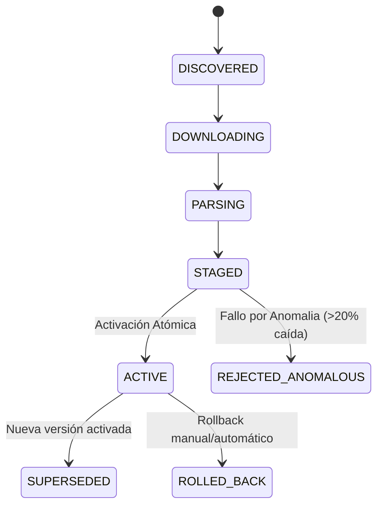

# 04 — Modelo de Datasets y Versiones de Fuentes (`RucDataSourceModel`, `RucDatasetVersionModel`)

## 1. Modelo `RucDataSourceModel`

Representa una fuente proveedora configurada en el sistema (ej. Padrón General SUNAT, Padrón Locales Anexos SUNAT, Proveedor API MIGO).

```python
class RucDataSourceModel(Base):
    __tablename__ = "ruc_data_sources"

    id = Column(UUID(as_uuid=True), primary_key=True, default=uuid4)
    code = Column(String(50), nullable=False, unique=True, index=True)
    name = Column(String(150), nullable=False)
    source_type = Column(String(50), nullable=False)
    authority = Column(String(100), nullable=False, default="SUNAT")
    source_reference = Column(String(500), nullable=False)
    base_domain = Column(String(200), nullable=False)
    enabled = Column(Boolean, nullable=False, default=True)
    priority = Column(Integer, nullable=False, default=10)
    status = Column(String(30), nullable=False, default="ACTIVE")
```

---

## 2. Modelo `RucDatasetVersionModel` y Ciclo de Vida

Almacena cada entrega descargada e ingestada de una fuente de datos masiva.

```python
class RucDatasetVersionModel(Base):
    __tablename__ = "ruc_dataset_versions"

    id = Column(UUID(as_uuid=True), primary_key=True, default=uuid4)
    data_source_id = Column(UUID(as_uuid=True), ForeignKey("ruc_data_sources.id", ondelete="CASCADE"), nullable=False)
    dataset_type = Column(String(40), nullable=False) # RUC_GENERAL, RUC_ANNEX_ADDRESS
    status = Column(String(30), nullable=False, default="DISCOVERED")
    
    archive_hash = Column(String(64), nullable=True)  # SHA-256 del archivo ZIP
    content_hash = Column(String(64), nullable=True)  # SHA-256 del contenido descomprimido
    total_rows = Column(BigInteger, nullable=False, default=0)
    accepted_rows = Column(BigInteger, nullable=False, default=0)
    rejected_rows = Column(BigInteger, nullable=False, default=0)
    
    fetched_at = Column(DateTime(timezone=True), nullable=False)
    activated_at = Column(DateTime(timezone=True), nullable=True)
```

### Máquina de Estados del Dataset:

