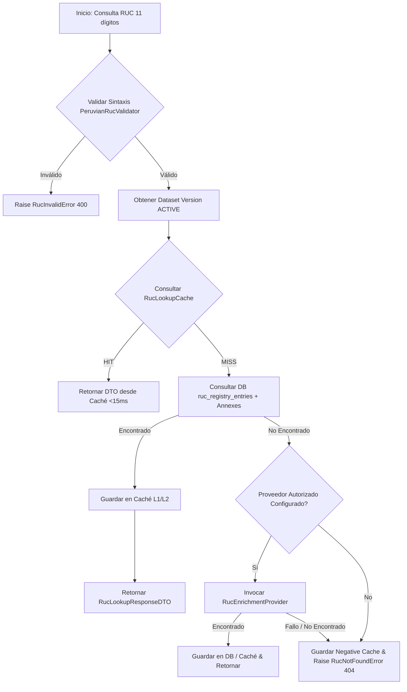

# 14 — Flujo de Consulta Unificada de RUC (`RucLookupService`)

## 1. Algoritmo Paso a Paso de Consulta

El servicio `RucLookupService` implementa el flujo unificado de resolución de consultas de contribuyentes:



---

## 2. Estructura de Respuesta DTO

```python
class RucLookupResponseDTO(BaseModel):
    ruc: str
    normalized_ruc: str
    legal_name: str
    taxpayer_status: TaxpayerStatus
    domicile_condition: DomicileCondition
    ubigeo_code: str | None
    annex_addresses: list[RucAnnexAddressDTO] = []
    
    source_type: RucSourceType
    confidence_level: ConfidenceLevel
    staleness_level: StalenessLevel
    dataset_version_id: UUID | None
    fetched_at: datetime
```
