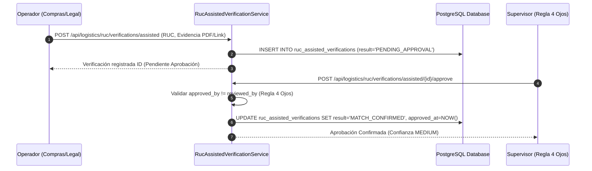

# 17 — Verificación Manual Oficial Asistida (`RucAssistedVerificationService`)

## 1. Flujo de Verificación Asistida por Operador

Cuando un contribuyente de reciente creación no aparece en el padrón masivo ni en los proveedores autorizados, un operador del equipo legal/compras puede realizar una consulta manual directa en la plataforma interactiva oficial de SUNAT desde su navegador web y registrar la verificación en el ERP.



---

## 2. Restricción Estricta de Cuatro Ojos (4-Eyes Rule)

El usuario que aprueba la verificación asistida (`approved_by`) debe ser strictly diferente del operador que la registró (`reviewed_by`). Esto previene fraudes en el alta de proveedores no verificados.

```python
if verification.reviewed_by == current_user_id:
    raise RucAssistedApprovalError("El usuario aprobador debe ser diferente del operador que registró la evidencia.")
```
