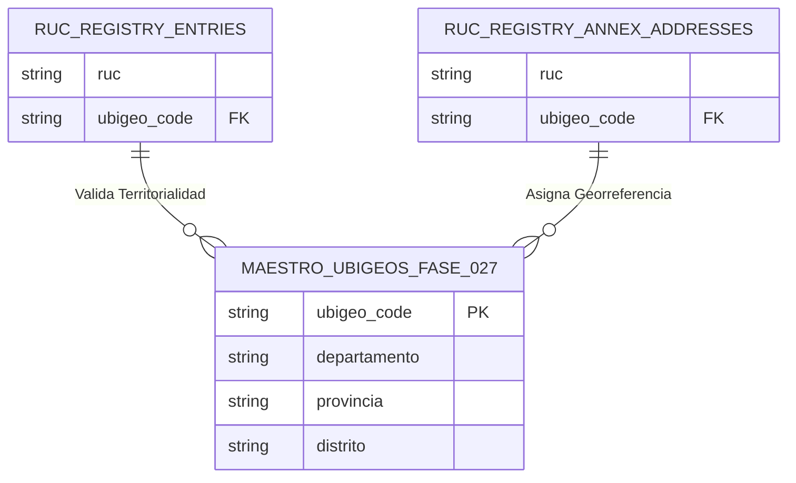

# 32 — Contrato de Integración Downstream con la Fase 027 (Ubigeos y Direcciones)

## 1. Vinculación Territorial mediante Código Ubigeo (6 Dígitos)

El código de 6 dígitos `ubigeo_code` (ej. `150101` para Lima, Lima, Lima) presente en los registros del padrón RUC y locales anexos sirve como clave foránea virtual hacia la infraestructura de Ubigeos que se implementará en la **Fase 027**.

---

## 2. Garantía de Compatibilidad

Los componentes de la Fase 026 exportan el método `validate_ubigeo_format(code: str) -> bool` garantizando que solo códigos de 6 dígitos numéricos normalizados sean almacenados, asegurando migración limpia hacia los modelos de la Fase 027.
