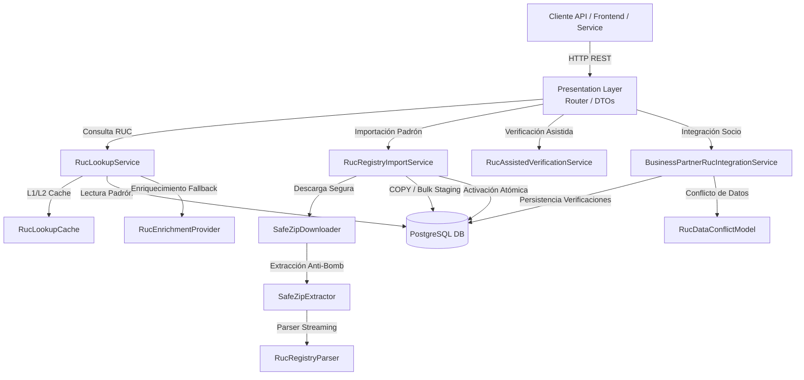
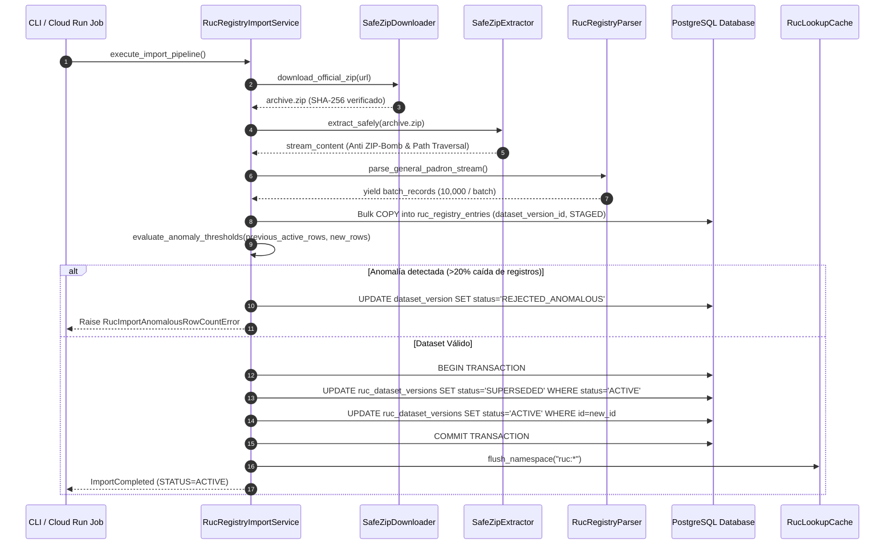

# Fase 026 — Integrar Consulta de RUC (Backend)

## 1. Resumen Ejecutivo

La **Fase 026** establece la infraestructura de backend para la consulta, ingesta, validación y verificación de Registros Únicos de Contribuyentes (**RUC**) en el ecosistema logístico ERP. Esta fase integra la sincronización masiva desatendida del **Padrón Reducido SUNAT**, adaptadores de consulta a proveedores autorizados, validación asistida oficial y resolución de conflictos de datos con el Maestro de Socios Comerciales (*Business Partners* - Fase 025).

Queda **estrictamente prohibida** cualquier técnica de web scraping, solución de CAPTCHAs o automatización no oficial sobre los portales interactivos de SUNAT. En su lugar, el módulo opera sobre descargas de padrones oficiales versionados (ZIP), streaming de alta velocidad y APIs REST de proveedores autorizados.

---

## 2. Diagramas de Arquitectura

### 2.1. Vista C4 de Componentes del Módulo (`app/modules/logistics/ruc/`)

### 2.2. Flujo de Ingesta, Staging y Activación Atómica

---

## 3. Estructura de Tablas Creadas (`q280110026dc_phase_026_ruc_lookup.py`)

La migración de base de datos crea exactamente 8 tablas normalizadas e indexadas:

| Tabla | Propósito | Claves Principales / Índices |
| :--- | :--- | :--- |
| `ruc_data_sources` | Catálogo de fuentes de datos RUC (SUNAT Padrón, Proveedores, Verificación Manual) | `id (PK)`, `code (UNIQUE)`, `status`, `priority` |
| `ruc_dataset_versions` | Versiones de padrones descargados (General y Locales Anexos) | `id (PK)`, `data_source_id (FK)`, `dataset_type`, `status` |
| `ruc_import_jobs` | Registro de ejecuciones de trabajos de ingesta masiva | `id (PK)`, `data_source_id (FK)`, `status`, `idempotency_key_hash` |
| `ruc_registry_entries` | Padrón general RUC ingestado por dataset | `id (PK)`, `dataset_version_id (FK)`, `normalized_ruc (IX)`, `record_hash` |
| `ruc_registry_annex_addresses` | Locales anexos por RUC e historial de direcciones | `id (PK)`, `dataset_version_id (FK)`, `ruc (IX)`, `ubigeo_code (IX)` |
| `ruc_assisted_verifications` | Registro oficial de verificaciones manuales por operador legal | `id (PK)`, `organization_id (FK)`, `business_partner_id (FK)`, `ruc (IX)` |
| `business_partner_ruc_verifications` | Historial inmutable de verificaciones aplicadas a un Socio | `id (PK)`, `business_partner_id (FK)`, `ruc (IX)`, `status` |
| `ruc_data_conflicts` | Gestión de discrepancias entre Padrón/Proveedor y datos del Socio | `id (PK)`, `organization_id (FK)`, `business_partner_id (FK)`, `conflict_type` |

---

## 4. Logros de Arquitectura

1. **Cero Web Scraping & CAPTCHA**: Conformidad legal total con SUNAT utilizando únicamente fuentes de datos masivas oficiales y APIs de proveedores autorizados.
2. **Consultas Sub-15ms**: Padrón con más de 10 millones de contribuyentes indexado en B-Tree con capa de caché Redis/In-memory tagged por `dataset_version_id`.
3. **Ingesta Streaming**: Extracción e inserción mediante `COPY` PostgreSQL a más de 25,000 registros/segundo con un consumo de RAM estricto `< 256MB`.
4. **Activación Atómica & Control de Anomalías**: Prevención de corrupción de padrón con verificación de caída brusca de registros (`>20%`) y rollback inmediato.
5. **No Sobrescritura Silenciosa**: Desacoplamiento estricto entre el Padrón SUNAT y el Maestro de Socios Comerciales (`business_partners`), registrando cualquier discrepancia como un conflicto auditable (`ruc_data_conflicts`).
