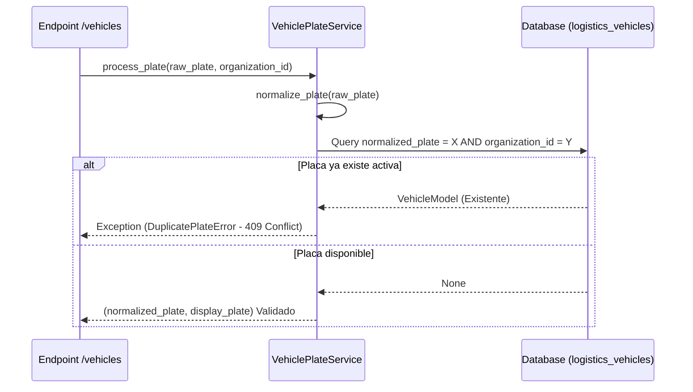

# Servicio de Normalización de Placas e Historial de Reasignaciones

## 1. Servicio `VehiclePlateService`

El servicio `VehiclePlateService` (`app/services/logistics/vehicle_plate_service.py`) es el componente responsable de validar, normalizar y gestionar el ciclo de vida de las placas vehiculares según las normativas del Reglamento Nacional de Vehículos del Perú (SUNARP / MTC).

### Formatos Soportados en Perú
1. **Formato Antiguo (Pre-2010)**: 3 letras y 3 números separados por guión, espacio o continuo (ej: `ABC-123`, `ABC 123`, `ABC123`).
2. **Formato Nuevo (Placa Única Nacional de Rodaje)**: 
   * Vehículos particulares / carga ligera: 3 caracteres alfanuméricos + 3 números (ej: `A1B-890`, `F3X-992`).
   * Vehículos pesados / remolques: Formatos especiales con prefijos de categoría (ej: `T3B-981`, `V5B-112`).

---

## 2. Algoritmo de Normalización de Placa

El proceso de normalización convierte cualquier entrada del usuario en dos representaciones:
* **`normalized_plate`**: String canonizado en mayúsculas, removiendo guiones, espacios, puntos y caracteres no alfanuméricos. Se utiliza para búsquedas directas e índices de unicidad.
* **`display_plate`**: Formato estándar visual presentado en pantalla (ej: `ABC-123` o `A1B-890`).

```python
import re

class VehiclePlateService:
    REGEX_PERU_PLATE = re.compile(r"^[A-Z0-9]{3}[- ]?[A-Z0-9]{3}$", re.IGNORECASE)

    @classmethod
    def normalize_plate(cls, raw_plate: str) -> tuple[str, str]:
        """
        Devuelve (normalized_plate, display_plate)
        Ejemplo: ' a1b - 890 ' -> ('A1B890', 'A1B-890')
        """
        clean = re.sub(r"[^A-Za-z0-9]", "", raw_plate).upper()
        if len(clean) != 6:
            raise ValueError(f"La placa '{raw_plate}' no tiene la longitud requerida de 6 caracteres alfanuméricos.")
            
        display = f"{clean[:3]}-{clean[3:]}"
        return clean, display
```

---

## 3. Comprobación de Duplicados Activos

Antes de registrar o actualizar la placa de un vehículo, el servicio verifica en `logistics_vehicles` que la `normalized_plate` no se encuentre asignada activamente a otro vehículo dentro de la misma organización.



---

## 4. Reasignación y Tabla `VehiclePlateAssignmentModel`

Cuando un vehículo cambia de placa (ej: re-matriculación por robo, transferencia de dominio o cambio de uso de servicio público a privado), la placa anterior no se borra. Se registra una transición histórica en la tabla `logistics_vehicle_plate_assignments` y se actualizan los alias.

```python
class VehiclePlateAssignmentModel(Base, TimestampMixin):
    __tablename__ = "logistics_vehicle_plate_assignments"

    id: Mapped[UUID] = mapped_column(PostgresUUID(as_uuid=True), primary_key=True, default=uuid4)
    vehicle_id: Mapped[UUID] = mapped_column(PostgresUUID(as_uuid=True), ForeignKey("logistics_vehicles.id"), nullable=False)
    
    previous_plate: Mapped[str] = mapped_column(String(16), nullable=False)
    normalized_previous_plate: Mapped[str] = mapped_column(String(16), nullable=False)
    
    new_plate: Mapped[str] = mapped_column(String(16), nullable=False)
    normalized_new_plate: Mapped[str] = mapped_column(String(16), nullable=False)
    
    reason: Mapped[str] = mapped_column(String(255), nullable=False)
    assigned_at: Mapped[datetime] = mapped_column(DateTime(timezone=True), nullable=False, default=datetime.utcnow)
    assigned_by_user_id: Mapped[UUID] = mapped_column(PostgresUUID(as_uuid=True), nullable=False)
```

### Reglas de Negocio en Reasignaciones:
1. La placa anterior se archiva automáticamente en `VehicleAliasModel` con tipo `PREVIOUS_PLATE`.
2. Se genera un evento inmutable en `logistics_audit_events` (`VEHICLE_PLATE_CHANGED`).
3. Se recalcula y crea un nuevo snapshot en `VehicleVersionModel` con la firma SHA-256 actualizada.
