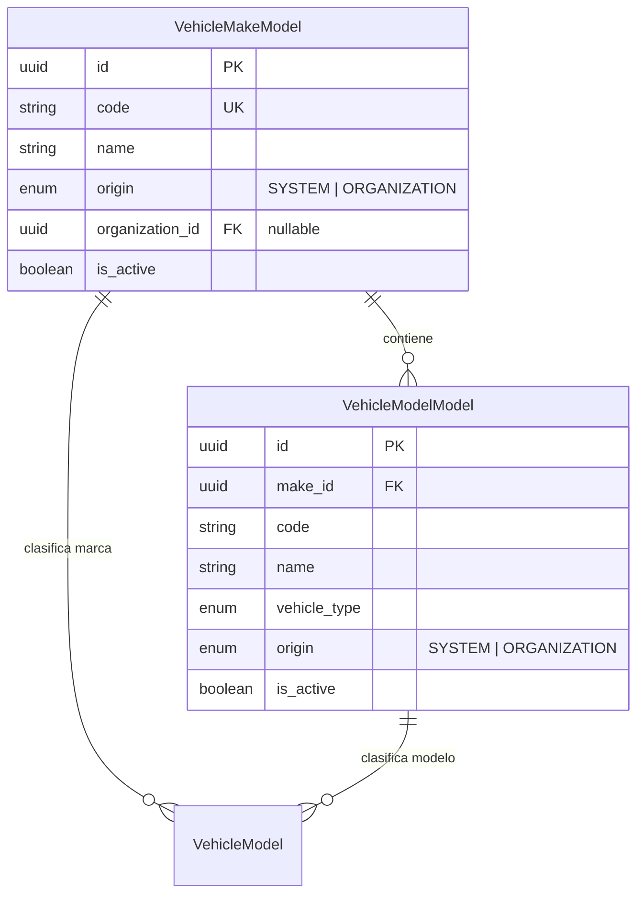

# Catálogo de Marcas y Modelos Vehiculares

## 1. Arquitectura del Catálogo Relacional

Para evitar la contaminación de datos por errores tipográficos en el registro de vehículos, la Fase 027 implementa un catálogo jerárquico normalizado de marcas (`VehicleMakeModel`) y modelos (`VehicleModelModel`).



---

## 2. Modelos ORM: Marcas y Modelos

### 2.1 `VehicleMakeModel` (`logistics_vehicle_makes`)
```python
class MakeOrigin(str, enum.Enum):
    SYSTEM = "SYSTEM"            # Precargado por la plataforma (Volvo, Scania, Mercedes-Benz, International)
    ORGANIZATION = "ORGANIZATION" # Creado por la empresa cliente para su uso exclusivo

class VehicleMakeModel(Base, TimestampMixin):
    __tablename__ = "logistics_vehicle_makes"

    id: Mapped[UUID] = mapped_column(PostgresUUID(as_uuid=True), primary_key=True, default=uuid4)
    code: Mapped[str] = mapped_column(String(32), unique=True, nullable=False)
    name: Mapped[str] = mapped_column(String(64), nullable=False)
    origin: Mapped[MakeOrigin] = mapped_column(Enum(MakeOrigin), nullable=False, default=MakeOrigin.ORGANIZATION)
    organization_id: Mapped[UUID | None] = mapped_column(PostgresUUID(as_uuid=True), nullable=True)
    is_active: Mapped[bool] = mapped_column(Boolean, default=True, nullable=False)
```

### 2.2 `VehicleModelModel` (`logistics_vehicle_models`)
```python
class VehicleModelModel(Base, TimestampMixin):
    __tablename__ = "logistics_vehicle_models"

    id: Mapped[UUID] = mapped_column(PostgresUUID(as_uuid=True), primary_key=True, default=uuid4)
    make_id: Mapped[UUID] = mapped_column(PostgresUUID(as_uuid=True), ForeignKey("logistics_vehicle_makes.id"), nullable=False)
    code: Mapped[str] = mapped_column(String(32), nullable=False)
    name: Mapped[str] = mapped_column(String(64), nullable=False)
    vehicle_type: Mapped[VehicleType] = mapped_column(Enum(VehicleType), nullable=False)
    origin: Mapped[MakeOrigin] = mapped_column(Enum(MakeOrigin), nullable=False, default=MakeOrigin.ORGANIZATION)
    organization_id: Mapped[UUID | None] = mapped_column(PostgresUUID(as_uuid=True), nullable=True)
    is_active: Mapped[bool] = mapped_column(Boolean, default=True, nullable=False)
```

---

## 3. Discriminación por Origen (`SYSTEM` vs `ORGANIZATION`)

1. **`SYSTEM`**:
   * Marcas y modelos estándar globales provistos por la plataforma (ej: VOLVO FH 540, SCANIA R500, MERCEDES-BENZ ACTROS).
   * Visibles para todas las organizaciones registradas en el sistema ERP.
   * `organization_id` es `NULL`. Solo pueden ser modificados por administradores globales.
2. **`ORGANIZATION`**:
   * Marcas o modelos personalizados ingresados por una organización específica (ej: Carrozados especiales locales o prototipos).
   * Solo visibles para la organización propietaria (`organization_id` del tenant).

---

## 4. Servicio `VehicleMakeModelService` y Sugerencias Correlativas

El servicio `VehicleMakeModelService` ofrece funciones para consultar, crear y autosugerir marcas y modelos en las pantallas de registro vehicular.

### Algoritmo de Sugerencia Correlativa de Código:
Cuando el usuario crea una marca custom (ej: "Sinotruk"), el servicio genera un código correlativo unívoco normalizado (ej: `MAKE-SINOTRUK-001`).

```python
class VehicleMakeModelService:
    @classmethod
    async def get_or_create_make(cls, db: AsyncSession, name: str, org_id: UUID) -> VehicleMakeModel:
        clean_name = name.strip()
        code = f"MAKE-{clean_name.upper().replace(' ', '_')}"
        
        # 1. Buscar en SYSTEM o en la organización actual
        query = select(VehicleMakeModel).where(
            or_(
                VehicleMakeModel.origin == MakeOrigin.SYSTEM,
                VehicleMakeModel.organization_id == org_id
            ),
            func.upper(VehicleMakeModel.name) == clean_name.upper()
        )
        res = await db.execute(query)
        make = res.scalar_one_or_none()
        
        if not make:
            make = VehicleMakeModel(
                code=code,
                name=clean_name,
                origin=MakeOrigin.ORGANIZATION,
                organization_id=org_id
            )
            db.add(make)
            await db.flush()
        return make
```
