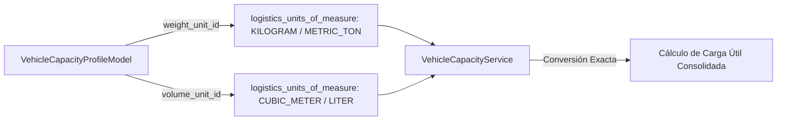

# Perfil de Capacidad y Matemática Decimal de Pesos

## 1. Modelo `VehicleCapacityProfileModel`

El perfil de capacidad de un vehículo define los límites operativos de masa y volumen para la planificación de cargas y despachos. Para evitar errores de redondeo inherentes a la aritmética de coma flotante (`float`), todos los valores se almacenan con el tipo estricto `NUMERIC(12,4)` (`Decimal` en Python).

```python
class VehicleCapacityProfileModel(Base, TimestampMixin):
    __tablename__ = "logistics_vehicle_capacity_profiles"

    id: Mapped[UUID] = mapped_column(PostgresUUID(as_uuid=True), primary_key=True, default=uuid4)
    vehicle_id: Mapped[UUID] = mapped_column(PostgresUUID(as_uuid=True), ForeignKey("logistics_vehicles.id"), nullable=False, unique=True)
    
    # Pesos (Masa)
    tare_weight: Mapped[Decimal] = mapped_column(Numeric(12, 4), nullable=False) # Peso del vehículo vacío
    max_payload_weight: Mapped[Decimal] = mapped_column(Numeric(12, 4), nullable=False) # Carga útil máxima
    max_gross_weight: Mapped[Decimal] = mapped_column(Numeric(12, 4), nullable=False) # Peso bruto vehicular (PBV = Tare + Payload)
    
    weight_unit_id: Mapped[UUID] = mapped_column(PostgresUUID(as_uuid=True), ForeignKey("logistics_units_of_measure.id"), nullable=False)
    
    # Volumen
    max_volume: Mapped[Decimal] = mapped_column(Numeric(12, 4), nullable=False) # Volumen máximo de carga (m3)
    volume_unit_id: Mapped[UUID] = mapped_column(PostgresUUID(as_uuid=True), ForeignKey("logistics_units_of_measure.id"), nullable=False)
    
    # Capacidad Específica
    pallet_capacity: Mapped[int | None] = mapped_column(Integer, nullable=True) # Cantidad estándar de palets Euro/Estándar
    axle_count: Mapped[int] = mapped_column(Integer, nullable=False, default=2) # Número de ejes mecánicos
```

---

## 2. Ecuación Fundamental de Pesos Vehiculares

El servicio `VehicleCapacityService` (`app/services/logistics/vehicle_capacity_service.py`) garantiza que la relación entre Tara, Carga Útil y Peso Bruto Cumpla la ecuación legal del MTC:

$$\text{Max Gross Weight (PBV)} = \text{Tare Weight} + \text{Max Payload Weight}$$

```python
from decimal import Decimal

class VehicleCapacityService:
    @classmethod
    def validate_capacity_math(cls, tare: Decimal, payload: Decimal, gross: Decimal) -> None:
        """
        Verifica la consistencia matemática entre tara, carga útil y peso bruto.
        """
        calculated_gross = tare + payload
        # Tolerancia de precisión por redondeos menores (0.0001 kg)
        if abs(calculated_gross - gross) > Decimal("0.0001"):
            raise ValueError(
                f"Inconsistencia en pesos: Tare ({tare}) + Payload ({payload}) = {calculated_gross}, "
                f"pero se especificó Max Gross Weight = {gross}."
            )
```

---

## 3. Integración con Unidades de Medida (Fase 024)

Las claves foráneas `weight_unit_id` y `volume_unit_id` enlazan directamente con la tabla `logistics_units_of_measure` creada en la **Fase 024**.



### Reglas de Conversión Estándar:
1. **Unidad Base de Peso Interna**: Kilogramos (`KG`). Si el usuario ingresa 20 Toneladas Métricas (`T`), el servicio invoca a la Fase 024 para obtener el factor exacto ($1\text{ T} = 1000\text{ KG}$) y almacena el valor en base estandarizada.
2. **Unidad Base de Volumen Interna**: Metros Cúbicos ($m^3$).
