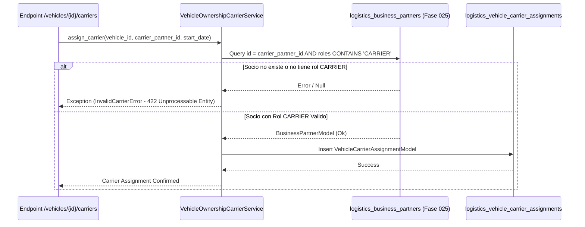

# Integración con Transportistas y Socios de Negocio (Fase 025)

## 1. Contexto de Asignación de Transportista

En las operaciones logísticas, la empresa propietaria del vehículo no siempre es quien opera el transporte. Un vehículo puede ser cedido u asignado operacionalmente a una empresa de transporte específica (Transportista autorizado).

La Fase 027 se conecta formalmente con la **Fase 025 (Socios de Negocio)** reutilizando los registros de la tabla `logistics_business_partners` que poseen el rol activo **`CARRIER`**.

---

## 2. Modelo `VehicleCarrierAssignmentModel`

```python
class VehicleCarrierAssignmentModel(Base, TimestampMixin):
    __tablename__ = "logistics_vehicle_carrier_assignments"

    id: Mapped[UUID] = mapped_column(PostgresUUID(as_uuid=True), primary_key=True, default=uuid4)
    vehicle_id: Mapped[UUID] = mapped_column(PostgresUUID(as_uuid=True), ForeignKey("logistics_vehicles.id"), nullable=False)
    
    carrier_partner_id: Mapped[UUID] = mapped_column(
        PostgresUUID(as_uuid=True), ForeignKey("logistics_business_partners.id"), nullable=False
    )
    
    mtc_authorization_code: Mapped[str | None] = mapped_column(String(64), nullable=True) # Registro MTC del transportista
    assignment_start_date: Mapped[date] = mapped_column(Date, nullable=False)
    assignment_end_date: Mapped[date | None] = mapped_column(Date, nullable=True)
    
    is_active: Mapped[bool] = mapped_column(Boolean, default=True, nullable=False)
    notes: Mapped[str | None] = mapped_column(String(255), nullable=True)
```

---

## 3. Diagrama de Integración Fase 025 -> Fase 027



---

## 4. Validaciones de Negocio

1. **Verificación de Rol `CARRIER`**: El servicio comprueba mediante query en `logistics_business_partners` que el `partner_id` tenga habilitado el rol de transportista.
2. **Cierre Automático de Asignaciones Previas**: Al crear una nueva asignación activa (`assignment_end_date IS NULL`), el sistema actualiza automáticamente la asignación previa seteando `assignment_end_date = start_date - 1 día` y `is_active = False`.
