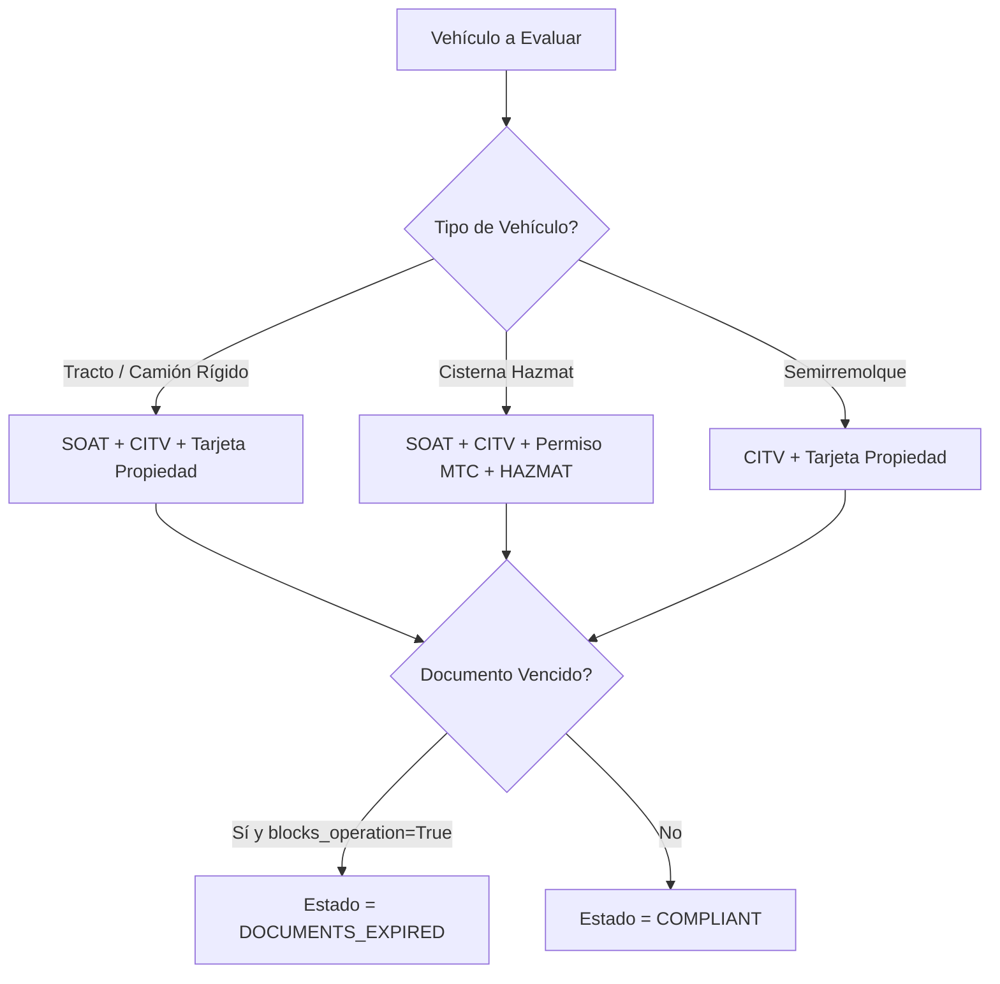

# Matriz de Requisitos Documentales por Tipo Vehicular

## 1. Modelo `VehicleDocumentRequirementModel`

No todos los tipos de vehículo ni modalidades de operación requieren exactamente el mismo paquete de documentos. Por ejemplo, una furgoneta de reparto urbano requiere SOAT y CITV, mientras que un semirremolque cisternas para insumos químicos requiere adicionalmente Permiso MTC y Certificado HAZMAT.

La matriz `VehicleDocumentRequirementModel` (`app/models/logistics/vehicle_document_requirement.py`) parametriza de manera dinámica qué documentos son obligatorios y bloqueantes según las propiedades de la unidad.

```python
class VehicleDocumentRequirementModel(Base, TimestampMixin):
    __tablename__ = "logistics_vehicle_document_requirements"

    id: Mapped[UUID] = mapped_column(PostgresUUID(as_uuid=True), primary_key=True, default=uuid4)
    organization_id: Mapped[UUID] = mapped_column(PostgresUUID(as_uuid=True), nullable=False, index=True)
    
    vehicle_type: Mapped[VehicleType | None] = mapped_column(Enum(VehicleType), nullable=True) # NULL aplica a todos
    body_type: Mapped[VehicleBodyType | None] = mapped_column(Enum(VehicleBodyType), nullable=True) # NULL aplica a todos
    ownership_type: Mapped[VehicleOwnershipType | None] = mapped_column(Enum(VehicleOwnershipType), nullable=True)
    
    required_document_type: Mapped[VehicleDocumentType] = mapped_column(Enum(VehicleDocumentType), nullable=False)
    
    is_mandatory: Mapped[bool] = mapped_column(Boolean, default=True, nullable=False) # Si es obligatorio para habilitar
    blocks_operation_on_expiration: Mapped[bool] = mapped_column(Boolean, default=True, nullable=False) # Si al vencer pasa a DOCUMENTS_EXPIRED
    
    warning_threshold_days: Mapped[int] = mapped_column(Integer, default=15, nullable=False)
```

---

## 2. Matriz de Requisitos Predeterminada (Perú)



---

## 3. Matriz Configurable por Organización

| Tipo Vehículo | Carrocería | Tipo Documento | Obligatorio | Bloquea Operación | Días Alerta |
|---|---|---|---|---|---|
| `*` (Todos) | `*` (Todas) | `SOAT` | `True` | `True` | 15 días |
| `*` (Todos) | `*` (Todas) | `PROPERTY_CARD` | `True` | `False` | N/A |
| `RIGID_TRUCK` | `*` (Todas) | `TECHNICAL_INSPECTION` | `True` | `True` | 15 días |
| `TRACTO_TRUCK` | `*` (Todas) | `TECHNICAL_INSPECTION` | `True` | `True` | 15 días |
| `TANKER` | `REFRIGERATED` / `CISTERNA` | `MTC_PERMIT` | `True` | `True` | 30 días |
| `*` (Todos) | `HAZMAT` | `HAZMAT_PERMIT` | `True` | `True` | 30 días |

### Lógica de Evaluación:
Cuando se evalúa el estado de cumplimiento de un vehículo, el sistema busca todas las reglas aplicables ordenando de lo más específico (coincidencia de `vehicle_type` + `body_type` + `ownership_type`) a lo más general (`NULL`).
