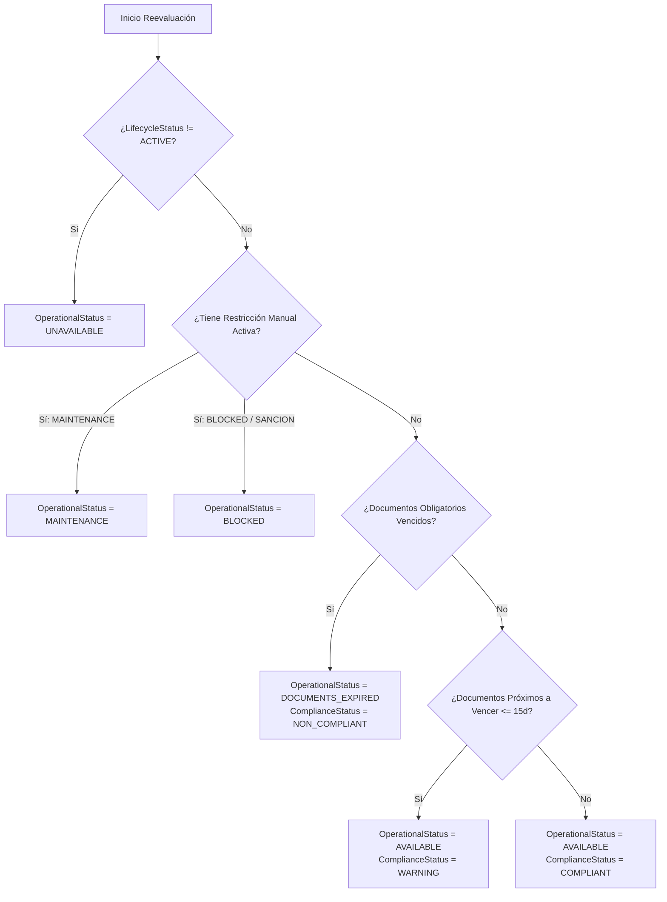

# Resolutor Dinámico de Estado Operativo y Cumplimiento

## 1. Resolutor `VehicleOperationalStatusResolver`

El estado operativo (`VehicleOperationalStatus`) y de cumplimiento (`VehicleComplianceStatus`) de un vehículo no deben ser asignados arbitrariamente mediante mutaciones directas sin control.

El componente `VehicleOperationalStatusResolver` (`app/services/logistics/vehicle_operational_status_resolver.py`) es un motor de reglas determinista que reevalúa y calcula dinámicamente ambos estados cada vez que ocurre un evento en el ciclo de vida del vehículo (ej: actualización de SOAT, registro de falla técnica o bloqueo manual).

---

## 2. Diagrama de Flujo del Algoritmo Resolutor



---

## 3. Implementación del Algoritmo

```python
class VehicleOperationalStatusResolver:
    @classmethod
    def resolve_status(
        cls,
        vehicle: VehicleModel,
        active_restrictions: list[VehicleOperationalRestrictionModel],
        documents: list[VehicleDocumentModel],
        requirements: list[VehicleDocumentRequirementModel],
        ref_date: date | None = None
    ) -> tuple[VehicleOperationalStatus, VehicleComplianceStatus]:
        
        today = ref_date or date.today()
        
        # 1. Si el vehículo no está ACTIVE en su ciclo de vida
        if vehicle.lifecycle_status != VehicleLifecycleStatus.ACTIVE:
            return VehicleOperationalStatus.UNAVAILABLE, VehicleComplianceStatus.NON_COMPLIANT

        # 2. Revisar restricciones manuales activas (prioridad mecánica/administrativa)
        for restr in active_restrictions:
            if restr.is_active:
                if restr.restriction_type == "MAINTENANCE":
                    return VehicleOperationalStatus.MAINTENANCE, VehicleComplianceStatus.COMPLIANT
                elif restr.restriction_type in ("SAFETY_BLOCK", "ADMINISTRATIVE_LOCK"):
                    return VehicleOperationalStatus.BLOCKED, VehicleComplianceStatus.NON_COMPLIANT

        # 3. Evaluar documentos obligatorios contra matriz de requisitos
        has_expired_mandatory = False
        has_expiring_soon = False
        
        for req in requirements:
            if not req.is_mandatory:
                continue
                
            # Buscar documento correspondiente
            matching_doc = next((d for d in documents if d.document_type == req.required_document_type), None)
            
            if not matching_doc:
                has_expired_mandatory = True
                continue
                
            if matching_doc.is_lifetime or matching_doc.expiration_date is None:
                continue
                
            days_left = (matching_doc.expiration_date - today).days
            
            if days_left < 0:
                if req.blocks_operation_on_expiration:
                    has_expired_mandatory = True
            elif days_left <= req.warning_threshold_days:
                has_expiring_soon = True

        # 4. Derivar estado final
        if has_expired_mandatory:
            return VehicleOperationalStatus.DOCUMENTS_EXPIRED, VehicleComplianceStatus.NON_COMPLIANT
            
        if has_expiring_soon:
            return VehicleOperationalStatus.AVAILABLE, VehicleComplianceStatus.WARNING
            
        return VehicleOperationalStatus.AVAILABLE, VehicleComplianceStatus.COMPLIANT
```

---

## 4. Prioridades de Bloqueo

1. **Prioridad 1 (Máxima)**: Inactividad en Ciclo de Vida (`SUSPENDED` / `RETIRED`).
2. **Prioridad 2**: Restricción Manual / Mantenimiento (`MAINTENANCE` / `BLOCKED`).
3. **Prioridad 3**: Expiración Legal Documental (`DOCUMENTS_EXPIRED`).
4. **Prioridad 4**: Operatividad Normal (`AVAILABLE` con `COMPLIANT` o `WARNING`).
