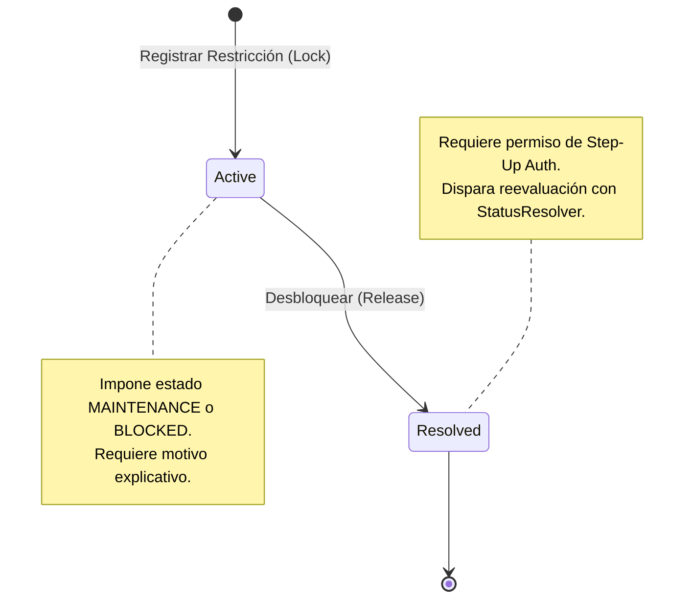

# Restricciones Operativas y Bloqueos Manuales

## 1. Modelo `VehicleOperationalRestrictionModel`

Además de los bloqueos automáticos por vencimiento documental, la gestión de flota requiere la capacidad de imponer bloqueos manuales por diversas razones: fallas mecánicas en ruta, orden de mantenimiento preventivo, investigación por siniestro o sanciones administrativas impuestas por auditores de seguridad.

La tabla `logistics_vehicle_operational_restrictions` (`app/models/logistics/vehicle_operational_restriction.py`) audita cada bloqueo e inhabilitación impuesta a un vehículo, incluyendo su causa, usuario responsable y resolución posterior.

```python
class RestrictionType(str, enum.Enum):
    MAINTENANCE = "MAINTENANCE"                   # Mantenimiento programado o correctivo en taller
    MECHANICAL_FAILURE = "MECHANICAL_FAILURE"     # Falla mecánica detectada en inspección previa al viaje
    SAFETY_BLOCK = "SAFETY_BLOCK"                 # Inhabilitación por incumplimiento de normas de SST / EPPs
    ADMINISTRATIVE_LOCK = "ADMINISTRATIVE_LOCK"   # Orden de inmovilización por legal o gerencia
    SANCTION = "SANCTION"                         # Sanción impuesta por MTC / SUTRAN / cliente

class VehicleOperationalRestrictionModel(Base, TimestampMixin, AuditMixin):
    __tablename__ = "logistics_vehicle_operational_restrictions"

    id: Mapped[UUID] = mapped_column(PostgresUUID(as_uuid=True), primary_key=True, default=uuid4)
    vehicle_id: Mapped[UUID] = mapped_column(PostgresUUID(as_uuid=True), ForeignKey("logistics_vehicles.id"), nullable=False, index=True)
    
    restriction_type: Mapped[RestrictionType] = mapped_column(Enum(RestrictionType), nullable=False)
    severity: Mapped[str] = mapped_column(String(16), default="CRITICAL", nullable=False) # CRITICAL, WARNING, INFO
    
    reason: Mapped[str] = mapped_column(String(512), nullable=False) # Explicación detallada del bloqueo
    
    applied_at: Mapped[datetime] = mapped_column(DateTime(timezone=True), default=datetime.utcnow, nullable=False)
    applied_by_user_id: Mapped[UUID] = mapped_column(PostgresUUID(as_uuid=True), nullable=False)
    
    is_active: Mapped[bool] = mapped_column(Boolean, default=True, nullable=False)
    
    # Flujo de Resolución (Des-bloqueo)
    resolved_at: Mapped[datetime | None] = mapped_column(DateTime(timezone=True), nullable=True)
    resolved_by_user_id: Mapped[UUID | None] = mapped_column(PostgresUUID(as_uuid=True), nullable=True)
    resolution_notes: Mapped[str | None] = mapped_column(String(512), nullable=True)
```

---

## 2. Ciclo de Vida de una Restricción



---

## 3. Reglas de Desbloqueo Auditado

1. **Requisito de Step-Up Auth**: Levantar una restricción de severidad `CRITICAL` o de tipo `ADMINISTRATIVE_LOCK` requiere autenticación reforzada (Step-Up Auth) y el permiso especial `logistics.vehicles.unblock`.
2. **Reevaluación Automática**: Al marcar `is_active = False` en la restricción, el sistema invoca inmediatamente al `VehicleOperationalStatusResolver` para verificar si el vehículo puede retornar a `AVAILABLE` o si existen otros bloqueos pendientes.
3. **Inmutabilidad del Historial**: Las restricciones resueltas nunca se eliminan de la base de datos; permanecen como registro histórico de auditoría mecánica para la flota.
