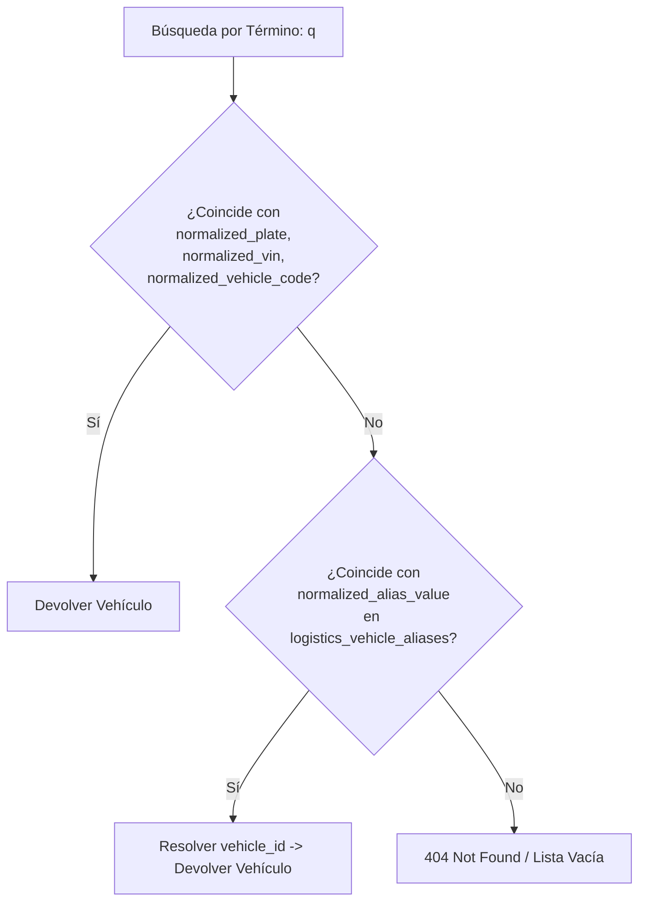

# Aliases Vehiculares e Identificadores Secundarios

## 1. Modelo `VehicleAliasModel`

En la gestión logística diaria, los operadores a menudo buscan un vehículo utilizando nombres coloquiales, códigos de radio antiguos, números de flota anteriores o placas viejas asociadas a unidades que sufrieron re-matriculación.

El modelo `VehicleAliasModel` (`app/models/logistics/vehicle_alias.py`) registra todas las denominaciones secundarias que permiten resolver unívocamente la entidad `VehicleModel` principal.

```python
class AliasType(str, enum.Enum):
    PREVIOUS_PLATE = "PREVIOUS_PLATE"     # Placa antigua reemplazada
    INTERNAL_CODE = "INTERNAL_CODE"       # Código secundario de inventario o activo fijo (ERP externo)
    CALL_SIGN = "CALL_SIGN"               # Clave de radio / VHF para operaciones en ruta
    GPS_TRACKER_ID = "GPS_TRACKER_ID"     # Identificador de hardware o IMEI de telemetría GPS

class VehicleAliasModel(Base, TimestampMixin):
    __tablename__ = "logistics_vehicle_aliases"

    id: Mapped[UUID] = mapped_column(PostgresUUID(as_uuid=True), primary_key=True, default=uuid4)
    vehicle_id: Mapped[UUID] = mapped_column(PostgresUUID(as_uuid=True), ForeignKey("logistics_vehicles.id"), nullable=False, index=True)
    
    alias_type: Mapped[AliasType] = mapped_column(Enum(AliasType), nullable=False)
    alias_value: Mapped[str] = mapped_column(String(64), nullable=False)
    normalized_alias_value: Mapped[str] = mapped_column(String(64), nullable=False, index=True)
    
    description: Mapped[str | None] = mapped_column(String(255), nullable=True)
    is_active: Mapped[bool] = mapped_column(Boolean, default=True, nullable=False)
```

---

## 2. Resolutor Transversal de Búsqueda por Alias

Cuando la API recibe una consulta de vehículo por el parámetro `q` o `search_term` (ej: `GET /api/logistics/vehicles?q=ABC-123`), la búsqueda no se limita al campo `normalized_plate` de la cabecera.

### Estrategia de Búsqueda Unificada:



---

## 3. Registro Automático tras Cambio de Placa

Cuando se ejecuta el servicio de cambio de placa (`VehiclePlateService.change_plate`), la placa anterior `display_plate` se inserta automáticamente en `VehicleAliasModel` con:
* `alias_type`: `AliasType.PREVIOUS_PLATE`
* `alias_value`: Placa antigua formateada.
* `normalized_alias_value`: Placa antigua canonizada sin guiones.
* `description`: `"Placa anterior reemplazada el YYYY-MM-DD por cambio de matrícula."`

Esto garantiza que Guías de Remisión Remitente (GRR) o comprobantes emitidos en el pasado bajo la placa anterior sigan encontrando la unidad correcta en el ERP.
