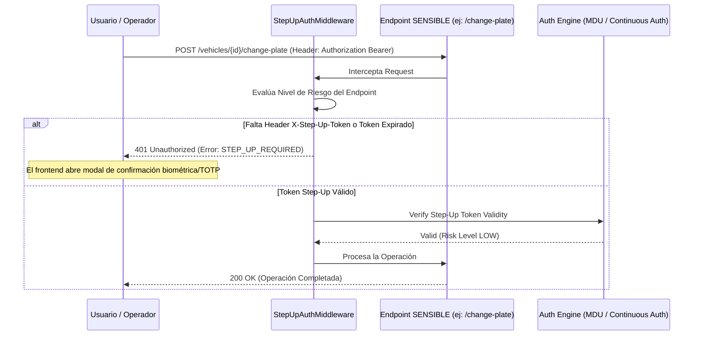

# Permisos RBAC y Autenticación Step-Up

## 1. Matriz de Permisos RBAC (`logistics.vehicles.*`)

La Fase 027 registra una jerarquía de permisos RBAC para asegurar el principio de menor privilegio sobre las operaciones del maestro vehicular.

```
logistics.vehicles
├── read             (Consulta de unidades, expediente y catálogos)
├── create           (Alta de nuevos vehículos, marcas y modelos)
├── update           (Modificación de capacidades, dimensiones y datos generales)
├── delete           (Baja lógica / Retiro de unidad del servicio)
├── change_plate     (Reasignación formal de placa vehicular)
├── block            (Imposición de restricciones manuales / inhabilitación)
├── unblock          (Levantamiento de restricciones / habilitación)
└── audit            (Acceso a snapshots SHA-256 e historial inmutable)
```

---

## 2. Requerimientos de Step-Up Authentication

La plataforma de autenticación continua exige **Step-Up Authentication** (re-autenticación mediante datos biométricos, FIDO2/WebAuthn o código TOTP de 2do factor) para operaciones sensibles que impactan la legalidad o seguridad operativa de la flota.



### Operaciones con Exigencia Mandatoria de Step-Up Auth:
1. **Reasignación de Placa (`POST /vehicles/{id}/change-plate`)**: Evita suplantaciones maliciosas de placas de rodaje en el sistema ERP.
2. **Bloqueo Manual Administrativo (`POST /vehicles/{id}/block`)**: Evita parálisis malintencionadas de la flota activa.
3. **Levantamiento de Bloqueo (`POST /vehicles/{id}/unblock`)**: Evita que unidades con sanciones de seguridad vuelvan a la vía pública sin autorización gerencial.
4. **Retiro Definitivo del Vehículo (`PUT /vehicles/{id}` con `lifecycle_status = RETIRED`)**: Inmovilización permanente del activo en el sistema.
