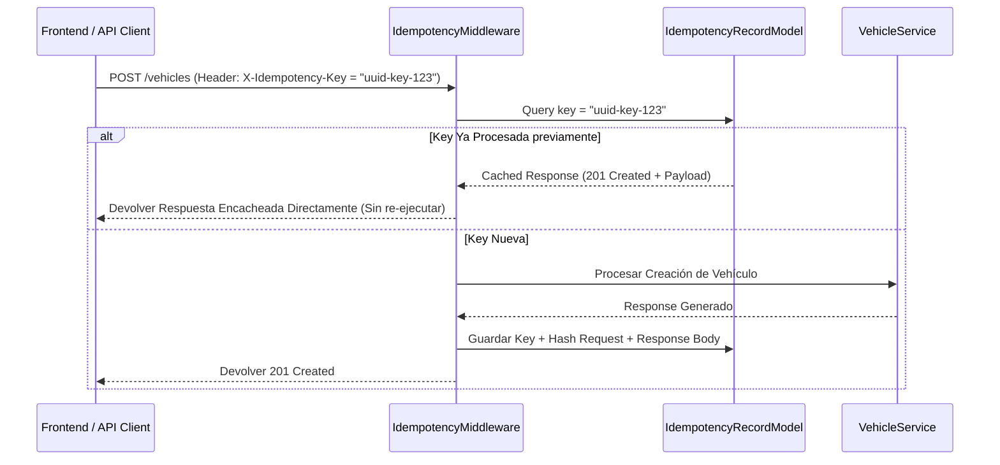

# Control de Concurrencia Optimista e Idempotencia

## 1. Concurrencia Optimista (`row_version`)

En entornos logísticos donde múltiples operadores pueden intentar actualizar de manera simultánea los datos de una misma unidad (ej: un despachador asignando un viaje mientras un mecánico registra una restricción de mantenimiento), se debe prevenir la pérdida de datos por escritura sobrescrita (*lost updates*).

La Fase 027 implementa el patrón de **Control de Concurrencia Optimista** mediante el campo `row_version` en `VehicleModel`.

```python
class StaleDataError(Exception):
    pass

async def update_vehicle_optimistic(
    db: AsyncSession,
    vehicle_id: UUID,
    expected_version: int,
    update_data: dict
) -> VehicleModel:
    
    # 1. Update condicionado a la versión esperada
    stmt = (
        update(VehicleModel)
        .where(
            VehicleModel.id == vehicle_id,
            VehicleModel.row_version == expected_version
        )
        .values(**update_data, row_version=VehicleModel.row_version + 1)
        .execution_options(synchronize_session="fetch")
    )
    
    result = await db.execute(stmt)
    
    if result.rowcount == 0:
        # Si afectó 0 filas, significa que otro proceso incrementó row_version en paralelo
        raise StaleDataError(
            f"El vehículo {vehicle_id} fue modificado por otro usuario en paralelo. "
            f"Versión esperada: {expected_version}. Por favor, recargue la información."
        )
```

---

## 2. Lock Transaccional Pesimista en Operaciones Críticas

Para operaciones de alta sensibilidad como la **reasignación de placa** (`change_plate`) o la **imposición de bloqueos manuales**, la concurrencia optimista se complementa con un bloqueo pesimista a nivel de fila (`SELECT ... FOR UPDATE`) durante la transacción de SQLAlchemy para evitar condiciones de carrera (*race conditions*) en la verificación de unicidad de placas.

```python
async def execute_plate_change_with_lock(
    db: AsyncSession,
    vehicle_id: UUID,
    new_plate: str
) -> VehicleModel:
    async with db.begin_nested():
        # Bloquea la fila del vehículo en PostgreSQL hasta completar el COMMIT
        stmt = select(VehicleModel).where(VehicleModel.id == vehicle_id).with_for_update()
        vehicle = (await db.execute(stmt)).scalar_one_or_none()
        
        # Validaciones de duplicados y actualización de placa...
        return vehicle
```

---

## 3. Idempotencia con `IdempotencyRecordModel`

Para proteger los endpoints mutativos de la API contra ejecuciones duplicadas producto de reintentos automáticos de red o doble clic en la interfaz de usuario, la Fase 027 integra el middleware de idempotencia que utiliza el header HTTP `X-Idempotency-Key`.



### Reglas de Retención:
* Las claves de idempotencia se almacenan en `logistics_idempotency_records` con un tiempo de vida (TTL) de **24 horas**.
* Si se reintenta un request con la misma `X-Idempotency-Key` pero con un cuerpo JSON diferente, la API responde inmediatamente con `400 Bad Request` (`IDEMPOTENCY_KEY_REUSE_MISMATCH`).
