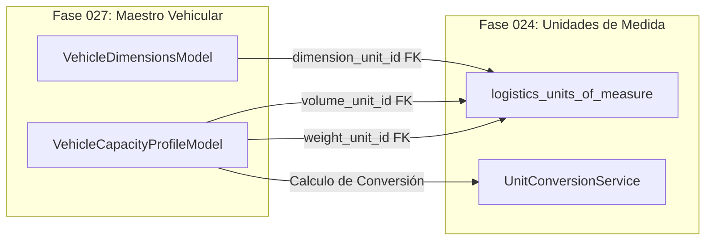

# Integración con Fase 024 (Unidades de Medida y Conversiones)

## 1. Contrato de Integración

La Fase 027 interactúa estrechamente con la **Fase 024 (Unidades de Medida y Conversiones Exactas)** para estandarizar las expresiones numéricas de masa, volumen y dimensiones métricas en los perfiles de capacidad (`VehicleCapacityProfileModel`) y cotas geométricas (`VehicleDimensionsModel`).



---

## 2. Reglas de Validación de Dominio de Unidad

Al asignar una unidad de medida a un atributo vehicular, el servicio `VehicleCapacityService` valida que la unidad pertenezca a la categoría física correcta en la Fase 024:

| Atributo Vehicular | Categoría Exigida en Fase 024 | Ejemplos Admitidos |
|---|---|---|
| `weight_unit_id` | `MASS` | `KILOGRAM` (KG), `METRIC_TON` (T), `POUND` (LB) |
| `volume_unit_id` | `VOLUME` | `CUBIC_METER` ($m^3$), `LITER` (L), `GALLON` (GAL) |
| `dimension_unit_id` | `LENGTH` | `METER` (M), `CENTIMETER` (CM), `INCH` (IN) |

```python
async def validate_unit_category(db: AsyncSession, unit_id: UUID, expected_category: str):
    unit = await db.get(UnitOfMeasureModel, unit_id)
    if not unit or unit.category != expected_category:
        raise ValueError(
            f"Unidad de medida inválida '{unit_id}'. Se esperaba una unidad de categoría '{expected_category}'."
        )
```

---

## 3. Conversión Transparente a Base del Sistema

Para la agregación y verificación de restricciones de peso en despacho:
* **Masa Base**: Kilogramos (`KG`).
* **Volumen Base**: Metros Cúbicos ($m^3$).
* **Longitud Base**: Metros (m).

Si un usuario ingresa una capacidad en Toneladas (`T`), el sistema invoca al `UnitConversionService` de la Fase 024 para obtener el valor convertido en `KG` con 4 decimales de precisión sin pérdida de exactitud.
