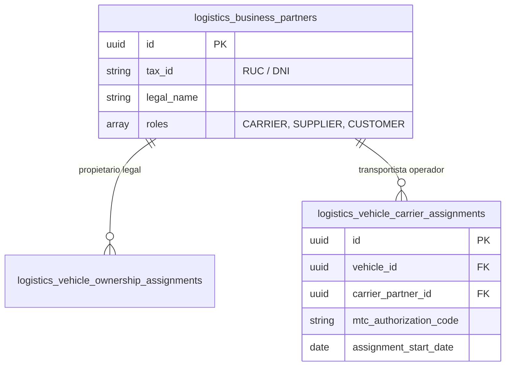

# Integración con Fase 025 (Socios de Negocio - Rol CARRIER)

## 1. Contrato de Integración

La Fase 027 se conecta dinámicamente con la **Fase 025 (Maestro de Socios de Negocio)** para la gestión de propiedad de terceros (`VehicleOwnershipAssignmentModel`) y la asignación operacional de transportistas autorizados (`VehicleCarrierAssignmentModel`).



---

## 2. Validación Estricta de Roles

No cualquier socio de negocio registrado en el ERP puede ser asignado como transportista de un vehículo. El servicio `VehicleOwnershipCarrierService` impone la siguiente regla de validación:

```python
async def validate_carrier_partner(db: AsyncSession, partner_id: UUID) -> None:
    partner = await db.get(BusinessPartnerModel, partner_id)
    if not partner:
        raise HTTPException(status_code=444, detail=f"Socio de negocio '{partner_id}' no encontrado.")
        
    if "CARRIER" not in partner.roles:
        raise HTTPException(
            status_code=422,
            detail=f"El socio de negocio '{partner.legal_name}' ({partner.tax_id}) no tiene habilitado el rol 'CARRIER'."
        )
```

---

## 3. Código de Autorización MTC

Cuando se asigna un socio con rol `CARRIER` a un vehículo de la flota, se requiere registrar el **Código de Autorización MTC** (`mtc_authorization_code`), el cual es expedido por el Ministerio de Transportes y Comunicaciones para el servicio de transporte público de mercancías en el Perú.
