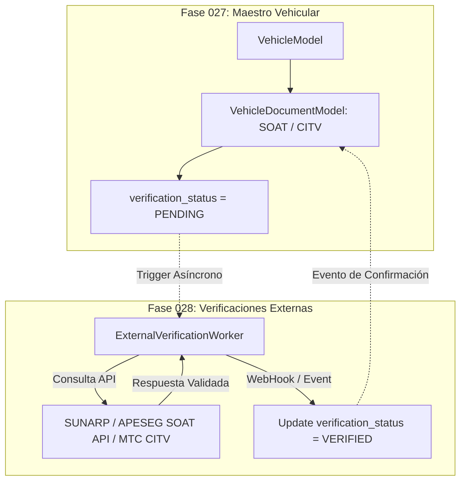

# Desacoplamiento e Integración con Fase 028 (Verificaciones Externas)

## 1. Puntos de Desacoplamiento con la Fase 028

La Fase 027 es estrictamente responsable de la **estructura del dominio, almacenamiento, validación sintáctica de formatos y gestión de estado interno** de los vehículos.

La validación cruzada con servicios web externos oficiales de instituciones del estado peruano (SUNARP, MTC, SBS/APESEG) está deliberadamente desacoplada y diferida a la **Fase 028 (Servicio de Verificaciones Externas)**.

---

## 2. Interfaz de Integración Futurible (`verification_status`)

En `VehicleDocumentModel`, el campo `verification_status` actúa como el contrato de enlace con la Fase 028:

* **`PENDING`**: Documento cargado localmente por el operador; aún no ha sido contrastado con la base oficial de SUNARP/APESEG.
* **`VERIFIED`**: Confirmado mediante consulta API a APESEG/MTC en la Fase 028.
* **`REJECTED`**: La API externa reportó que el número de SOAT o CITV no existe o pertenece a otro vehículo.

---

## 3. Disparo de Eventos de Verificación

Al crear o actualizar un documento en `VehicleDocumentService`, la Fase 027 emite una notificación de evento en el bus interno (`VEHICLE_DOCUMENT_CREATED_EVENT`), el cual será consumido de forma asíncrona por los workers de la Fase 028 sin bloquear el request HTTP del usuario.
