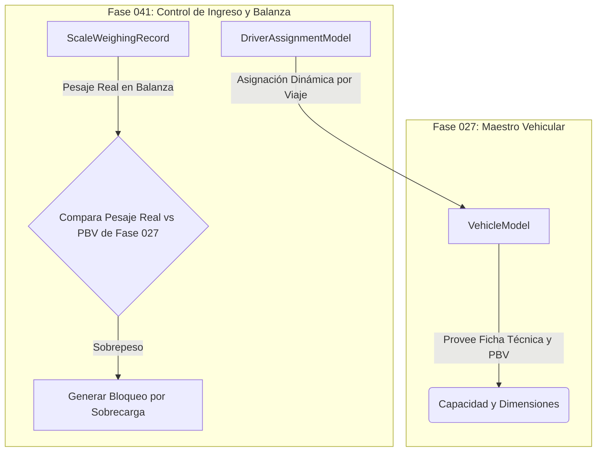

# Desacoplamiento de Asignación de Conductores y Control de Balanza (Fase 041)

## 1. Límites Arquitectónicos con la Fase 041

Es un antipatrón común en sistemas logísticos acoplar la asignación estática de un conductor directamente a la tabla del vehículo. La Fase 027 mantiene un desacoplamiento estricto respecto a los conductores, las balanzas de ingreso a almacén y la garita de control.

Tales funcionalidades se diferirán formalmente a la **Fase 041 (Control de Ingreso, Conductores y Balanza)**.

---

## 2. Puntos de Contacto con la Fase 041

1. **Conductores**: La asignación Chofer-Vehículo no se almacena en `VehicleModel` porque es una relación dinámica de 1 a N por turno/viaje. La Fase 041 consumirá `GET /api/v1/logistics/vehicles` para verificar la vigencia de la unidad antes de permitir el checklist del conductor.
2. **Control de Balanza en Garita**: Al ingresar un camión a la planta, el sistema de balanza (Fase 041) consultará `VehicleCapacityProfileModel.max_gross_weight` (PBV) de la Fase 027 para determinar si el peso registrado en la plataforma excede el límite legal MTC.
