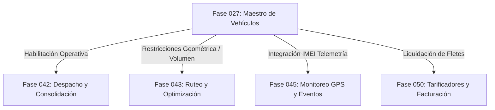

# Contrato de Integración con Fases de Transporte, Despacho y GPS (Fases 042-050)

## 1. Posicionamiento de la Fase 027 en el Ecosistema Logístico

La Fase 027 actúa como la fuente única de verdad (*Single Source of Truth*) para el maestro de flotas que consumirán los módulos avanzados de transporte de la plataforma.

---

## 2. Definición del Contrato de Intercambio

### 2.1 Fase 042 (Planeamiento de Despacho y Carga)
* **API Consumida**: `GET /api/v1/logistics/vehicles?operational_status=AVAILABLE&compliance_status=COMPLIANT`
* **Garantía**: Solo los vehículos en estado `AVAILABLE` y `COMPLIANT` pueden ser seleccionados en la asignación de Manifiestos de Carga o Guías de Remisión.

### 2.2 Fase 043 (Algoritmos de Ruteo y Cubaje)
* **Campos Consumidos**: `VehicleCapacityProfileModel.max_payload_weight`, `VehicleDimensionsModel.cargo_length`, `cargo_width`, `cargo_height`.
* **Uso**: El algoritmo 3D Bin Packing del motor de ruteo utiliza las dimensiones internas calculadas para distribuir palets y prevenir excesos de volumen o peso por eje.

### 2.3 Fase 045 (Telemetría GPS y Tracking)
* **Campos Consumidos**: `VehicleAliasModel` con `alias_type = GPS_TRACKER_ID`.
* **Uso**: Asocia la señal de tramas NMEA o MQTT provenientes de los dispositivos GPS con el `vehicle_id` del sistema.
