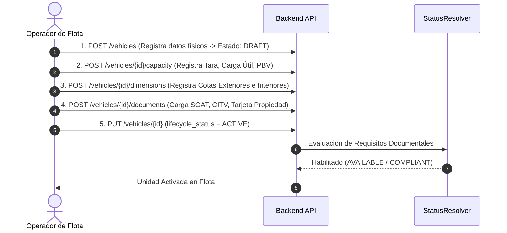

# Manual Operativo (Runbook): Alta y Activación de Vehículos

## 1. Propósito

Este documento establece el procedimiento operativo estándar (SOP) para dar de alta, configurar capacidades, registrar expediente documental y activar una nueva unidad en la flota del sistema ERP.

---

## 2. Flujo Paso a Paso para la Activación de una Unidad



---

## 3. Comandos cURL de Ejecución Operativa

### Paso 1: Registro Físico Inicial (Borrador)
```bash
curl -X POST "https://erp.empresa.com/api/v1/logistics/vehicles" \
  -H "Authorization: Bearer <JWT_TOKEN>" \
  -H "Content-Type: application/json" \
  -d '{
    "vehicle_code": "FL-201",
    "display_plate": "V5B-112",
    "vin": "19VDE1F28GE099887",
    "make_id": "8f31b412-2244-484d-b054-e0c19b02a110",
    "model_id": "9a12c334-1122-3344-5566-778899aabbcc",
    "vehicle_type": "TRACTO_TRUCK",
    "body_type": "DRY_VAN"
  }'
```

### Paso 2: Parametrización de Capacidades en Peso y Volumen
```bash
curl -X POST "https://erp.empresa.com/api/v1/logistics/vehicles/e4a3b2c1-0011-2233-4455-66778899aabb/capacity" \
  -H "Authorization: Bearer <JWT_TOKEN>" \
  -H "Content-Type: application/json" \
  -d '{
    "tare_weight": 7500.0,
    "max_payload_weight": 22500.0,
    "max_gross_weight": 30000.0,
    "weight_unit_id": "11111111-2222-3333-4444-555555555555",
    "max_volume": 45.0,
    "volume_unit_id": "66666666-7777-8888-9999-000000000000",
    "axle_count": 3
  }'
```

### Paso 3: Carga de Expediente Documental Obligatorio (SOAT)
```bash
curl -X POST "https://erp.empresa.com/api/v1/logistics/vehicles/e4a3b2c1-0011-2233-4455-66778899aabb/documents" \
  -H "Authorization: Bearer <JWT_TOKEN>" \
  -H "Content-Type: application/json" \
  -d '{
    "document_type": "SOAT",
    "document_number": "POL-99881122",
    "issuer": "La Positiva Seguros",
    "issue_date": "2026-01-01",
    "expiration_date": "2027-01-01"
  }'
```

### Paso 4: Activación del Ciclo de Vida
```bash
curl -X PUT "https://erp.empresa.com/api/v1/logistics/vehicles/e4a3b2c1-0011-2233-4455-66778899aabb" \
  -H "Authorization: Bearer <JWT_TOKEN>" \
  -H "Content-Type: application/json" \
  -d '{
    "lifecycle_status": "ACTIVE"
  }'
```
