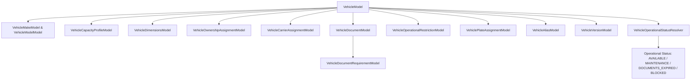
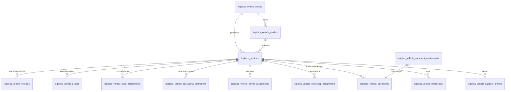

# Documentación de Arquitectura Backend — Fase 027: Maestro de Vehículos

## Resumen Ejecutivo

La **Fase 027 (Maestro de Vehículos - Backend)** establece la infraestructura central para el registro, control operativo, gestión documental, historial de asignaciones y versionado inmutable de la flota vehicular en la plataforma logística del sistema ERP.

Esta fase sirve como pilar estructural para los procesos logísticos terrestres, integrando capacidades mecánicas y dimensionales con matemática de precisión decimal, reglas de cumplimiento regulatorio peruano (MTC, SUNARP, SBS), matriz de requisitos documentales, auditoría inmutable mediante firmas SHA-256 y un estado operativo dinámico en tiempo real.

---

## Componentes Principales de la Fase 027

1. **Catálogo de Marcas y Modelos (`VehicleMakeModel`, `VehicleModelModel`)**: Separación entre marcas/modelos del sistema y definidos por la organización.
2. **Identificación y Normalización (`VehiclePlateService`, `VehicleVinService`)**: Manejo de placas peruanas (formato tradicional `ABC-123` y nuevo `A1B-890`), VIN ISO 3779 y alias de placas pasadas.
3. **Perfil de Capacidades y Dimensiones (`VehicleCapacityService`, `VehicleDimensionsModel`)**: Manejo estricto de pesos (tara, carga útil, peso bruto) con tipos `Decimal` integrados con la **Fase 024 (Unidades de Medida)**.
4. **Propiedad y Transportistas (`VehicleOwnershipCarrierService`)**: Gestión de propiedad (`OWNED`, `LEASED`, `THIRD_PARTY`, `RENTED`) y vinculación con la **Fase 025 (Socios de Negocio - Rol CARRIER)**.
5. **Expediente Documental y Matriz de Requisitos (`VehicleDocumentService`)**: Seguimiento de SOAT, Inspección Técnica (CITV), Tarjeta de Propiedad y Permisos MTC con bloqueo preventivo por vencimiento.
6. **Resolución de Estado Operativo (`VehicleOperationalStatusResolver`)**: Motor determinista que calcula el estado del vehículo a partir del expediente documental y restricciones manuales.
7. **Versionado Inmutable SHA-256 (`VehicleSnapshotProvider`, `VehicleVersionModel`)**: Creación de snapshots criptográficos inmutables tras cambios estructurales.

---

## Modelo Relacional Resumido (13 Tablas)

---

## Estructura de Documentación Técnica

| # | Archivo | Descripción |
|---|---|---|
| 01 | `01_auditoria_entidades_vehiculares.md` | Auditoría de cero modelos previos y justificación de las 13 tablas relacionales |
| 02 | `02_modelo_vehicle.md` | Estructura detallada de `VehicleModel` y estados de ciclo de vida |
| 03 | `03_normalizacion_placas_historial.md` | Lógica del servicio `VehiclePlateService` y patrones peruanos |
| 04 | `04_normalizacion_vin.md` | Estándar ISO 3779, normalización y políticas de enmascaramiento |
| 05 | `05_marcas_modelos.md` | Catálogo de marcas y modelos (origen `SYSTEM` vs `ORGANIZATION`) |
| 06 | `06_perfil_capacidad_decimal.md` | Matemática `Decimal` para tara, carga útil y volumen con integración Fase 024 |
| 07 | `07_dimensiones_calculadas.md` | Dimensiones exteriores e interiores, cálculo de volumen vs reportado |
| 08 | `08_propietarios_asignaciones.md` | Tipos de propiedad (`OWNED`, `LEASED`, `THIRD_PARTY`, `RENTED`) |
| 09 | `09_transportistas_socios.md` | Vinculación con `BusinessPartnerModel` (Rol CARRIER de Fase 025) |
| 10 | `10_expediente_documentos.md` | Expediente documental de vehículos (SOAT, CITV, Tarjeta de Propiedad) |
| 11 | `11_requisitos_documentales.md` | Matriz de obligatoriedad y bloqueos por tipo de vehículo |
| 12 | `12_resolucion_estado_operativo.md` | Resolutor dinámico de estado operativo y cumplimiento |
| 13 | `13_restricciones_operativas.md` | Bloqueos manuales por fallas técnicas, mantenimiento o sanciones |
| 14 | `14_versionado_snapshots_sha256.md` | Snapshots inmutables con hashes SHA-256 (`VehicleSnapshotProvider`) |
| 15 | `15_aliases_identificadores.md` | Trazabilidad histórica tras reasignaciones de placa |
| 16 | `16_busqueda_filtros.md` | Motor de búsqueda multicriterio y ordenamiento |
| 17 | `17_endpoints.md` | Contrato OpenAPI / REST de la Fase 027 |
| 18 | `18_permisos_step_up.md` | Matriz RBAC y requerimientos de Step-Up Authentication |
| 19 | `19_auditoria.md` | Catálogo de los 13 eventos inmutables en `logistics_audit_events` |
| 20 | `20_concurrencia_idempotencia.md` | Control optimista (`row_version`), locks transaccionales e idempotencia |
| 21 | `21_migracion.md` | DDL de la migración Alembic `r300110027dc_phase_027_vehicles.py` |
| 22 | `22_pruebas.md` | Cobertura del 100% de la suite de pruebas unitarias e integración |
| 23 | `23_rendimiento.md` | Análisis de latencia (< 20ms) e índices B-Tree |
| 24 | `24_integracion_fase_024_unidades.md` | Integración con la Fase 024 para unidades de medida |
| 25 | `25_integracion_fase_025_socios.md` | Integración con la Fase 025 para transportistas externos |
| 26 | `26_integracion_fase_028_verificaciones.md` | Desacoplamiento de verificaciones SUNARP/MTC/SBS (Fase 028) |
| 27 | `27_integracion_fase_041_ingreso_conductores.md` | Desacoplamiento de asignación de conductores y balanza (Fase 041) |
| 28 | `28_integracion_fases_042_050_transporte.md` | Contrato de integración con fases de despacho y ruteo GPS |
| 29 | `29_runbook_alta_vehiculo.md` | Manual de operaciones para el alta y activación de unidades |
| 30 | `30_decisiones_pendientes.md` | Registro de Decisiones de Arquitectura (ADR) |
| 31 | `phase_027_backend_manifest.json` | Manifiesto estructurado en formato JSON |
