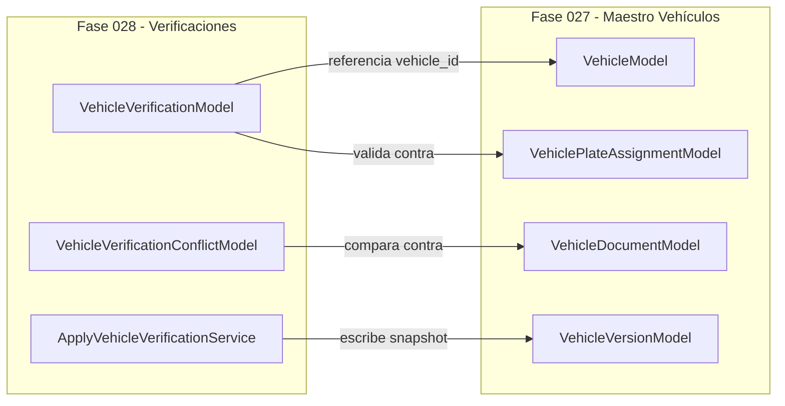

# Auditoría y Restricciones Legales / Técnicas de Verificación Vehicular

## 1. Contexto de Auditoría y Propósito

El subsistema de **Verificación Vehicular (Fase 028)** opera como la capa de certificación de datos frente a fuentes oficiales y proveedores externos para garantizar la autenticidad de las unidades de transporte que ingresan y operan en el ERP.

Dado el marco normativo peruano sobre protección de datos personales (Ley N° 29733) y las políticas de seguridad informática del sistema ERP, esta arquitectura establece restricciones operativas infranqueables orientadas a prevenir la suplantación, evitar prácticas de vulneración técnica y garantizar la trazabilidad legal de cada verificación realizada.

---

## 2. Política Estricta Zero Scraping & Zero Captcha Evasion (`ZERO SCRAPING`)

El sistema prohíbe de forma absoluta e incondicional cualquier mecanismo de web scraping, automatización de navegadores headless (Selenium, Playwright, Puppeteer), rotación de proxies IP o evitación algorítmica/manual de soluciones CAPTCHA/reCAPTCHA contra portales públicos peruanos (SUNARP, MTC, SBS, APESEG, SAT).

### Rationale Operativo y Legal
1. **Riesgo Legal y Penal**: El acceso no autorizado o la elusión de medidas de seguridad en sistemas informáticos estatales configura delitos contemplados en la Ley de Delitos Informáticos (Ley N° 30096).
2. **Inestabilidad del Servicio**: El scraping en portales web públicos es altamente frágil ante cambios de HTML, bloqueos por tasa de peticiones (Rate Limiting) y desafíos CAPTCHA, lo que invalida el SLA del ERP en escenarios críticos de Garita y Despacho.
3. **Falta de Trazabilidad Firmada**: Las capturas web desestructuradas carecen de firmas digitales o comprobantes API auditables en procesos litigiosos o inspecciones del MTC / SUTRAN.

### Regla de Arquitectura
> **REGLA ZERO_SCRAPING**: Ningún servicio backend, job en segundo plano ni tarea asistida podrá realizar peticiones HTTP no documentadas o destinadas a parsear código HTML de sitios web gubernamentales. Todas las integraciones automatizadas deben ser efectuadas exclusivamente mediante **APIs REST/SOAP autorizadas con contratos de servicio vigentes**.

---

## 3. Política No Unapproved APIs (`NO UNAPPROVED APIS`)

Queda estrictamente desaprobado el uso de APIs o endpoints no documentados, no oficiales o "asumidos" descubiertos mediante ingeniería inversa de aplicaciones móviles o portales web gubernamentales.

### Directrices de Integración
* **Proveedores Autorizados**: Solo se permite la conexión con proveedores B2B o entidades oficiales que expidan claves API, certificados mTLS o Tokens OAuth2 oficiales.
* **Gobierno de Fuentes**: Cada fuente externa debe estar explícitamente registrada en la tabla `logistics_vehicle_verification_sources` y contar con su respectiva configuración activa en `logistics_vehicle_verification_provider_configs`.
* **Modo Contingencia (Verificación Asistida)**: Ante la ausencia de un API autorizado con un organismo regulador (ej. consulta SUNARP abierta al público sin API), la verificación **DEBE** derivarse al flujo de **Verificación Asistida por Operador**, donde un usuario humano autorizado consulta el canal oficial e ingrese los datos adjuntando la evidencia documental.

---

## 4. Reutilización Directa de Entidades de Fase 027

La Fase 028 no duplica ni modifica la estructura base del Maestro de Vehículos. En su lugar, se acopla como un módulo de auditoría y enriquecimiento mediante referencias por Clave Foránea (`vehicle_id`) a las siguientes entidades de la Fase 027:

### Entidades Reutilizadas:
1. **`VehicleModel` (`logistics_vehicles`)**: Identidad principal del vehículo. La Fase 028 consulta atributos como `vin`, `display_plate`, `manufacturing_year`, `make_id`, `model_id` para realizar la confrontación de datos.
2. **`VehiclePlateAssignmentModel` (`logistics_vehicle_plate_assignments`)**: Historial de placas asociadas. La Fase 028 valida que la placa verificada corresponda a la asignación `is_active = True`.
3. **`VehicleDocumentModel` (`logistics_vehicle_documents`)**: Expediente documental (SOAT, CITV, Tarjeta de Propiedad). La Fase 028 contrasta las fechas de vencimiento y folios verificados contra las fechas registradas en los documentos.
4. **`VehicleVersionModel` (`logistics_vehicle_versions`)**: Snapshot inmutable de versión vehicular. Cuando una verificación es aprobada y aplicada mediante `ApplyVehicleVerificationService`, se genera una nueva versión inmutable con la firma hash SHA-256 de los cambios.

---

## 5. Tabla de Matriz Cumplimiento Regulatorio Peruano

| Dominio | Entidad Reguladora | Atributos Verificados | Estrategia de Integración | Contingencia Asistida |
|---|---|---|---|---|
| **Propiedad & Titularidad** | **SUNARP** (Registro Vehicular) | Placa, VIN, Motor, Propietario (DNI/RUC), Estado Titularidad | API Convenio Interinstitucional / B2B Autorizado | Carga de Certificado de Licitud / Tarjeta de Propiedad |
| **Inspección Técnica** | **MTC** (CITV) | Nº Certificado CITV, Resultado, Vigencia (Inicio/Fin), Taller | API MTC / Proveedor Homologado | Carga de Certificado CITV Físico + Escaneo QR Oficial |
| **Seguro de Accidentes** | **SBS / APESEG** (SOAT) | Nº Póliza SOAT, Aseguradora, Fecha Inicio, Fecha Fin, Estado | API APESEG B2B / Servicio Web Aseguradora | Carga de Certificado SOAT Electrónico PDF |
