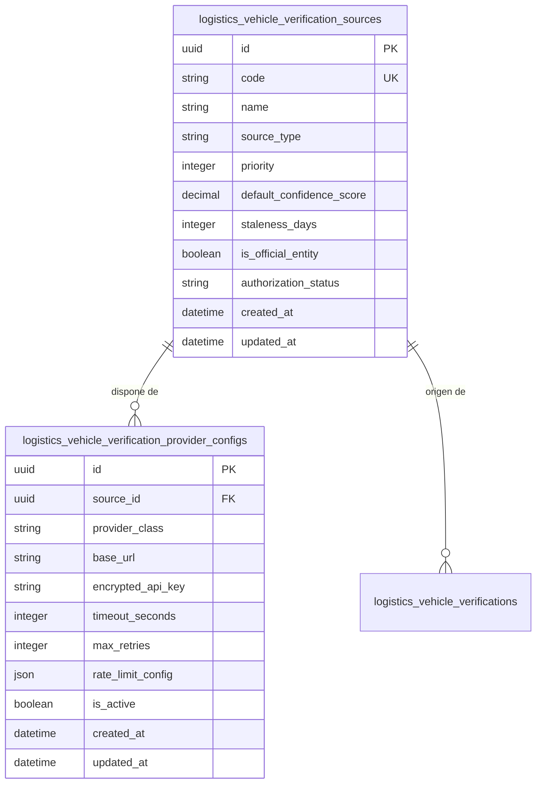

# Modelo de Fuentes de Verificación y Configuración de Proveedores

## 1. Descripción General

El modelo de **Fuentes de Verificación** gestiona el catálogo de orígenes autorizados de datos vehiculares (organismos gubernamentales, aseguradoras, API B2B autorizados o flujos asistidos internos). Define los niveles de confianza predeterminados, políticas de reintento, estados de autorización y configuraciones técnicas de conexión (endpoints, credenciales encriptadas y timeouts).

---

## 2. Modelo Relacional de Fuentes y Proveedores



---

## 3. Especificación de Tablas ORM

### 3.1. `VehicleVerificationSourceModel` (`logistics_vehicle_verification_sources`)

Representa la entidad lógica o institución proveedora de información vehicular.

| Campo | Tipo | Nulo | Descripción / Reglas |
|---|---|---|---|
| `id` | `UUID` | No | Clave Primaria (UUIDv4) |
| `code` | `VARCHAR(50)` | No | Código único de la fuente (ej. `SUNARP`, `MTC_CITV`, `APESEG_SOAT`, `ASSISTED_OPERATOR`, `MOCK_PROVIDER`) |
| `name` | `VARCHAR(150)` | No | Nombre descriptivo oficial |
| `source_type` | `VARCHAR(30)` | No | Categoría: `GOVERNMENT_OFFICIAL`, `INSURANCE_REGISTRY`, `AUTHORIZED_VENDOR`, `INTERNAL_ASSISTED` |
| `priority` | `INTEGER` | No | Prioridad de resolución en caso de conflicto (1 = Más alta, 100 = Más baja) |
| `default_confidence_score` | `NUMERIC(3,2)` | No | Nivel de confianza por defecto (ej. `1.00` para SUNARP/MTC, `0.85` para Proveedor B2B, `0.75` para Asistida) |
| `staleness_days` | `INTEGER` | No | Ventana de frescura por defecto en días antes de considerar los datos obsoletos |
| `is_official_entity` | `BOOLEAN` | No | `True` si la fuente es un organismo del Estado Peruano o ente regulador oficial |
| `authorization_status` | `VARCHAR(30)` | No | Estado de autorización: `ACTIVE`, `MAINTENANCE`, `DEPRECATED`, `DISABLED` |
| `created_at` | `TIMESTAMPTZ` | No | Fecha de creación del registro |
| `updated_at` | `TIMESTAMPTZ` | No | Fecha de última actualización |

#### Claves Únicas e Índices B-Tree
* `uq_vehicle_verification_sources_code`: UNIQUE(`code`)
* `idx_vv_sources_status_priority`: INDEX(`authorization_status`, `priority`)

---

### 3.2. `VehicleVerificationProviderConfigurationModel` (`logistics_vehicle_verification_provider_configs`)

Contiene la parametrización técnica para la ejecución de llamadas a servicios web de la fuente.

| Campo | Tipo | Nulo | Descripción / Reglas |
|---|---|---|---|
| `id` | `UUID` | No | Clave Primaria (UUIDv4) |
| `source_id` | `UUID` | No | FK a `logistics_vehicle_verification_sources.id` (ON DELETE RESTRICT) |
| `provider_class` | `VARCHAR(150)` | No | Clase Python que implementa `VehicleVerificationProvider` (ej. `FakeVehicleVerificationProvider`) |
| `base_url` | `VARCHAR(255)` | Sí | URL base del API HTTP/SOAP |
| `encrypted_api_key` | `TEXT` | Sí | Token/Key de acceso encriptado en reposo mediante AES-256-GCM |
| `timeout_seconds` | `INTEGER` | No | Timeout máximo de red por petición (por defecto `10` segundos) |
| `max_retries` | `INTEGER` | No | Cantidad máxima de reintentos en fallos transitorios (por defecto `3`) |
| `rate_limit_config` | `JSONB` | Sí | Estructura JSON de cuotas (ej. `{"requests_per_minute": 60, "daily_quota": 5000}`) |
| `is_active` | `BOOLEAN` | No | Estado operativo de la configuración técnica |
| `created_at` | `TIMESTAMPTZ` | No | Fecha de creación del registro |
| `updated_at` | `TIMESTAMPTZ` | No | Fecha de última actualización |

#### Claves e Índices
* `fk_vv_provider_configs_source_id`: Foreign Key a `logistics_vehicle_verification_sources(id)`
* `idx_vv_provider_configs_active`: INDEX(`source_id`, `is_active`)

---

## 4. Enum de Estados de Autorización de Fuentes (`AuthorizationStatusEnum`)

```python
class AuthorizationStatusEnum(str, PyEnum):
    ACTIVE = "ACTIVE"            # Fuente operacional y autorizada
    MAINTENANCE = "MAINTENANCE"    # Fuente temporalmente inhabilitada por ventana de mantenimiento
    DEPRECATED = "DEPRECATED"      # Fuente en proceso de retiro (solo lectura para datos históricos)
    DISABLED = "DISABLED"        # Fuente revocada por razones de seguridad o vencimiento de convenio
```

---

## 5. Jerarquía de Prioridades y Nivel de Confianza (`Confidence Level`)

Cuando coexisten múltiples verificaciones para una misma unidad vehicular, el sistema resuelve conflictos priorizando las fuentes en función de su peso regulatorio y nivel de confianza:

| Código Fuente | Categoría | Prioridad | Confidence Score | Ventana Frescura |
|---|---|---|---|---|
| `SUNARP` | `GOVERNMENT_OFFICIAL` | 1 | `1.00` (100%) | 30 días |
| `MTC_CITV` | `GOVERNMENT_OFFICIAL` | 2 | `1.00` (100%) | 15 días |
| `APESEG_SOAT` | `INSURANCE_REGISTRY` | 3 | `0.95` (95%) | 7 días |
| `AUTHORIZED_API` | `AUTHORIZED_VENDOR` | 4 | `0.85` (85%) | 15 días |
| `ASSISTED_OPERATOR` | `INTERNAL_ASSISTED` | 5 | `0.75` (75%) | 30 días |
