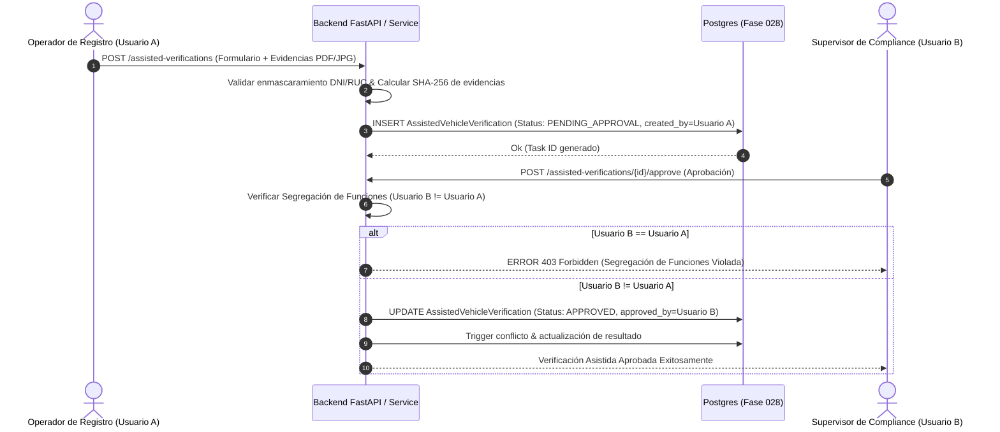

# Modelo de Verificaciones Asistidas y Captura de Evidencias Documentales

## 1. Descripción General

En escenarios de contingencia donde no existan APIs web autorizados con las entidades públicas (ej. SUNARP o portales de consulta masiva), la arquitectura habilita el flujo de **Verificación Asistida por Operador**. 

Este flujo permite a un operador humano ingresar la información constatada visualmente o expedida por certificados físicos/digitales oficiales, respaldando cada dato con archivos probatorios. Para salvaguardar la integridad de la operación, el sistema aplica rigurosamente el **Principio de Doble Control / Segregación de Funciones (Four-Eyes Principle)**, impidiendo que el mismo usuario que registra la verificación pueda aprobarla.

---

## 2. Diagrama del Flujo de Verificación Asistida



---

## 3. Especificación de Tablas ORM

### 3.1. `AssistedVehicleVerificationModel` (`logistics_assisted_vehicle_verifications`)

Extensión 1 a 1 de `VehicleVerificationModel` para registrar la metadata del flujo manual.

| Campo | Tipo | Nulo | Descripción / Reglas |
|---|---|---|---|
| `id` | `UUID` | No | Clave Primaria (UUIDv4) |
| `verification_id` | `UUID` | No | FK a `logistics_vehicle_verifications.id` (ON DELETE CASCADE) — UNIQUE |
| `operator_notes` | `TEXT` | No | Declaración jurada y observaciones ingresadas por el operador de registro |
| `owner_identity_hash` | `CHAR(64)` | No | Hash SHA-256 del DNI/RUC del propietario para comprobación sin revelar PII |
| `masked_owner_name` | `VARCHAR(150)` | No | Nombre del propietario enmascarado (ej. `J*** P**** Z*****`) |
| `approval_status` | `VARCHAR(30)` | No | Estado del flujo: `DRAFT`, `PENDING_APPROVAL`, `APPROVED`, `REJECTED` |
| `created_by` | `UUID` | No | FK al usuario que creó y registró la verificación asistida |
| `approved_by` | `UUID` | Sí | FK al usuario supervisor que aprobó el registro (`approved_by != created_by`) |
| `approval_date` | `TIMESTAMPTZ` | Sí | Fecha y hora de resolución de la aprobación |
| `rejection_reason` | `TEXT` | Sí | Sustento explicativo en caso de rechazo por el supervisor |
| `created_at` | `TIMESTAMPTZ` | No | Timestamp de creación |

#### Constraint de Segregación de Funciones en Base de Datos
```sql
CONSTRAINT chk_assisted_segregation_of_duties 
CHECK (approved_by IS NULL OR created_by <> approved_by)
```

#### Claves e Índices
* `uq_assisted_vv_verification_id`: UNIQUE(`verification_id`)
* `idx_assisted_vv_approval_status`: INDEX(`approval_status`, `created_at`)

---

### 3.2. `VehicleVerificationEvidenceModel` (`logistics_assisted_verification_evidence`)

Almacena los archivos adjuntos de prueba (PDF Tarjeta de Propiedad, Fotos CITV, Pólizas SOAT).

| Campo | Tipo | Nulo | Descripción / Reglas |
|---|---|---|---|
| `id` | `UUID` | No | Clave Primaria (UUIDv4) |
| `assisted_verification_id` | `UUID` | No | FK a `logistics_assisted_vehicle_verifications.id` (ON DELETE CASCADE) |
| `document_type` | `VARCHAR(50)` | No | Categoría del adjunto: `SUNARP_OWNERSHIP_CARD`, `CITV_INSPECTION_PDF`, `SOAT_POLICY_PDF`, `VEHICLE_PHOTO` |
| `file_name` | `VARCHAR(255)` | No | Nombre original del archivo adjuntado |
| `storage_path` | `VARCHAR(500)` | No | Ruta interna o URI del objeto en almacenamiento seguro (S3 / Blob Storage) |
| `file_size_bytes` | `INTEGER` | No | Tamaño del archivo en bytes |
| `mime_type` | `VARCHAR(100)` | No | Tipo MIME (`application/pdf`, `image/jpeg`, `image/png`) |
| `file_sha256` | `CHAR(64)` | No | Hash SHA-256 del contenido binario del archivo para verificar su integridad inalterable |
| `uploaded_by` | `UUID` | No | FK al usuario que subió el archivo |
| `created_at` | `TIMESTAMPTZ` | No | Fecha de subida |

#### Claves e Índices
* `fk_vv_evidence_assisted_id`: Foreign Key a `logistics_assisted_vehicle_verifications(id)`
* `idx_vv_evidence_file_sha256`: INDEX(`file_sha256`)

---

## 4. Regla Estricta de Segregación de Funciones (`Four-Eyes Principle`)

En el servicio de aplicación `AssistedVehicleVerificationService`, se ejecuta la siguiente comprobación lógica previo a la persistencia del estado `APPROVED`:

```python
def approve_assisted_verification(
    db: Session, 
    assisted_verification_id: UUID, 
    supervisor_user_id: UUID
) -> AssistedVehicleVerificationModel:
    assisted_record = db.query(AssistedVehicleVerificationModel).filter_by(id=assisted_verification_id).one()
    
    if assisted_record.created_by == supervisor_user_id:
        raise PermissionError(
            "VIOLATION_SEGREGATION_OF_DUTIES: El usuario que registró la verificación asistida "
            "no puede auto-aprobarla. Se requiere la revisión de un usuario supervisor independiente."
        )
        
    assisted_record.approval_status = "APPROVED"
    assisted_record.approved_by = supervisor_user_id
    assisted_record.approval_date = datetime.now(timezone.utc)
    db.commit()
    return assisted_record
```
