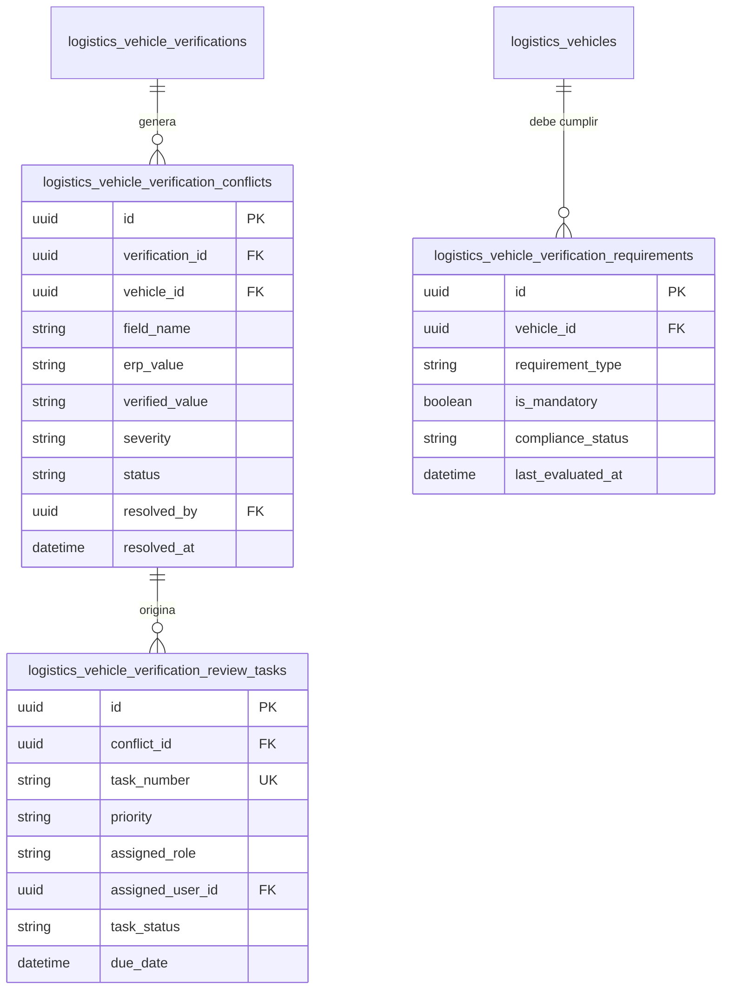

# Modelo de Conflictos, Requisitos y Tareas de Cumplimiento

## 1. Descripción General

Cuando los datos verificados ante la fuente externa presentan diferencias o incongruencias respecto al expediente del Maestro de Vehículos (Fase 027), el sistema no descarta la información ni sobreescribe ciegamente los campos. En su lugar, activa el subsistema de **Conflictos y Cumplimiento Vehicular**.

Este subsistema registra:
1. `VehicleVerificationConflictModel`: Discrepancia específica a nivel de campo entre la verdad declarada en el ERP y la devuelta por la fuente.
2. `VehicleVerificationRequirementModel`: Reglas regulatorias y operativas que debe cumplir la unidad para obtener autorización de tránsito.
3. `VehicleVerificationReviewTaskModel`: Tarea de trabajo asignada a oficiales de compliance para resolver o dispensar un conflicto detectado.

---

## 2. Diagrama de Relaciones de Conflictos y Revisiones

---

## 3. Especificación de Tablas ORM

### 3.1. `VehicleVerificationConflictModel` (`logistics_vehicle_verification_conflicts`)

| Campo | Tipo | Nulo | Descripción / Reglas |
|---|---|---|---|
| `id` | `UUID` | No | Clave Primaria (UUIDv4) |
| `verification_id` | `UUID` | No | FK a `logistics_vehicle_verifications.id` (ON DELETE CASCADE) |
| `vehicle_id` | `UUID` | No | FK a `logistics_vehicles.id` de Fase 027 (ON DELETE RESTRICT) |
| `field_name` | `VARCHAR(60)` | No | Nombre del campo en disputa (ej. `vin`, `engine_number`, `manufacturing_year`, `soat_policy`) |
| `erp_value` | `TEXT` | Sí | Valor que ostentaba el ERP en la Fase 027 al ejecutarse la consulta |
| `verified_value` | `TEXT` | Sí | Valor oficial retornado por la fuente externa o verificación asistida |
| `severity` | `VARCHAR(20)` | No | Severidad del conflicto: `CRITICAL`, `HIGH`, `MEDIUM`, `LOW` |
| `status` | `VARCHAR(30)` | No | Estado de resolución: `OPEN`, `RESOLVED_OVERRIDDEN`, `RESOLVED_UPDATED`, `IGNORED` |
| `resolution_comment` | `TEXT` | Sí | Justificación técnica/legal provista al resolver el conflicto |
| `resolved_by` | `UUID` | Sí | FK al usuario autorizado que resolvió el conflicto |
| `resolved_at` | `TIMESTAMPTZ` | Sí | Fecha y hora de resolución |
| `created_at` | `TIMESTAMPTZ` | No | Fecha de detección del conflicto |

#### Claves e Índices
* `idx_vv_conflicts_vehicle_status`: INDEX(`vehicle_id`, `status`)
* `idx_vv_conflicts_severity`: INDEX(`severity`, `status`)

---

### 3.2. `VehicleVerificationRequirementModel` (`logistics_vehicle_verification_requirements`)

| Campo | Tipo | Nulo | Descripción / Reglas |
|---|---|---|---|
| `id` | `UUID` | No | Clave Primaria (UUIDv4) |
| `vehicle_id` | `UUID` | No | FK a `logistics_vehicles.id` de Fase 027 (ON DELETE CASCADE) |
| `requirement_type` | `VARCHAR(50)` | No | Tipo de requisito: `SUNARP_OWNERSHIP_VALID`, `SOAT_ACTIVE_VIGENT`, `CITV_PASSED_VIGENT`, `NO_CRITICAL_CONFLICTS` |
| `is_mandatory` | `BOOLEAN` | No | Indica si el incumplimiento bloquea automáticamente el tránsito vehicular |
| `compliance_status` | `VARCHAR(30)` | No | Estado de cumplimiento: `COMPLIANT`, `NON_COMPLIANT`, `PENDING_VERIFICATION`, `EXEMPTED` |
| `last_evaluated_at` | `TIMESTAMPTZ` | No | Timestamp de la última evaluación por el `VehicleVerificationComplianceResolver` |
| `evaluation_details` | `JSONB` | Sí | Detalle en formato JSON de la evaluación (mensajes, IDs de verificación involucrados) |
| `created_at` | `TIMESTAMPTZ` | No | Fecha de creación del registro |
| `updated_at` | `TIMESTAMPTZ` | No | Fecha de actualización |

#### Claves Únicas e Índices
* `uq_vv_requirements_vehicle_type`: UNIQUE(`vehicle_id`, `requirement_type`)
* `idx_vv_reqs_compliance`: INDEX(`vehicle_id`, `compliance_status`, `is_mandatory`)

---

### 3.3. `VehicleVerificationReviewTaskModel` (`logistics_vehicle_verification_review_tasks`)

| Campo | Tipo | Nulo | Descripción / Reglas |
|---|---|---|---|
| `id` | `UUID` | No | Clave Primaria (UUIDv4) |
| `conflict_id` | `UUID` | No | FK a `logistics_vehicle_verification_conflicts.id` (ON DELETE CASCADE) |
| `task_number` | `VARCHAR(60)` | No | Código único de tarea de revisión (ej. `TSK-REV-2026-00412`) |
| `priority` | `VARCHAR(20)` | No | Prioridad de atención: `URGENT`, `HIGH`, `NORMAL`, `LOW` |
| `assigned_role` | `VARCHAR(60)` | No | Rol RBAC requerido para atender la tarea (ej. `logistics.compliance_officer`) |
| `assigned_user_id` | `UUID` | Sí | FK al usuario específico asignado a la tarea |
| `task_status` | `VARCHAR(30)` | No | Estado de la tarea: `OPEN`, `IN_REVIEW`, `COMPLETED`, `CANCELLED` |
| `due_date` | `TIMESTAMPTZ` | No | Fecha límite estimada para resolver el conflicto antes de emitir alerta |
| `completed_at` | `TIMESTAMPTZ` | Sí | Timestamp de finalización de la tarea |
| `created_at` | `TIMESTAMPTZ` | No | Timestamp de generación |

#### Claves e Índices
* `uq_vv_review_tasks_number`: UNIQUE(`task_number`)
* `idx_vv_review_tasks_status`: INDEX(`task_status`, `priority`, `assigned_user_id`)

---

## 4. Matriz de Severidad de Conflictos y Acciones Operativas

| Severidad | Escenario de Discrepancia | Impacto en Cumplimiento | Acción Automática |
|---|---|---|---|
| `CRITICAL` | Número VIN no coincide, Póliza SOAT vencida o inexistente, CITV Desaprobado | `NON_COMPLIANT` Inmediato | Bloqueo preventivo de la unidad en Garita / Despacho. Tarea `URGENT` asignada a Compliance. |
| `HIGH` | Tipo de propiedad no coincide, DNI/RUC del Propietario difiere de SUNARP | `NON_COMPLIANT` Preventivo | Alerta a gestión de transportistas. Requiere revisión manual previa a la siguiente asignación de carga. |
| `MEDIUM` | Diferencia en Marca o Modelo (ej. `TOYOTA` vs `TOYOTA MOTOR CORP`) | `COMPLIANT` con Alerta | Tarea de prioridad `NORMAL` para unificación de catálogo mediante `VehicleVerificationNormalizer`. |
| `LOW` | Año de fabricación difiere en ±1 año (ej. 2022 en ERP vs 2021 en SUNARP por año modelo) | `COMPLIANT` | Auto-resolución o sugerencia de actualización de metadata sin bloqueo operativo. |
