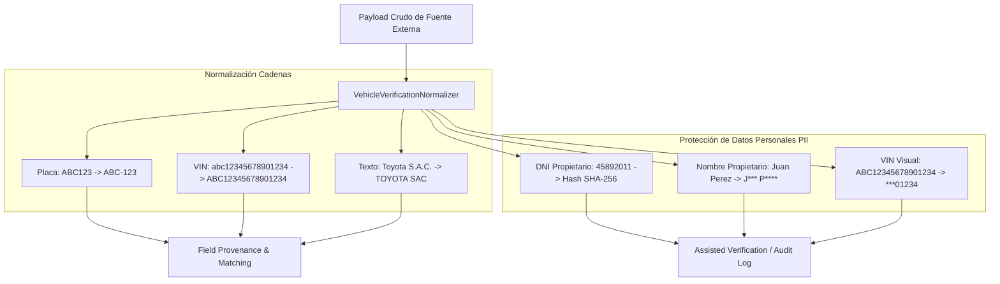

# Servicio de Normalización y Enmascaramiento de Datos (`VehicleVerificationNormalizer`)

## 1. Descripción General

El servicio **`VehicleVerificationNormalizer`** provee funciones puras y deterministas encargadas de:
1. **Normalización Estándar**: Limpieza de cadenas, remoción de diacríticos, conversión a mayúsculas y eliminación de caracteres no alfanuméricos para uniformizar datos provenientes de distintas APIs (SUNARP, MTC, SBS).
2. **Enmascaramiento Hash SHA-256 para Identificadores Sensibles**: Anonimización estricta de DNI/RUC de propietarios para cumplimiento de la Ley N° 29733 (Protección de Datos Personales).
3. **Enmascaramiento Visual para UI / Logs**: Transformación de VINs, números de póliza y nombres de personas naturales a formatos enmascarados visualmente para evitar la fuga de PII en logs y vistas generales.

---

## 2. Diagrama de Procesamiento de Normalización y Enmascaramiento



---

## 3. Especificación del Servicio `VehicleVerificationNormalizer`

```python
import re
import hashlib
import unicodedata
from typing import Optional, Dict, Any

class VehicleVerificationNormalizer:
    """
    Servicio encargado de la limpieza de cadenas y enmascaramiento seguro 
    de identificadores personales y vehiculares.
    """

    @staticmethod
    def normalize_plate(plate: str) -> str:
        """
        Limpia y formatea placas peruanas al estándar ABC-123 o A1B-890.
        """
        if not plate:
            return ""
        clean = re.sub(r'[^A-Z0-9]', '', plate.upper())
        if len(clean) == 6:
            return f"{clean[:3]}-{clean[3:]}"
        return clean

    @staticmethod
    def normalize_vin(vin: str) -> str:
        """
        Convierte a mayúsculas y elimina caracteres inválidos (I, O, Q según ISO 3779).
        """
        if not vin:
            return ""
        clean = re.sub(r'[^A-Z0-9]', '', vin.upper())
        return clean

    @staticmethod
    def normalize_text(text: Optional[str]) -> str:
        """
        Elimina acentos, tildes, caracteres especiales y convierte a mayúsculas limpias.
        """
        if not text:
            return ""
        # Normalizar NFD para separar tildes de caracteres
        nfd_form = unicodedata.normalize('NFD', text)
        clean_text = "".join([c for c in nfd_form if unicodedata.category(c) != 'Mn'])
        # Reemplazar caracteres no alfanuméricos por un solo espacio
        clean_text = re.sub(r'[^A-ZA-Z0-9\s]', ' ', clean_text.upper())
        return re.sub(r'\s+', ' ', clean_text).strip()

    @staticmethod
    def hash_identity_document(document_number: str) -> str:
        """
        Genera un hash SHA-256 para el DNI/RUC del propietario.
        Evita almacenar el número de documento directo en tablas de verificaciones.
        """
        clean_doc = re.sub(r'\D', '', document_number or '')
        if not clean_doc:
            return ""
        return hashlib.sha256(clean_doc.encode('utf-8')).hexdigest()

    @staticmethod
    def mask_vin_visual(vin: str) -> str:
        """
        Retorna los últimos 5 caracteres del VIN enmascarando los 12 iniciales (ej: ***12345).
        """
        clean = VehicleVerificationNormalizer.normalize_vin(vin)
        if len(clean) <= 5:
            return "***" + clean
        return "***" + clean[-5:]

    @staticmethod
    def mask_policy_number(policy: str) -> str:
        """
        Enmascara el número de póliza SOAT conservando solo los últimos 4 dígitos (ej: POL-***9821).
        """
        if not policy:
            return ""
        clean = re.sub(r'[^A-Z0-9]', '', policy.upper())
        if len(clean) <= 4:
            return "***" + clean
        return clean[:3] + "-***" + clean[-4:]

    @staticmethod
    def mask_person_name(name: str) -> str:
        """
        Enmascara un nombre completo preservando la primera letra de cada palabra (ej. J*** P**** Z*****).
        """
        clean = VehicleVerificationNormalizer.normalize_text(name)
        if not clean:
            return ""
        words = clean.split()
        masked_words = []
        for word in words:
            if len(word) <= 1:
                masked_words.append(word)
            else:
                masked_words.append(word[0] + "*" * (len(word) - 1))
        return " ".join(masked_words)
```

---

## 4. Tabla de Ejemplos de Entrada / Salida

| Función | Entrada Cruda | Resultado Processed / Enmascarado | Propósito |
|---|---|---|---|
| `normalize_plate` | `" a1b  890 "` | `"A1B-890"` | Estandarización de consulta |
| `normalize_vin` | `"936-a812k0-1290"` | `"936A812K01290"` | Conformidad ISO 3779 |
| `normalize_text` | `"Corporación Rímac S.A.C."` | `"CORPORACION RIMAC SAC"` | Comparación de nombres de empresas |
| `hash_identity_document` | `"45892011"` | `"8f43b67c...d10e"` (SHA-256) | Protección PII Ley 29733 |
| `mask_vin_visual` | `"1HGCR2F83HA001234"` | `"***01234"` | Visualización segura en UI |
| `mask_policy_number` | `"SOAT-9812401928"` | `"SOA-***1928"` | Enmascaramiento de folios |
| `mask_person_name` | `"JUAN CARLOS PEREZ"` | `"J*** C***** P****"` | Privacidad de datos asistidos |
