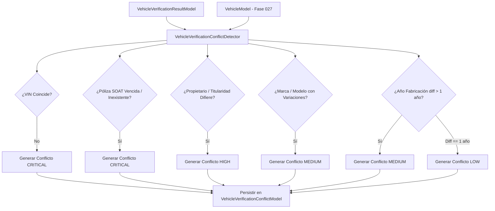

# Servicio de Detección de Conflictos (`VehicleVerificationConflictDetector`)

## 1. Descripción General

El servicio **`VehicleVerificationConflictDetector`** es el componente algorítmico encargado de comparar de forma automática la información verificada desde fuentes externas frente a los datos registrados en el Maestro de Vehículos (Fase 027).

Para cada campo verificado, el detector evalúa el grado de divergencia, aplica tolerancias de negocio y clasifica las discrepancias en cuatro niveles de severidad (`CRITICAL`, `HIGH`, `MEDIUM`, `LOW`), generando los registros correspondientes en `VehicleVerificationConflictModel`.

---

## 2. Diagrama de Flujo del Motor de Detección



---

## 3. Matriz Completa de Reglas de Discrepancia y Severidades

| Atributo Evaluado | Regla de Coincidencia / Tolerancia | Severidad | Acción Operativa Asociada |
|---|---|---|---|
| **VIN (Vehicle Identification Number)** | Coincidencia exacta tras `normalize_vin()`. Si difieren -> **CRITICAL** | `CRITICAL` | Bloqueo automático e inmediato del vehículo para despacho y garita. |
| **Póliza SOAT (Vigencia)** | Fecha fin de vigencia < Fecha actual -> **CRITICAL** | `CRITICAL` | Bloqueo preventivo por falta de seguro obligatorio. |
| **Inspección Técnica CITV** | Estado CITV == `DESAPROBADO` o `VENCIDO` -> **CRITICAL** | `CRITICAL` | Bloqueo preventivo por incumplimiento normativo MTC. |
| **Propietario / Titularidad** | Hash DNI/RUC del propietario no coincide con SUNARP -> **HIGH** | `HIGH` | Requerimiento de actualización documental de titularidad. |
| **Número de Motor** | Coincidencia de número de serie de motor sin espacios. Si difiere -> **HIGH** | `HIGH` | Alerta por posible rectificación o cambio de motor no reportado. |
| **Marca / Modelo** | Coincidencia tras `normalize_text()`. Difiere marca o modelo -> **MEDIUM** | `MEDIUM` | Tarea de revisión para homogenización de marcas/modelos en catálogo. |
| **Año Fabricación (Diferencia > 1)** | `abs(year_erp - year_verified) > 1` -> **MEDIUM** | `MEDIUM` | Incongruencia en ficha técnica. Requisito de aclaración. |
| **Año Fabricación (Diferencia = 1)** | `abs(year_erp - year_verified) == 1` (Año modelo vs año fabricación) -> **LOW** | `LOW` | Tolerancia permitida en importaciones. No bloquea tránsito. |

---

## 4. Implementación del Servicio `VehicleVerificationConflictDetector`

```python
from typing import List, Dict, Any
from uuid import UUID
from datetime import date

from app.models.logistics.vehicle import VehicleModel
from app.models.logistics.vehicle_verification import (
    VehicleVerificationConflictModel,
    VehicleVerificationResultModel,
    VehicleVerificationFieldProvenanceModel
)
from app.services.logistics.vehicle_verification_normalizer import VehicleVerificationNormalizer

class VehicleVerificationConflictDetector:
    """
    Motor determinista para detección y clasificación de discrepancias 
    entre la verdad del ERP y la verdad verificada externamente.
    """

    @staticmethod
    def detect_conflicts(
        vehicle: VehicleModel,
        verification_id: UUID,
        provenance_list: List[VehicleVerificationFieldProvenanceModel]
    ) -> List[VehicleVerificationConflictModel]:
        
        conflicts: List[VehicleVerificationConflictModel] = []

        for prov in provenance_list:
            field_name = prov.field_name
            verified_val = prov.normalized_value or ""
            erp_val = prov.erp_current_value or ""

            # 1. Evaluación de VIN
            if field_name == "vin":
                if verified_val and erp_val and verified_val != erp_val:
                    conflicts.append(VehicleVerificationConflictModel(
                        verification_id=verification_id,
                        vehicle_id=vehicle.id,
                        field_name="vin",
                        erp_value=erp_val,
                        verified_value=verified_val,
                        severity="CRITICAL",
                        status="OPEN"
                    ))

            # 2. Evaluación de SOAT (Estado / Vigencia)
            elif field_name == "soat_status":
                if verified_val.upper() in ["EXPIRED", "INVALID", "NOT_FOUND"]:
                    conflicts.append(VehicleVerificationConflictModel(
                        verification_id=verification_id,
                        vehicle_id=vehicle.id,
                        field_name="soat_status",
                        erp_value=erp_val,
                        verified_value=verified_val,
                        severity="CRITICAL",
                        status="OPEN"
                    ))

            # 3. Evaluación del Propietario (DNI/RUC Hash)
            elif field_name == "owner_identity_hash":
                if verified_val and erp_val and verified_val != erp_val:
                    conflicts.append(VehicleVerificationConflictModel(
                        verification_id=verification_id,
                        vehicle_id=vehicle.id,
                        field_name="owner_identity_hash",
                        erp_value="HASH_ERP_DOC",
                        verified_value="HASH_VERIFIED_DOC",
                        severity="HIGH",
                        status="OPEN"
                    ))

            # 4. Evaluación de Número de Motor
            elif field_name == "engine_number":
                if verified_val and erp_val and verified_val != erp_val:
                    conflicts.append(VehicleVerificationConflictModel(
                        verification_id=verification_id,
                        vehicle_id=vehicle.id,
                        field_name="engine_number",
                        erp_value=erp_val,
                        verified_value=verified_val,
                        severity="HIGH",
                        status="OPEN"
                    ))

            # 5. Evaluación de Marca / Modelo
            elif field_name in ["make", "model"]:
                if verified_val and erp_val and verified_val != erp_val:
                    conflicts.append(VehicleVerificationConflictModel(
                        verification_id=verification_id,
                        vehicle_id=vehicle.id,
                        field_name=field_name,
                        erp_value=erp_val,
                        verified_value=verified_val,
                        severity="MEDIUM",
                        status="OPEN"
                    ))

            # 6. Evaluación de Año de Fabricación con Tolerancia
            elif field_name == "manufacturing_year":
                if verified_val and erp_val:
                    try:
                        v_year = int(verified_val)
                        e_year = int(erp_val)
                        diff = abs(v_year - e_year)
                        if diff > 1:
                            conflicts.append(VehicleVerificationConflictModel(
                                verification_id=verification_id,
                                vehicle_id=vehicle.id,
                                field_name="manufacturing_year",
                                erp_value=str(e_year),
                                verified_value=str(v_year),
                                severity="MEDIUM",
                                status="OPEN"
                            ))
                        elif diff == 1:
                            conflicts.append(VehicleVerificationConflictModel(
                                verification_id=verification_id,
                                vehicle_id=vehicle.id,
                                field_name="manufacturing_year",
                                erp_value=str(e_year),
                                verified_value=str(v_year),
                                severity="LOW",
                                status="OPEN"
                            ))
                    except ValueError:
                        pass

        return conflicts
```
