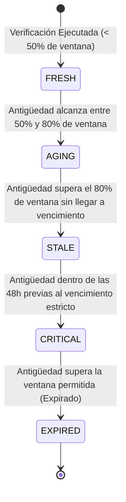

# Servicio de Política de Antigüedad y Frescura de Datos (`VehicleVerificationStalenessPolicy`)

## 1. Descripción General

Los datos provistos por entidades reguladoras y registros de seguros cambian con el tiempo debido a renovaciones, inspecciones periódicas o transferencias de propiedad. Por ello, una verificación exitosa no conserva validez perpetua.

El servicio **`VehicleVerificationStalenessPolicy`** calcula dinámicamente la frescura de una verificación determinando si los datos continúan siendo confiables o si requieren una nueva re-validación ante las fuentes oficiales.

---

## 2. Diagrama de Transición de Estados de Frescura



---

## 3. Ventanas Temporales por Dominio de Verificación

El tiempo de validez de una verificación depende de la volatilidad y la naturaleza del dominio evaluado:

| Código Fuente / Dominio | Ventana de Frescura | Justificación Operativa |
|---|---|---|
| **`SUNARP`** (Titularidad / Datos Básicos) | **30 días** | La propiedad y datos estructurales cambian con baja frecuencia. |
| **`APESEG_SOAT`** (Seguro Obligatorio) | **7 días** | Permite detectar oportunamente cancelaciones o vencimientos semanales de pólizas. |
| **`MTC_CITV`** (Inspección Técnica) | **15 días** | Balance entre vigencia anual del certificado y monitoreo de observaciones. |
| **`AUTHORIZED_API`** (Proveedor B2B) | **15 días** | Política estándar para APIs comerciales de terceros. |
| **`ASSISTED_OPERATOR`** (Flujo Manual) | **30 días** | Refleja la validez legal del documento físico adjuntado como evidencia. |

---

## 4. Clasificación de Estados de Frescura (`FreshnessStateEnum`)

```python
from enum import Enum

class FreshnessStateEnum(str, Enum):
    FRESH = "FRESH"          # Información totalmente vigente y confiable
    AGING = "AGING"          # Información en periodo intermedio de validez
    STALE = "STALE"          # Información próxima a vencer (requiere programar re-verificación)
    CRITICAL = "CRITICAL"    # Información a menos de 48h de caducar
    EXPIRED = "EXPIRED"      # Información obsoleta. Se requiere nueva consulta obligatoria.
```

---

## 5. Especificación del Servicio `VehicleVerificationStalenessPolicy`

```python
from datetime import datetime, timezone, timedelta
from typing import Dict, Any

class VehicleVerificationStalenessPolicy:
    """
    Evaluador determinista de frescura y caducidad para verificaciones vehiculares.
    """

    DOMAIN_STALENESS_DAYS: Dict[str, int] = {
        "SUNARP": 30,
        "APESEG_SOAT": 7,
        "MTC_CITV": 15,
        "AUTHORIZED_API": 15,
        "ASSISTED_OPERATOR": 30,
    }

    @classmethod
    def get_staleness_days(cls, source_code: str) -> int:
        return cls.DOMAIN_STALENESS_DAYS.get(source_code.upper(), 15)

    @classmethod
    def calculate_expiration_date(cls, source_code: str, verification_date: datetime) -> datetime:
        days = cls.get_staleness_days(source_code)
        return verification_date + timedelta(days=days)

    @classmethod
    def evaluate_freshness(
        cls, 
        source_code: str, 
        verification_date: datetime, 
        current_time: datetime = None
    ) -> Dict[str, Any]:
        """
        Calcula el estado de frescura actual y el porcentaje consumido de la ventana temporal.
        """
        if current_time is None:
            current_time = datetime.now(timezone.utc)

        expiration_date = cls.calculate_expiration_date(source_code, verification_date)
        total_seconds = (expiration_date - verification_date).total_seconds()
        elapsed_seconds = (current_time - verification_date).total_seconds()

        if elapsed_seconds < 0:
            elapsed_seconds = 0

        percent_elapsed = (elapsed_seconds / total_seconds) * 100.0 if total_seconds > 0 else 100.0
        remaining_hours = (expiration_date - current_time).total_seconds() / 3600.0

        if current_time >= expiration_date:
            state = FreshnessStateEnum.EXPIRED
        elif remaining_hours <= 48.0:
            state = FreshnessStateEnum.CRITICAL
        elif percent_elapsed >= 80.0:
            state = FreshnessStateEnum.STALE
        elif percent_elapsed >= 50.0:
            state = FreshnessStateEnum.AGING
        else:
            state = FreshnessStateEnum.FRESH

        return {
            "source_code": source_code,
            "verification_date": verification_date,
            "expiration_date": expiration_date,
            "freshness_state": state,
            "percent_elapsed": round(percent_elapsed, 2),
            "is_valid_for_operation": state not in [FreshnessStateEnum.EXPIRED]
        }
```
