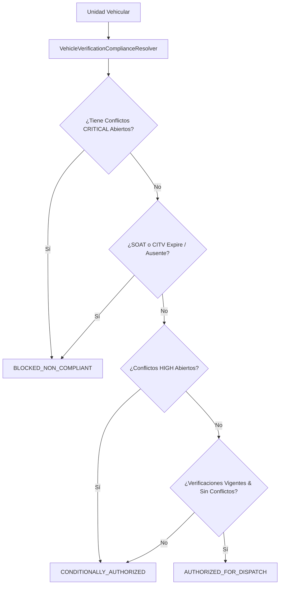

# Servicio de Resolución de Cumplimiento Vehicular (`VehicleVerificationComplianceResolver`)

## 1. Descripción General

El servicio **`VehicleVerificationComplianceResolver`** actua como el orquestador final de decisiones de seguridad y conformidad vehicular. Su función es evaluar de forma consolidada:
1. Las verificaciones activas de la unidad y sus estados de frescura (`VehicleVerificationStalenessPolicy`).
2. Los conflictos no resueltos registradas en `VehicleVerificationConflictModel`.
3. El estado de los requisitos obligatorios en `VehicleVerificationRequirementModel`.
4. El estado operativo base del vehículo definido en la Fase 027 (`VehicleOperationalStatusResolver`).

Como resultado, emite un dictamen unificado de **Tránsito Logístico** que es consumido por los módulos de Control de Acceso en Garita (Fase 041) y Despacho de Carga (Fase 042).

---

## 2. Diagrama de Decisión de Cumplimiento



---

## 3. Matriz de Estados de Autorización Logística

| Estado Emitido | Descripción | Operaciones Permitidas | Acciones Requeridas |
|---|---|---|---|
| **`AUTHORIZED_FOR_DISPATCH`** | La unidad cuenta con verificaciones vigentes (SUNARP, SOAT, CITV) y cero conflictos abiertos. | Permiso total para ingresar a garita, cargar mercancía y salir a ruta. | Ninguna. |
| **`CONDITIONALLY_AUTHORIZED`** | La unidad no posee faltas críticas pero presenta conflictos de severidad `HIGH` o `MEDIUM` pendientes de resolución. | Se permite el tránsito pero se emite una alerta a operaciones para resolución en < 48h. | Tarea de revisión asignada a Compliance. |
| **`BLOCKED_NON_COMPLIANT`** | La unidad presenta al menos un conflicto `CRITICAL` abierto (ej. VIN no coincide, SOAT vencido) o expedientes obligatorios caducados. | **PROHIBIDO** el ingreso a planta, asignación de viaje o emisión de guía de remisión. | Bloqueo preventivo en sistema. Requiere resolución explícita de conflicto. |

---

## 4. Especificación del Servicio `VehicleVerificationComplianceResolver`

```python
from typing import Dict, Any, List
from uuid import UUID
from datetime import datetime, timezone

from sqlalchemy.orm import Session
from app.models.logistics.vehicle import VehicleModel
from app.models.logistics.vehicle_verification import (
    VehicleVerificationConflictModel,
    VehicleVerificationRequirementModel,
    VehicleVerificationModel
)
from app.services.logistics.vehicle_verification_staleness import VehicleVerificationStalenessPolicy

class VehicleVerificationComplianceResolver:
    """
    Motor resolutor de cumplimiento y autorización de tránsito para la flota vehicular.
    """

    @classmethod
    def resolve_compliance(cls, db: Session, vehicle_id: UUID) -> Dict[str, Any]:
        vehicle = db.query(VehicleModel).filter_by(id=vehicle_id).one()
        
        # 1. Consultar conflictos abiertos por severidad
        open_conflicts = db.query(VehicleVerificationConflictModel).filter(
            VehicleVerificationConflictModel.vehicle_id == vehicle_id,
            VehicleVerificationConflictModel.status == "OPEN"
        ).all()

        critical_conflicts = [c for c in open_conflicts if c.severity == "CRITICAL"]
        high_conflicts = [c for c in open_conflicts if c.severity == "HIGH"]
        medium_conflicts = [c for c in open_conflicts if c.severity in ["MEDIUM", "LOW"]]

        # 2. Consultar requisitos de transitabilidad obligatorios
        requirements = db.query(VehicleVerificationRequirementModel).filter(
            VehicleVerificationRequirementModel.vehicle_id == vehicle_id
        ).all()

        failed_mandatory_reqs = [
            r for r in requirements 
            if r.is_mandatory and r.compliance_status == "NON_COMPLIANT"
        ]

        # 3. Evaluar dictamen
        if critical_conflicts or failed_mandatory_reqs:
            dispatch_status = "BLOCKED_NON_COMPLIANT"
            reason = "La unidad posee conflictos CRÍTICOS abiertos o requisitos obligatorios incumplidos."
        elif high_conflicts:
            dispatch_status = "CONDITIONALLY_AUTHORIZED"
            reason = "La unidad posee conflictos de severidad ALTA pendientes de revisión."
        else:
            dispatch_status = "AUTHORIZED_FOR_DISPATCH"
            reason = "La unidad cumple satisfactoriamente con las verificaciones y requisitos."

        # 4. Construir respuesta estructurada
        return {
            "vehicle_id": str(vehicle_id),
            "plate_number": vehicle.display_plate,
            "dispatch_status": dispatch_status,
            "is_authorized": dispatch_status in ["AUTHORIZED_FOR_DISPATCH", "CONDITIONALLY_AUTHORIZED"],
            "reason": reason,
            "conflicts_summary": {
                "critical_count": len(critical_conflicts),
                "high_count": len(high_conflicts),
                "medium_low_count": len(medium_conflicts),
            },
            "evaluated_at": datetime.now(timezone.utc).isoformat()
        }
```
