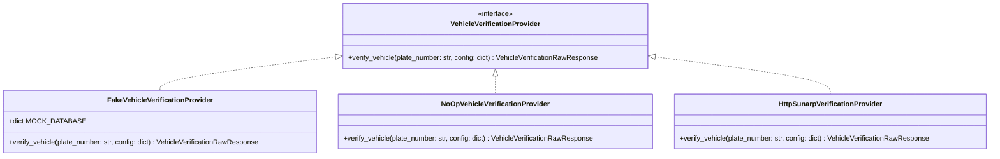

# Adaptador de Proveedores y Proveedores Fakes (`VehicleVerificationProvider`)

## 1. Descripción General

Para asegurar que las pruebas unitarias, pruebas de integración y entornos de desarrollo sean **100% deterministas, aislados y libres de dependencias HTTP externas**, la Fase 028 define el patrón **Adapter / Strategy** mediante la interfaz abstracta `VehicleVerificationProvider`.

Se suministran dos adaptadores deterministas:
1. `FakeVehicleVerificationProvider`: Simula respuestas realistas de SUNARP, MTC y SOAT basándose en diccionarios preconfigurados o patrones de prueba según la placa consultada.
2. `NoOpVehicleVerificationProvider`: Retorna un payload neutro sin error para escenarios donde la verificación se desactiva explícitamente.

---

## 2. Diagrama de Clases del Patrón Provider



---

## 3. Especificación de la Interfaz y Proveedores Fake

```python
from abc import ABC, abstractmethod
from dataclasses import dataclass
from typing import Dict, Any, Optional
from datetime import datetime, timezone

@dataclass
class VehicleVerificationRawResponse:
    source_code: str
    plate_number: str
    is_success: bool
    status_code: int
    raw_payload: Dict[str, Any]
    error_message: Optional[str] = None
    execution_time_ms: int = 15

class VehicleVerificationProvider(ABC):
    """
    Interfaz abstracta para proveedores de verificación vehicular.
    """

    @abstractmethod
    def verify_vehicle(self, plate_number: str, provider_config: Dict[str, Any]) -> VehicleVerificationRawResponse:
        pass


class FakeVehicleVerificationProvider(VehicleVerificationProvider):
    """
    Proveedor determinista para pruebas automatizadas y entorno local/staging.
    """

    # Banco de datos mock determinista indexado por placa
    MOCK_DATABASE: Dict[str, Dict[str, Any]] = {
        "ABC-123": {
            "vin": "1HGCR2F83HA001234",
            "engine_number": "ENG-982104",
            "make": "TOYOTA",
            "model": "HILUX",
            "manufacturing_year": 2022,
            "owner_name": "JUAN PEREZ ZURITA",
            "owner_document": "45892011",
            "soat_status": "ACTIVE",
            "soat_policy": "POL-981240",
            "citv_status": "PASSED"
        },
        "XYZ-999": {
            "vin": "VIN-MISMATCH-99999",
            "engine_number": "ENG-INVALID",
            "make": "NISSAN",
            "model": "FRONTIER",
            "manufacturing_year": 2018,
            "owner_name": "EMPRESA TRUCHA SAC",
            "owner_document": "20601234567",
            "soat_status": "EXPIRED",
            "soat_policy": "POL-EXPIRED-00",
            "citv_status": "EXPIRED"
        }
    }

    def verify_vehicle(self, plate_number: str, provider_config: Dict[str, Any]) -> VehicleVerificationRawResponse:
        clean_plate = plate_number.upper().strip()
        
        if clean_plate in self.MOCK_DATABASE:
            data = self.MOCK_DATABASE[clean_plate]
            return VehicleVerificationRawResponse(
                source_code=provider_config.get("source_code", "FAKE_PROVIDER"),
                plate_number=clean_plate,
                is_success=True,
                status_code=200,
                raw_payload=data,
                execution_time_ms=12
            )
        
        # Respuesta por defecto para placas no catalogadas
        return VehicleVerificationRawResponse(
            source_code=provider_config.get("source_code", "FAKE_PROVIDER"),
            plate_number=clean_plate,
            is_success=True,
            status_code=200,
            raw_payload={
                "vin": f"VIN{clean_plate.replace('-', '')}00000",
                "engine_number": f"ENG{clean_plate.replace('-', '')}",
                "make": "VOLVO",
                "model": "FH16",
                "manufacturing_year": 2021,
                "owner_name": "TRANSPORTES GENERICOS EIRL",
                "owner_document": "20100011122",
                "soat_status": "ACTIVE",
                "soat_policy": "POL-DEF-100",
                "citv_status": "PASSED"
            },
            execution_time_ms=10
        )


class NoOpVehicleVerificationProvider(VehicleVerificationProvider):
    """
    Proveedor nulo que retorna una verificación deshabilitada sin efecto.
    """

    def verify_vehicle(self, plate_number: str, provider_config: Dict[str, Any]) -> VehicleVerificationRawResponse:
        return VehicleVerificationRawResponse(
            source_code="NOOP",
            plate_number=plate_number,
            is_success=True,
            status_code=200,
            raw_payload={"status": "BYPASSED", "message": "No-Op provider executed"},
            execution_time_ms=1
        )
```
