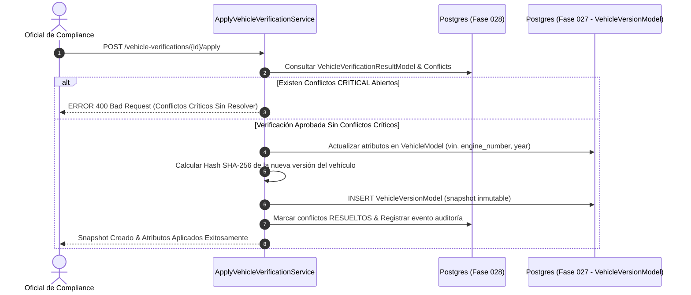

# Aplicación Controlada de Verificaciones y Snapshots Inmutables (`ApplyVehicleVerificationService`)

## 1. Descripción General

El servicio **`ApplyVehicleVerificationService`** gestiona la transferencia controlada de los atributos validados en un resultado de verificación hacia el Maestro de Vehículos (`VehicleModel` de la Fase 027).

Para preservar la auditoría y cumplir con los principios de inmutabilidad del ERP, la actualización de datos **NUNCA destruye ni sobreescribe sin dejar rastro**. Cada aplicación exitosa produce automáticamente un nuevo snapshot en la tabla `logistics_vehicle_versions` (`VehicleVersionModel`), sellándolo con un hash **SHA-256** que certifica la versión histórica del vehículo tras la verificación.

---

## 2. Diagrama del Proceso de Aplicación y Snapshot



---

## 3. Especificación del Servicio `ApplyVehicleVerificationService`

```python
import json
import hashlib
from typing import Dict, Any, List
from uuid import UUID
from datetime import datetime, timezone

from sqlalchemy.orm import Session
from app.models.logistics.vehicle import VehicleModel, VehicleVersionModel
from app.models.logistics.vehicle_verification import (
    VehicleVerificationModel,
    VehicleVerificationResultModel,
    VehicleVerificationConflictModel
)

class ApplyVehicleVerificationService:
    """
    Servicio responsable de aplicar los datos verificados al Maestro de Vehículos 
    y congelar un snapshot inmutable en VehicleVersionModel.
    """

    @classmethod
    def apply_verification(
        cls, 
        db: Session, 
        verification_id: UUID, 
        applied_by_user_id: UUID
    ) -> VehicleVersionModel:
        
        # 1. Obtener la verificación y su resultado
        verification = db.query(VehicleVerificationModel).filter_by(id=verification_id).one()
        result = db.query(VehicleVerificationResultModel).filter_by(verification_id=verification_id).one()
        vehicle = db.query(VehicleModel).filter_by(id=verification.vehicle_id).one()

        # 2. Validar que no existan conflictos CRÍTICAL abiertos
        open_critical_conflicts = db.query(VehicleVerificationConflictModel).filter(
            VehicleVerificationConflictModel.verification_id == verification_id,
            VehicleVerificationConflictModel.severity == "CRITICAL",
            VehicleVerificationConflictModel.status == "OPEN"
        ).count()

        if open_critical_conflicts > 0:
            raise ValueError(
                f"CANNOT_APPLY_VERIFICATION: Existen {open_critical_conflicts} conflictos CRÍTICOS abiertos. "
                "Resuelva las discrepancias de VIN o Póliza antes de aplicar los datos."
            )

        raw_payload = result.raw_payload or {}

        # 3. Aplicar atributos verificados al vehículo
        applied_fields = []
        if "vin" in raw_payload and raw_payload["vin"]:
            vehicle.vin = raw_payload["vin"]
            applied_fields.append("vin")

        if "engine_number" in raw_payload and raw_payload["engine_number"]:
            vehicle.engine_number = raw_payload["engine_number"]
            applied_fields.append("engine_number")

        if "manufacturing_year" in raw_payload and raw_payload["manufacturing_year"]:
            vehicle.manufacturing_year = int(raw_payload["manufacturing_year"])
            applied_fields.append("manufacturing_year")

        vehicle.updated_at = datetime.now(timezone.utc)

        # 4. Generar snapshot inmutable (VehicleVersionModel - Fase 027)
        previous_version = db.query(VehicleVersionModel).filter_by(
            vehicle_id=vehicle.id
        ).order_by(VehicleVersionModel.version_number.desc()).first()

        next_version_number = (previous_version.version_number + 1) if previous_version else 1

        snapshot_data = {
            "vehicle_id": str(vehicle.id),
            "version_number": next_version_number,
            "plate_number": vehicle.display_plate,
            "vin": vehicle.vin,
            "engine_number": vehicle.engine_number,
            "manufacturing_year": vehicle.manufacturing_year,
            "applied_verification_id": str(verification_id),
            "applied_fields": applied_fields,
            "applied_at": datetime.now(timezone.utc).isoformat(),
            "applied_by": str(applied_by_user_id)
        }

        # Canonicalización y hash SHA-256
        snapshot_json = json.dumps(snapshot_data, sort_keys=True, separators=(',', ':'))
        version_hash = hashlib.sha256(snapshot_json.encode('utf-8')).hexdigest()

        version_snapshot = VehicleVersionModel(
            vehicle_id=vehicle.id,
            version_number=next_version_number,
            snapshot_data=snapshot_data,
            version_hash=version_hash,
            change_reason=f"Aplicación de Verificación Vehicular #{verification.verification_number}",
            created_by=applied_by_user_id
        )

        db.add(version_snapshot)

        # 5. Marcar los conflictos de menor severidad como resueltos por actualización
        db.query(VehicleVerificationConflictModel).filter(
            VehicleVerificationConflictModel.verification_id == verification_id,
            VehicleVerificationConflictModel.status == "OPEN"
        ).update({
            "status": "RESOLVED_UPDATED",
            "resolution_comment": f"Auto-resuelto al aplicar verificación #{verification.verification_number}",
            "resolved_by": applied_by_user_id,
            "resolved_at": datetime.now(timezone.utc)
        }, synchronize_session=False)

        db.commit()
        db.refresh(version_snapshot)
        return version_snapshot
```
