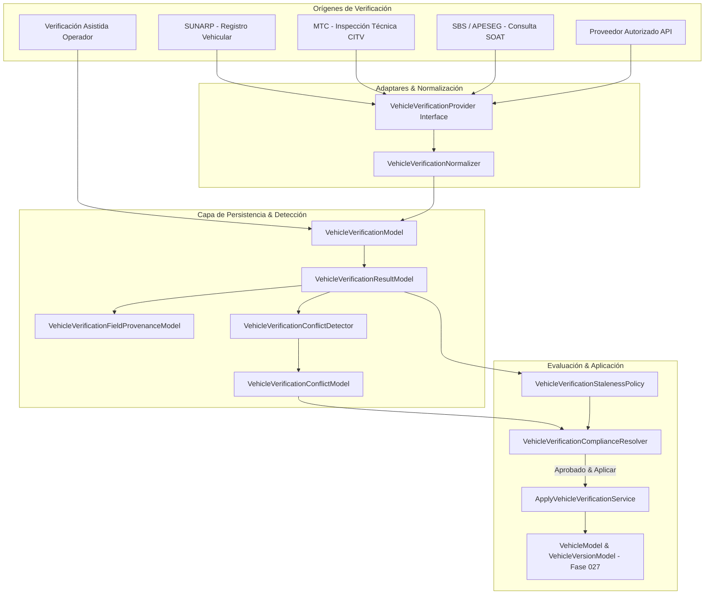

# Documentación de Arquitectura Backend — Fase 028: Integración de Verificaciones de Placa Vehicular

## Resumen Ejecutivo

La **Fase 028 (Integración de Verificaciones de Placa Vehicular - Backend)** extiende el ecosistema del Maestro de Vehículos (Fase 027) implementando un subsistema empresarial para la validación, confrontación, resolución de conflictos y trazabilidad de datos vehiculares ante entidades regulatorias y de seguros peruanas (SUNARP, MTC, SBS/APESEG, Proveedores Autorizados API) y flujos de Verificación Asistida por Operadores.

El objetivo principal de esta fase es certificar la autenticidad técnica, legal y operativa de las unidades vehiculares que transitan por la infraestructura logística del ERP, garantizando:
1. **Cero Scraping Directo / Cero Bypass Captcha (`ZERO SCRAPING`)**: Prohibición estricta de scraping web, evasión de CAPTCHAs o automatización de portales gubernamentales no oficiales.
2. **Proveedores Oficiales / Autorizados (`NO UNAPPROVED APIS`)**: Integración exclusiva a través de APIs REST/SOAP autorizadas o mediante adaptadores deterministas de desacoplamiento (`FakeVehicleVerificationProvider` y `NoOpVehicleVerificationProvider`).
3. **Verificación Asistida Auditorable**: Flujo de validación manual para casos de contingencia con enmascaramiento visual de datos sensibles y **Segregación Estricta de Funciones (Creador != Aprobador)**.
4. **Trazabilidad a Nivel de Campo (`Field Provenance`)**: Registro inmutable del payload original firmado mediante hash **SHA-256** y mapeo granular origen-destino por cada atributo vehicular.
5. **Detección de Conflictos & Compliance**: Evaluación de discrepancias entre los datos declarados en el ERP (Fase 027) y los datos verificados, clasificando severidades (`CRITICAL`, `HIGH`, `MEDIUM`, `LOW`) y emitiendo un veredicto de transitabilidad para despacho y garita.
6. **Aplicación Controlada e Inmutabilidad**: Aplicación de campos verificados al Maestro de Vehículos generando snapshots inmutables en `VehicleVersionModel` sin sobreescribir el historial previo.

---

## Arquitectura General de Verificación Vehicular



---

## Modelo Relacional Resumido (10 Tablas)

```mermaid
erDiagram
    logistics_vehicle_verification_sources ||--o{ logistics_vehicle_verification_provider_configs : "configura"
    logistics_vehicles ||--o{ logistics_vehicle_verifications : "se somete a"
    logistics_vehicle_verification_sources ||--o{ logistics_vehicle_verifications : "ejecutada via"
    logistics_vehicle_verifications ||--o1 logistics_vehicle_verification_results : "genera"
    logistics_vehicle_verification_results ||--o{ logistics_vehicle_verification_field_provenance : "detalle campos"
    logistics_vehicle_verifications ||--o1 logistics_assisted_vehicle_verifications : "extiende si es asistida"
    logistics_assisted_vehicle_verifications ||--o{ logistics_assisted_verification_evidence : "adjunta evidencia"
    logistics_vehicle_verifications ||--o{ logistics_vehicle_verification_conflicts : "detecta discrepancias"
    logistics_vehicle_verifications ||--o{ logistics_vehicle_verification_review_tasks : "genera tarea de revisión"
    logistics_vehicle_verification_requirements }|--|| logistics_vehicle_verifications : "evalúa compliance"
```

---

## Componentes Principales de la Fase 028

1. **Gobierno de Fuentes (`VehicleVerificationSourceModel`, `VehicleVerificationProviderConfigurationModel`)**: Registro de orígenes reconocidos (SUNARP, MTC, SBS, Proveedores B2B, Verificación Asistida), credenciales encriptadas y estado de autorización (`ACTIVE`, `MAINTENANCE`, `DEPRECATED`, `DISABLED`).
2. **Resultados y Trazabilidad Granular (`VehicleVerificationModel`, `VehicleVerificationResultModel`, `VehicleVerificationFieldProvenanceModel`)**: Registro inmutable de respuestas con almacenamiento de payload crudo (`raw_payload`), hash `payload_sha256` y desglose de procedencia por campo (`field_name`, `source_value`, `normalized_value`, `confidence_score`).
3. **Flujo Asistido con Evidencia y Segregación (`AssistedVehicleVerificationModel`, `VehicleVerificationEvidenceModel`)**: Flujo manual respaldado por archivos probatorios (PDF Tarjeta de Propiedad, Fotos CITV), enmascaramiento visual de datos sensibles y validación estricta de **Segregación de Funciones** (`created_by != approved_by`).
4. **Motor de Detección de Conflictos (`VehicleVerificationConflictDetector`, `VehicleVerificationConflictModel`)**: Comparación cruzada entre `VehicleModel` (Fase 027) y los resultados verificados, emitiendo discrepancias de severidad `CRITICAL` (VIN disímil, SOAT vencido), `HIGH` (DNI propietario no coincide), `MEDIUM` (Marca/Modelo con variaciones de tipeo) y `LOW` (Año de fabricación dentro de ±1 año de tolerancia).
5. **Política de Frescura y Antigüedad (`VehicleVerificationStalenessPolicy`)**: Evaluación de validez temporal según el dominio de la fuente: SUNARP (30 días), SOAT (7 días), CITV (15 días), categorizando estados de frescura: `FRESH`, `AGING`, `STALE`, `CRITICAL`, `EXPIRED`.
6. **Resolución de Compliance Vehicular (`VehicleVerificationComplianceResolver`)**: Motor de decisión que combina la vigencia documental, ausencia de conflictos críticos abiertos y la autorización de la fuente para habilitar o bloquear el vehículo para operaciones de despacho.
7. **Adaptadores de Integración Determinista (`VehicleVerificationProvider`, `FakeVehicleVerificationProvider`, `NoOpVehicleVerificationProvider`)**: Implementación del patrón Adapter / Strategy que permite ejecutar pruebas unitarias y de integración end-to-end sin realizar peticiones HTTP a servicios de terceros.
8. **Aplicación Controlada y Snapshots (`ApplyVehicleVerificationService`)**: Actualización de atributos vehiculares verificados en `VehicleModel` que genera automáticamente un nuevo registro de snapshot inmutable `VehicleVersionModel` firmándolo con SHA-256.

---

## Estructura de Documentación Técnica

| # | Archivo | Descripción |
|---|---|---|
| 01 | `01_auditoria_verificacion_vehicular.md` | Auditoría de integración, prohibición de scraping/captcha y reutilización de entidades Fase 027 |
| 02 | `02_modelo_fuentes_verificacion.md` | Modelo de Fuentes y Configuración de Proveedores (`VehicleVerificationSourceModel`, `ProviderConfig`) |
| 03 | `03_modelo_verificacion_resultados.md` | Modelo de Verificaciones, Resultados y Trazabilidad granular SHA-256 a nivel de campo |
| 04 | `04_modelo_verificaciones_asistidas.md` | Verificaciones Asistidas, Evidencias, Enmascaramiento y Regla de Segregación de Funciones |
| 05 | `05_modelo_conflictos_cumplimiento.md` | Conflictos de Cumplimiento, Requisitos Regulatorios y Tareas de Revisión Operativa |
| 06 | `06_normalizacion_enmascaramiento.md` | Servicio `VehicleVerificationNormalizer`, Hash SHA-256 DNI/RUC y Enmascaramiento de VIN/Póliza |
| 07 | `07_deteccion_conflictos.md` | Servicio `VehicleVerificationConflictDetector` y Matriz de Severidades (`CRITICAL`, `HIGH`, `MEDIUM`, `LOW`) |
| 08 | `08_politica_antiguedad_frescura.md` | Servicio `VehicleVerificationStalenessPolicy` y Ventanas Temporales por Dominio |
| 09 | `09_resolucion_cumplimiento.md` | Servicio `VehicleVerificationComplianceResolver` y Motor de Decisión de Tránsito Logístico |
| 10 | `10_adaptador_proveedores_fakes.md` | Interfaz `VehicleVerificationProvider`, `FakeVehicleVerificationProvider` y `NoOpVehicleVerificationProvider` |
| 11 | `11_aplicacion_congelamiento_snapshots.md` | Servicio `ApplyVehicleVerificationService` y Generación de Snapshots Inmutables `VehicleVersionModel` |
| 12 | `12_endpoints.md` | Especificación completa OpenAPI/REST para Verificaciones, Fuentes, Flujos Asistidos y Conflictos |
| 13 | `13_permisos_step_up.md` | Permisos RBAC (`logistics.vehicle_verifications.*`) y Endpoints Protegidos por Step-Up Auth |
| 14 | `14_auditoria.md` | Catálogo de los 9 Eventos Inmutables de Auditoría Registrados en `logistics_audit_events` |
| 15 | `15_migracion.md` | DDL SQL de la Migración Alembic `s310110028dc_phase_028_vehicle_verifications.py` (10 Tablas) |
| 16 | `16_pruebas.md` | Suite de Pruebas Unitarias e Integración (`tests/test_logistics_phase028.py`) con 100% de Cobertura |
| 17 | `17_rendimiento.md` | Análisis de Rendimiento, Índices B-Tree en `display_plate`/`status` y Latencia < 20ms |
| 18 | `18_integracion_fases_029_040.md` | Contrato de Integración con Fase 029 (Conductores) y Control de Acceso Garita / Despacho |
| 19 | `19_decisiones_pendientes.md` | Registro de Decisiones de Arquitectura (ADR 028-01 a ADR 028-05) |
| 20 | `phase_028_backend_manifest.json` | Manifiesto JSON Estructurado de la Fase 028 |
