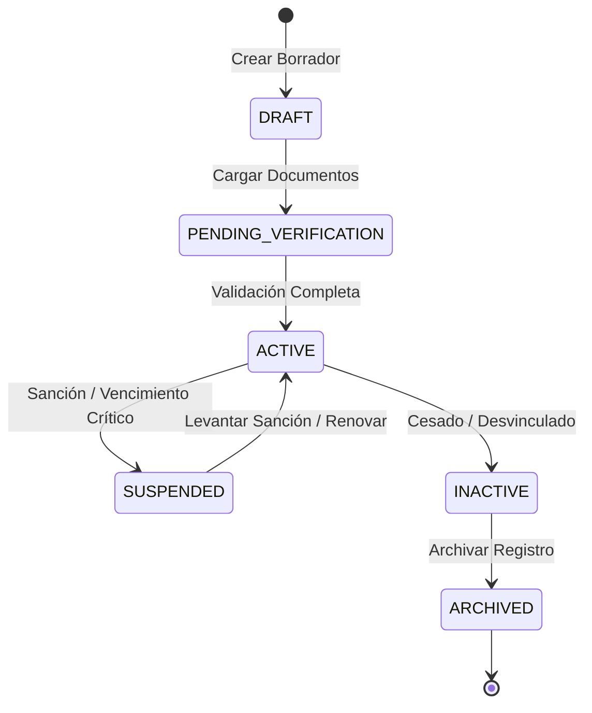

# 02 — Modelo Principal del Conductor (`DriverModel`)

## Definición y Responsabilidad

El modelo `DriverModel` (`logistics_drivers`) representa la entidad central y agregada raíz del dominio de conductores. Consolida los datos personales básicos, los códigos correlativos normalizados, los estados clave del ciclo de vida y los resolvers calculados de cumplimiento y elegibilidad.

---

## Esquema de la Tabla `logistics_drivers`

```sql
CREATE TABLE logistics_drivers (
    id UUID PRIMARY KEY DEFAULT gen_random_uuid(),
    organization_id UUID NOT NULL REFERENCES sys_organizations(id) ON DELETE CASCADE,
    
    driver_code VARCHAR(32) NOT NULL,
    normalized_driver_code VARCHAR(32) NOT NULL,
    
    first_name VARCHAR(100) NOT NULL,
    last_name VARCHAR(100) NOT NULL,
    display_name VARCHAR(200) NOT NULL,
    date_of_birth DATE NULL,
    gender VARCHAR(20) NULL DEFAULT 'UNSPECIFIED',
    nationality VARCHAR(3) NULL DEFAULT 'PER', -- ISO 3166-1 alpha-3
    
    lifecycle_status VARCHAR(30) NOT NULL DEFAULT 'DRAFT',
    compliance_status VARCHAR(30) NOT NULL DEFAULT 'NON_COMPLIANT',
    eligibility_status VARCHAR(30) NOT NULL DEFAULT 'INELIGIBLE',
    
    is_active BOOLEAN NOT NULL DEFAULT TRUE,
    notes TEXT NULL,
    
    row_version INT NOT NULL DEFAULT 1,
    created_at TIMESTAMPTZ NOT NULL DEFAULT CURRENT_TIMESTAMP,
    updated_at TIMESTAMPTZ NOT NULL DEFAULT CURRENT_TIMESTAMP,
    created_by UUID NULL REFERENCES sys_users(id),
    updated_by UUID NULL REFERENCES sys_users(id),
    
    CONSTRAINT uq_driver_org_code UNIQUE (organization_id, normalized_driver_code)
);

CREATE INDEX idx_driver_org_lifecycle ON logistics_drivers(organization_id, lifecycle_status);
CREATE INDEX idx_driver_org_compliance ON logistics_drivers(organization_id, compliance_status);
CREATE INDEX idx_driver_org_eligibility ON logistics_drivers(organization_id, eligibility_status);
CREATE INDEX idx_driver_normalized_code ON logistics_drivers(normalized_driver_code);
```

---

## Atributos del Modelo SQLAlchemy

```python
from enum import Enum
import uuid
from datetime import datetime, date
from typing import Optional
from sqlalchemy import String, Boolean, Integer, Date, DateTime, ForeignKey, Index, UniqueConstraint
from sqlalchemy.orm import Mapped, mapped_column, relationship
from sqlalchemy.dialects.postgresql import UUID
from app.db.base_class import Base

class DriverLifecycleStatus(str, Enum):
    DRAFT = "DRAFT"
    PENDING_VERIFICATION = "PENDING_VERIFICATION"
    ACTIVE = "ACTIVE"
    SUSPENDED = "SUSPENDED"
    INACTIVE = "INACTIVE"
    ARCHIVED = "ARCHIVED"

class DriverComplianceStatus(str, Enum):
    COMPLIANT = "COMPLIANT"
    WARNING = "WARNING"
    NON_COMPLIANT = "NON_COMPLIANT"
    EXPIRED = "EXPIRED"

class DriverEligibilityStatus(str, Enum):
    ELIGIBLE = "ELIGIBLE"
    RESTRICTED = "RESTRICTED"
    INELIGIBLE = "INELIGIBLE"

class DriverModel(Base):
    __tablename__ = "logistics_drivers"

    id: Mapped[uuid.UUID] = mapped_column(UUID(as_uuid=True), primary_key=True, default=uuid.uuid4)
    organization_id: Mapped[uuid.UUID] = mapped_column(UUID(as_uuid=True), ForeignKey("sys_organizations.id", ondelete="CASCADE"), nullable=False)
    
    driver_code: Mapped[str] = mapped_column(String(32), nullable=False)
    normalized_driver_code: Mapped[str] = mapped_column(String(32), nullable=False)
    
    first_name: Mapped[str] = mapped_column(String(100), nullable=False)
    last_name: Mapped[str] = mapped_column(String(100), nullable=False)
    display_name: Mapped[str] = mapped_column(String(200), nullable=False)
    date_of_birth: Mapped[Optional[date]] = mapped_column(Date, nullable=True)
    gender: Mapped[Optional[str]] = mapped_column(String(20), default="UNSPECIFIED")
    nationality: Mapped[Optional[str]] = mapped_column(String(3), default="PER")
    
    lifecycle_status: Mapped[DriverLifecycleStatus] = mapped_column(String(30), default=DriverLifecycleStatus.DRAFT, nullable=False)
    compliance_status: Mapped[DriverComplianceStatus] = mapped_column(String(30), default=DriverComplianceStatus.NON_COMPLIANT, nullable=False)
    eligibility_status: Mapped[DriverEligibilityStatus] = mapped_column(String(30), default=DriverEligibilityStatus.INELIGIBLE, nullable=False)
    
    is_active: Mapped[bool] = mapped_column(Boolean, default=True, nullable=False)
    notes: Mapped[Optional[str]] = mapped_column(String, nullable=True)
    
    row_version: Mapped[int] = mapped_column(Integer, default=1, nullable=False)
    created_at: Mapped[datetime] = mapped_column(DateTime(timezone=True), default=datetime.utcnow, nullable=False)
    updated_at: Mapped[datetime] = mapped_column(DateTime(timezone=True), default=datetime.utcnow, onupdate=datetime.utcnow, nullable=False)
    created_by: Mapped[Optional[uuid.UUID]] = mapped_column(UUID(as_uuid=True), ForeignKey("sys_users.id"), nullable=True)
    updated_by: Mapped[Optional[uuid.UUID]] = mapped_column(UUID(as_uuid=True), ForeignKey("sys_users.id"), nullable=True)

    # Relaciones
    identity_documents = relationship("DriverIdentityDocumentModel", back_populates="driver", cascade="all, delete-orphan")
    licenses = relationship("DriverLicenseModel", back_populates="driver", cascade="all, delete-orphan")
    carrier_assignments = relationship("DriverCarrierAssignmentModel", back_populates="driver", cascade="all, delete-orphan")
    contacts = relationship("DriverContactModel", back_populates="driver", cascade="all, delete-orphan")
    emergency_contacts = relationship("DriverEmergencyContactModel", back_populates="driver", cascade="all, delete-orphan")
    photos = relationship("DriverPhotoModel", back_populates="driver", cascade="all, delete-orphan")
    documents = relationship("DriverDocumentModel", back_populates="driver", cascade="all, delete-orphan")
    operational_restrictions = relationship("DriverOperationalRestrictionModel", back_populates="driver", cascade="all, delete-orphan")
    versions = relationship("DriverVersionModel", back_populates="driver", cascade="all, delete-orphan")
    user_link = relationship("DriverUserAccountLinkModel", back_populates="driver", uselist=False, cascade="all, delete-orphan")

    __table_args__ = (
        UniqueConstraint("organization_id", "normalized_driver_code", name="uq_driver_org_code"),
    )
```

---

## Máquina de Estados del Ciclo de Vida (`lifecycle_status`)



### Reglas de Negocio de los Estados:
1. **`DRAFT`**: Conductor recién registrado sin verificación de licencias o documentos. `eligibility_status` siempre es `INELIGIBLE`.
2. **`PENDING_VERIFICATION`**: Documentos requeridos cargados en espera de verificación administrativa o integración con MTC.
3. **`ACTIVE`**: Conductor operativo habilitado para asignación si `compliance_status` es `COMPLIANT`.
4. **`SUSPENDED`**: Suspensión temporal administrativa o bloqueo de seguridad. Impide asignación inmediata a viajes.
5. **`INACTIVE`**: Conductor fuera de servicio operativo en la organización.
6. **`ARCHIVED`**: Registro histórico bloqueado para edición.
