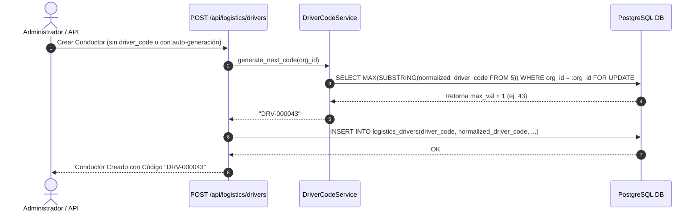

# 03 — Norma y Servicio del Código de Conductor (`DriverCodeService`)

## Formato Estándar del Código

Cada conductor posee un identificador de negocio único por organización con el formato de prefijo correlativo **`DRV-XXXXXX`** (ejemplo: `DRV-000001`, `DRV-000042`, `DRV-001500`).

### Reglas del Código:
1. **Prefijo Obligatorio**: `DRV-` (en mayúsculas).
2. **Correlativo**: Secuencia de 6 dígitos numéricos rellenada con ceros a la izquierda (`%06d`).
3. **Unicidad Scope por Organización**: Dos organizaciones distintas pueden tener el código `DRV-000001`, pero dentro de la misma organización es estrictamente único (`UNIQUE(organization_id, normalized_driver_code)`).
4. **Normalización**: Stripping de espacios, conversión a mayúsculas y eliminación de caracteres no alfanuméricos salvo el guion medio.

---

## Servicio `DriverCodeService`

El servicio `DriverCodeService` gestiona la generación atómica y segura ante concurrencia del código correlativo utilizando secuencias PostgreSQL por organización o bloqueos optimistas.

```python
import re
import uuid
from typing import Optional
from sqlalchemy import select, func, text
from sqlalchemy.ext.asyncio import AsyncSession
from app.models.logistics.driver import DriverModel

class DriverCodeService:
    CODE_PREFIX = "DRV-"
    CODE_REGEX = re.compile(r"^DRV-\d{6}$")

    @classmethod
    def normalize_code(cls, raw_code: str) -> str:
        """
        Normaliza cualquier código de conductor eliminando espacios y convirtiendo a mayúsculas.
        """
        if not raw_code:
            raise ValueError("El código de conductor no puede estar vacío.")
        cleaned = raw_code.strip().upper()
        # Asegura sustitución de espacios internos por guiones si aplicara
        return cleaned

    @classmethod
    def validate_code_format(cls, code: str) -> bool:
        """
        Valida que el código cumpla la expresión regular DRV-\d{6}.
        """
        return bool(cls.CODE_REGEX.match(code))

    @classmethod
    async def generate_next_code(cls, db: AsyncSession, organization_id: uuid.UUID) -> str:
        """
        Genera de forma atómica el siguiente código correlativo disponible para la organización.
        Utiliza una consulta con bloqueo de tabla de conteo o max correlativo.
        """
        # Consulta el valor máximo numérico existente para la organización
        stmt = text("""
            SELECT COALESCE(
                MAX(
                    CAST(SUBSTRING(normalized_driver_code FROM 5) AS INTEGER)
                ), 0
            ) + 1
            FROM logistics_drivers
            WHERE organization_id = :org_id
              AND normalized_driver_code ~ '^DRV-[0-9]{6}$'
        """)
        
        result = await db.execute(stmt, {"org_id": organization_id})
        next_val = result.scalar() or 1
        
        formatted_code = f"{cls.CODE_PREFIX}{next_val:06d}"
        return formatted_code
```

---

## Diagrama de Secuencia de Generación de Código



---

## Manejo de Colisiones y Resiliencia

En caso de inserción concurrente simultánea en la misma organización:
1. La restricción de unicidad de base de datos `uq_driver_org_code` arrojará un error `IntegrityError` (código SQL 23505).
2. El servicio atrapa la excepción `IntegrityError`, realiza un reintento automático de generación (hasta 3 reintentos) invocando nuevamente `generate_next_code`.
3. Esto garantiza un comportamiento 100% resiliente y consistente sin huecos accidentales ni bloqueos muertos (deadlocks).
