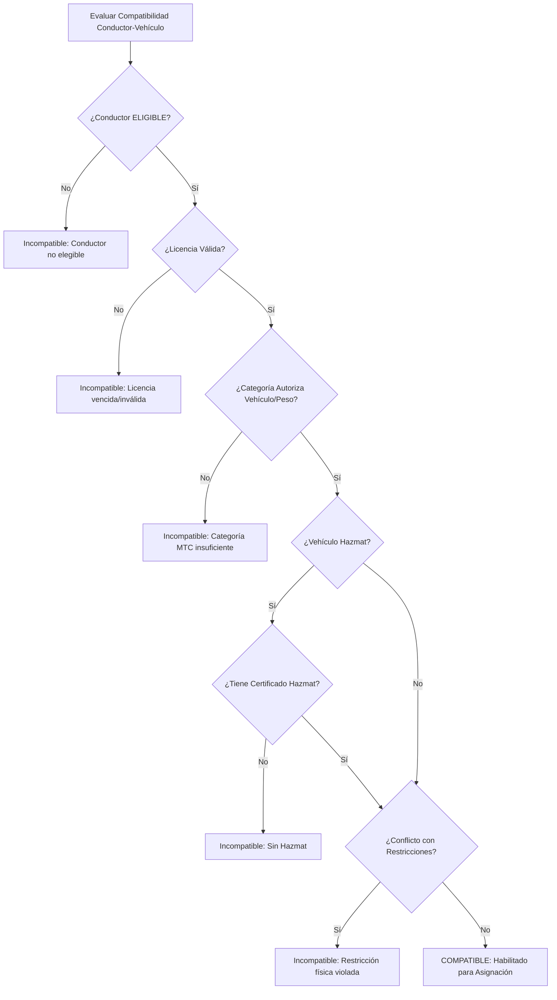

# 08 — Matriz de Compatibilidad Conductor-Vehículo (`EvaluateDriverVehicleCompatibility`)

## Matriz de Reglas de Compatibilidad (`DriverLicenseVehicleTypeRuleModel`)

Para garantizar que un conductor opere únicamente vehículos para los cuales su categoría de licencia esté legalmente facultada por el MTC, se implementa el modelo `DriverLicenseVehicleTypeRuleModel` (`logistics_driver_license_vehicle_rules`) y el servicio evaluador `EvaluateDriverVehicleCompatibility`.

---

## Esquema SQL de `logistics_driver_license_vehicle_rules`

```sql
CREATE TABLE logistics_driver_license_vehicle_rules (
    id UUID PRIMARY KEY DEFAULT gen_random_uuid(),
    license_category_code VARCHAR(20) NOT NULL, -- A-I, A-IIa, A-IIb, A-IIIa, A-IIIb, A-IIIc
    vehicle_type VARCHAR(50) NOT NULL, -- PICKUP, LIGHT_TRUCK, HEAVY_TRUCK, TRAILER, BUS, VAN
    
    is_allowed BOOLEAN NOT NULL DEFAULT TRUE,
    max_gross_weight_kg NUMERIC(10, 2) NULL, -- Peso bruto vehicular máximo (ej. 3500 kg para A-I, 12000 kg para A-IIb)
    max_passenger_capacity INT NULL, -- Capacidad de pasajeros máxima (ej. 8 para A-I, 16 para A-IIa/b)
    requires_hazmat BOOLEAN NOT NULL DEFAULT FALSE,
    
    is_active BOOLEAN NOT NULL DEFAULT TRUE,
    created_at TIMESTAMPTZ NOT NULL DEFAULT CURRENT_TIMESTAMP,
    
    CONSTRAINT uq_cat_vehicle_rule UNIQUE (license_category_code, vehicle_type)
);

CREATE INDEX idx_rule_cat_vehicle ON logistics_driver_license_vehicle_rules(license_category_code, vehicle_type);
```

---

## Servicio Evaluador `EvaluateDriverVehicleCompatibility`

```python
from dataclasses import dataclass
from typing import List, Optional
import uuid
from sqlalchemy import select
from sqlalchemy.ext.asyncio import AsyncSession

from app.models.logistics.driver import DriverModel, DriverEligibilityStatus
from app.models.logistics.vehicle import VehicleModel # Integración Fase 027

@dataclass
class CompatibilityEvaluationResult:
    is_compatible: bool
    reason: str
    missing_category: Optional[str] = None
    requires_hazmat_cert: bool = False
    restriction_conflicts: List[str] = None

class EvaluateDriverVehicleCompatibility:
    
    @classmethod
    async def evaluate(
        cls,
        db: AsyncSession,
        driver: DriverModel,
        vehicle: VehicleModel
    ) -> CompatibilityEvaluationResult:
        """
        Evalúa determinísticamente si un conductor está habilitado legal y técnicamente para conducir un vehículo específico.
        """
        # 1. Verificar elegibilidad operativa del conductor
        if driver.eligibility_status != DriverEligibilityStatus.ELIGIBLE:
            return CompatibilityEvaluationResult(
                is_compatible=False,
                reason=f"El conductor no posee estado ELIGIBLE (Estado actual: {driver.eligibility_status.value})."
            )
            
        # 2. Obtener licencias válidas del conductor
        primary_license = next((lic for lic in driver.licenses if lic.is_primary and lic.status == "VALID"), None)
        if not primary_license:
            return CompatibilityEvaluationResult(
                is_compatible=False,
                reason="El conductor no posee una licencia de conducir primaria válida."
            )
            
        # Obtener códigos de categoría asignados a la licencia
        assigned_category_codes = [assign.category.code for assign.category_assignments if assign.category.is_active]
        
        # Si el conductor posee A-IIIc, cubre todas las categorías convencionales de carga y pasajeros
        if "A-IIIc" in assigned_category_codes:
            has_unrestricted_category = True
        else:
            has_unrestricted_category = False
            
        # 3. Consultar reglas de compatibilidad para el tipo de vehículo
        stmt = select(DriverLicenseVehicleTypeRuleModel).where(
            DriverLicenseVehicleTypeRuleModel.vehicle_type == vehicle.vehicle_type,
            DriverLicenseVehicleTypeRuleModel.is_active == True
        )
        res = await db.execute(stmt)
        rules = res.scalars().all()
        
        # Buscar si alguna categoría del conductor autoriza el tipo de vehículo y sus especificaciones (peso, pasajeros)
        is_rule_satisfied = False
        requires_hazmat = False
        
        for rule in rules:
            if rule.license_category_code in assigned_category_codes or has_unrestricted_category:
                # Validar restricciones de peso si aplica
                if rule.max_gross_weight_kg and vehicle.gross_weight_kg:
                    if vehicle.gross_weight_kg > rule.max_gross_weight_kg:
                        continue
                is_rule_satisfied = True
                requires_hazmat = rule.requires_hazmat
                break
                
        if not is_rule_satisfied:
            return CompatibilityEvaluationResult(
                is_compatible=False,
                reason=f"Ninguna de las categorías de licencia del conductor ({', '.join(assigned_category_codes)}) autoriza la conducción de un vehículo tipo {vehicle.vehicle_type}."
            )
            
        # 4. Validar certificado Hazmat si el vehículo o la carga lo requiere
        if vehicle.is_hazmat or requires_hazmat:
            has_hazmat_cert = any(
                doc for doc in driver.documents 
                if doc.document_type == "HAZMAT_CERTIFICATE" and doc.is_valid
            )
            if not has_hazmat_cert:
                return CompatibilityEvaluationResult(
                    is_compatible=False,
                    reason="El vehículo / ruta requiere acreditación de Materiales Peligrosos (Hazmat) y el conductor no posee un certificado válido.",
                    requires_hazmat_cert=True
                )
                
        # 5. Validar restricciones físicas incompatibles
        blocking_restrictions = [
            restr.code for restr in primary_license.restrictions 
            if restr.severity == "BLOCKING" and restr.is_active
        ]
        if "REST_AUTOMATIC_TRANS" in blocking_restrictions and vehicle.transmission_type == "MANUAL":
            return CompatibilityEvaluationResult(
                is_compatible=False,
                reason="El conductor posee la restricción 'Solo Transmisión Automática' y el vehículo es de transmisión Manual.",
                restriction_conflicts=["REST_AUTOMATIC_TRANS"]
            )
            
        return CompatibilityEvaluationResult(
            is_compatible=True,
            reason="Compatibilidad legal y técnica totalmente validada."
        )
```

---

## Flujo de Evaluación


