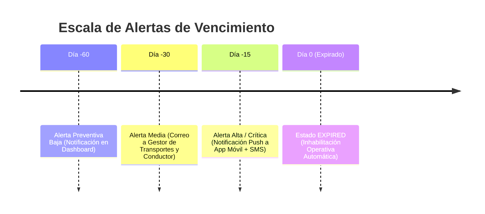

# 18 — Servicio de Alertas de Vencimiento (`DriverExpirationAlertService`)

## Propósito del Servicio de Alertas

Para evitar interrupciones operativas derivadas del vencimiento intempestivo de licencias de conducir o certificaciones obligatorias, el servicio **`DriverExpirationAlertService`** calcula proactivamente el riesgo de expiración proyectado a 60, 30, 15 y 7 días.

---

## Escalado de Ventanas de Advertencia



---

## Estrategia de Ejecución Asíncrona (Celery / Background Tasks)

Un job diario programado (`cron: 0 2 * * *` a las 02:00 AM UTC) escanea la base de datos evaluando licencias y documentos:

```python
from dataclasses import dataclass
from datetime import date, timedelta
from typing import List
import uuid
from sqlalchemy import select
from sqlalchemy.ext.asyncio import AsyncSession

from app.models.logistics.driver_license import DriverLicenseModel
from app.models.logistics.driver_document import DriverDocumentModel

@dataclass
class ExpirationAlertItem:
    driver_id: uuid.UUID
    driver_code: str
    display_name: str
    item_type: str # LICENSE, HAZMAT_CERTIFICATE, MEDICAL_FITNESS, etc.
    identifier_masked: str
    expires_at: date
    days_remaining: int
    urgency_level: str # LOW (31-60d), MEDIUM (16-30d), HIGH (1-15d), EXPIRED (<=0d)

class DriverExpirationAlertService:

    @classmethod
    async def scan_expiring_items(
        cls,
        db: AsyncSession,
        organization_id: uuid.UUID,
        lookahead_days: int = 60
    ) -> List[ExpirationAlertItem]:
        """
        Escanea todas las licencias y documentos de la organización con vencimiento en los próximos lookahead_days.
        """
        today = date.today()
        max_date = today + timedelta(days=lookahead_days)
        alerts: List[ExpirationAlertItem] = []

        # 1. Escanear Licencias de Conducir
        stmt_lic = select(DriverLicenseModel).where(
            DriverLicenseModel.expires_at <= max_date,
            DriverLicenseModel.status == "VALID"
        )
        res_lic = await db.execute(stmt_lic)
        for lic in res_lic.scalars().all():
            if lic.driver.organization_id == organization_id:
                days_left = (lic.expires_at - today).days
                urgency = cls._calculate_urgency(days_left)
                alerts.append(ExpirationAlertItem(
                    driver_id=lic.driver_id,
                    driver_code=lic.driver.driver_code,
                    display_name=lic.driver.display_name,
                    item_type="LICENSE",
                    identifier_masked=lic.masked_license_number,
                    expires_at=lic.expires_at,
                    days_remaining=days_left,
                    urgency_level=urgency
                ))

        # 2. Escanear Documentos Adicionales
        stmt_doc = select(DriverDocumentModel).where(
            DriverDocumentModel.expires_at.isnot(None),
            DriverDocumentModel.expires_at <= max_date
        )
        res_doc = await db.execute(stmt_doc)
        for doc in res_doc.scalars().all():
            if doc.driver.organization_id == organization_id:
                days_left = (doc.expires_at - today).days
                urgency = cls._calculate_urgency(days_left)
                alerts.append(ExpirationAlertItem(
                    driver_id=doc.driver_id,
                    driver_code=doc.driver.driver_code,
                    display_name=doc.driver.display_name,
                    item_type=doc.document_type.value,
                    identifier_masked=doc.document_number or "N/A",
                    expires_at=doc.expires_at,
                    days_remaining=days_left,
                    urgency_level=urgency
                ))

        alerts.sort(key=lambda x: x.days_remaining)
        return alerts

    @staticmethod
    def _calculate_urgency(days_left: int) -> str:
        if days_left <= 0:
            return "EXPIRED"
        elif days_left <= 15:
            return "HIGH"
        elif days_left <= 30:
            return "MEDIUM"
        else:
            return "LOW"
```

---

## Canales de Notificación Emitidos

1. **`LOW`**: Evento registrado en el feed interno de notificaciones del portal web logístico.
2. **`MEDIUM`**: Correo electrónico automático estructurado en HTML enviado al Jefe de Transportes y al Conductor.
3. **`HIGH`**: Notificación Push a la app móvil del Conductor y alerta prioritaria en la consola de despacho de transporte.
4. **`EXPIRED`**: Evento crítico de cambio de estado a `EXPIRED` en el maestro del conductor.
