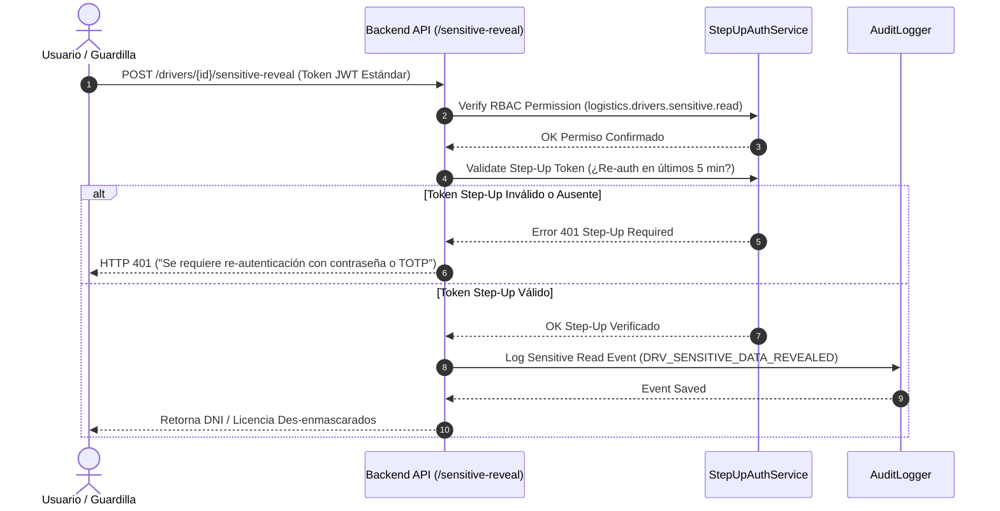

# 23 — Permisos RBAC y Autenticación Step-Up Security

## Matriz de Permisos RBAC (`logistics.drivers.*`)

El acceso a las funcionalidades y datos del Maestro de Conductores se controla granularmente mediante el sistema de **Role-Based Access Control (RBAC)** de la plataforma.

---

## Catálogo de Permisos

| Permiso | Descripción | Roles Típicos Asignados |
|---|---|---|
| **`logistics.drivers.read`** | Permite listar y consultar detalles de conductores con campos enmascarados (`*****153`). | Dispatcher, Logistics Clerk, Auditor, Safety Inspector |
| **`logistics.drivers.create`** | Registrar nuevos conductores en estado `DRAFT` o `PENDING_VERIFICATION`. | Fleet Manager, Logistics Admin |
| **`logistics.drivers.update`** | Editar datos de conductores, licencias y certificados. | Fleet Manager, Logistics Admin |
| **`logistics.drivers.delete`** | Archivar o desactivar registros de conductores. | System Admin, Logistics Manager |
| **`logistics.drivers.sensitive.read`** | Requerido para solicitar la unmasking/revelación de DNI y Licencia mediante Step-Up. | Compliance Officer, Security Chief |
| **`logistics.drivers.restrictions.manage`** | Aplicar bloqueos administrativos, sanciones y inhabilitaciones operativas. | Safety Chief, HR Manager |
| **`logistics.drivers.restrictions.revoke`** | Levantar / revocar sanciones operativas registradas. | Safety Chief, Logistics Director |

---

## Autenticación Step-Up Security para Datos Sensibles

La lectura de datos de identificación sin enmascarar (DNI y Licencia completos) exige un mecanismo de **Step-Up Authentication** para prevenir la exfiltración masiva de datos personales.

### Requisitos del Token Step-Up:
1. El usuario debe re-ingresar su contraseña o un código **MFA/TOTP (One-Time Password)** dentro de un endpoint de re-autenticación (`POST /api/auth/step-up`).
2. El servidor emite un token efímero firmado por clave privada con expiración de **300 segundos (5 minutos)**.
3. El token efímero debe ser enviado en el cuerpo o cabecera `X-Step-Up-Token` al consumir la revelación sensible.
