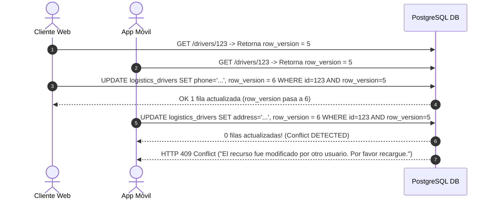

# 25 — Control de Concurrencia e Idempotencia

## Control de Concurrencia Optimista (`row_version`)

Para prevenir la pérdida de datos y sobreescrituras ciegas (*lost updates*) cuando múltiples operadores modifican simultáneamente el perfil de un conductor (ej. actualización de teléfono desde app móvil mientras el gestor actualiza licencias en el portal web), el modelo `DriverModel` implementa **Concurrencia Optimista basada en `row_version`**.

---

## Mecanismo de Funcionamiento de `row_version`



### Implementación en SQLAlchemy

```python
from fastapi import HTTPException, status
from sqlalchemy import update
from sqlalchemy.ext.asyncio import AsyncSession
from app.models.logistics.driver import DriverModel

async def update_driver_optimistic(
    db: AsyncSession,
    driver_id: uuid.UUID,
    expected_version: int,
    update_data: dict
) -> DriverModel:
    update_data["row_version"] = expected_version + 1
    
    stmt = (
        update(DriverModel)
        .where(
            DriverModel.id == driver_id,
            DriverModel.row_version == expected_version
        )
        .values(**update_data)
        .execution_options(synchronize_session="fetch")
    )
    result = await db.execute(stmt)
    
    if result.rowcount == 0:
        raise HTTPException(
            status_code=status.HTTP_409_CONFLICT,
            detail="Conflict: El perfil del conductor fue modificado por otra transacción. Actualice los datos e intente nuevamente."
        )
    await db.commit()
```

---

## Idempotencia mediante Cabecera `X-Idempotency-Key`

En operaciones mutables de creación o asignación masiva de documentos (`POST /api/logistics/drivers`), se requiere el envío de la cabecera estándar **`X-Idempotency-Key`** (UUID v4).

1. El middleware intercepta la cabecera `X-Idempotency-Key` y consulta la cache distribuida (Redis).
2. Si la clave ya fue procesada en los últimos 86,400 segundos (24 horas), retorna de forma inmediata el cuerpo de respuesta original grabado en Redis con código de estado HTTP 200/201.
3. Si es una nueva clave, procesa la transacción atómicamente y guarda el resultado en Redis antes de retornar.
