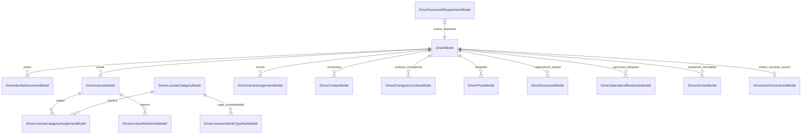
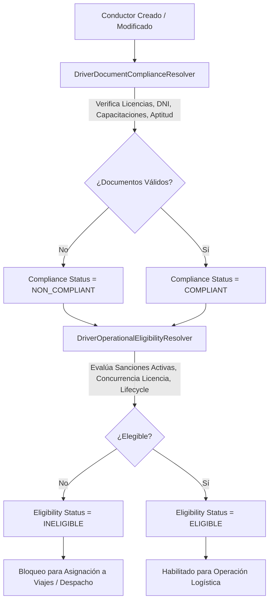

# Fase 029 — Maestro de Conductores (Driver Master Data)

## Resumen Ejecutivo

La **Fase 029** establece el **Maestro de Conductores (Driver Master Data)** dentro del ecosistema logístico de la plataforma empresarial. Su propósito es proveer una arquitectura limpia, robusta, altamente auditable y extensible para gestionar el ciclo de vida completo de los conductores (propios, de terceros o subcontratados), sus documentos de identidad, licencias de conducir con categorías MTC y restricciones, contactos de emergencia, fotografías con resguardo estricto de privacidad, certificaciones de capacitación (Manejo Defensivo, Hazmat), matriz de compatibilidad vehículo-conductor, matriz de cumplimiento documental y restricciones operativas/sanciones.

Esta arquitectura consta de **16 tablas de base de datos PostgreSQL** diseñadas bajo estrictos principios de separación de responsabilidades, concurrencia optimista mediante `row_version`, inmutabilidad histórica mediante versiones JSONB/SHA-256 y privacidad de datos sensibles (cumplimiento GDPR/LPDP Ley 29733 con enmascaramiento por defecto y permisos Step-Up).

---

## Diagrama de Arquitectura de Entidades (Mermaid ERD)

---

## Flujo General de Evaluación de Elegibilidad Operativa

---

## Resumen del Modelo de Datos (16 Tablas)

| # | Tabla / Modelo | Descripción Principal |
|---|---|---|
| 1 | `DriverModel` (`logistics_drivers`) | Entidad raíz del conductor, estado de ciclo de vida, cumplimiento y elegibilidad. |
| 2 | `DriverIdentityDocumentModel` (`logistics_driver_identity_documents`) | DNI, CE, Pasaporte con normalización y enmascaramiento (`*****678`). |
| 3 | `DriverLicenseModel` (`logistics_driver_licenses`) | Licencia de conducir MTC, número, vigencia y enmascaramiento (`****5678`). |
| 4 | `DriverLicenseCategoryModel` (`logistics_driver_license_categories`) | Catálogo maestro de categorías MTC (A-I, A-IIa, A-IIb, A-IIIa, A-IIIb, A-IIIc). |
| 5 | `DriverLicenseCategoryAssignmentModel` (`logistics_driver_license_category_assignments`) | Asignación M:N entre licencias y categorías autorizadas. |
| 6 | `DriverLicenseRestrictionModel` (`logistics_driver_license_restrictions`) | Restricciones de licencia (Uso de lentes, audífonos, vehículo automático, etc.). |
| 7 | `DriverLicenseVehicleTypeRuleModel` (`logistics_driver_license_vehicle_rules`) | Matriz de compatibilidad entre categoría de licencia y tipo de vehículo. |
| 8 | `DriverCarrierAssignmentModel` (`logistics_driver_carrier_assignments`) | Vinculación histórica con empresas transportistas (`BusinessPartner`). |
| 9 | `DriverContactModel` (`logistics_driver_contacts`) | Teléfonos y correos de contacto directo del conductor. |
| 10 | `DriverEmergencyContactModel` (`logistics_driver_emergency_contacts`) | Contactos de emergencia, parentesco y teléfonos de contacto rápido. |
| 11 | `DriverPhotoModel` (`logistics_driver_photos`) | Referencias opacas de archivos de fotografía (`file_reference_id`) sin almacenamiento Base64 ni datos biométricos. |
| 12 | `DriverDocumentModel` (`logistics_driver_documents`) | Capacitaciones (Manejo Defensivo, Hazmat) y metadata de aptitud médica. |
| 13 | `DriverDocumentRequirementModel` (`logistics_driver_document_requirements`) | Matriz de exigencias documentales por alcance operativo. |
| 14 | `DriverOperationalRestrictionModel` (`logistics_driver_operational_restrictions`) | Bloqueos administrativos, suspensiones y sanciones operativas. |
| 15 | `DriverVersionModel` (`logistics_driver_versions`) | Histórico inmutable de versiones mediante snapshots JSONB y hash SHA-256. |
| 16 | `DriverUserAccountLinkModel` (`logistics_driver_user_account_links`) | Enlace opcional y desacoplado entre el Conductor y una Cuenta de Usuario (`User`). |

---

## Principales Servicios y Evaluadores

- **`DriverCodeService`**: Generación e inserción atómica del código correlativo `DRV-XXXXXX` por organización.
- **`DriverDocumentComplianceResolver`**: Evaluación determinista del estado de cumplimiento documental (`COMPLIANT`, `WARNING`, `NON_COMPLIANT`).
- **`DriverOperationalEligibilityResolver`**: Evaluación determinista de la elegibilidad operativa (`ELIGIBLE`, `INELIGIBLE`, `RESTRICTED`).
- **`DriverDuplicateDetectionService`**: Algoritmo probabilístico multi-criterio para detectar registros duplicados sin autofusión destructiva.
- **`DriverExpirationAlertService`**: Motor de alertas proactivas de vencimiento de documentos y licencias.
- **`EvaluateDriverVehicleCompatibility`**: Evaluador de compatibilidad legal/técnica entre licencia de conductor y vehículo asignado.
