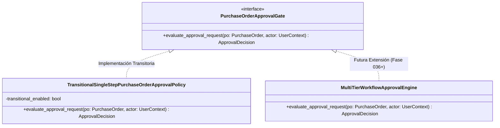

# 05 — Desacoplamiento del Motor de Aprobación (`PurchaseOrderApprovalGate`)

---

## 1. Patrón de Desacoplamiento de Aprobaciones

La aprobación de una Orden de Compra involucra reglas de gobernanza corporativa que pueden cambiar según el monto total, el centro de costo, la categoría de compra o las políticas de control interno.

Para evitar acoplar la entidad de dominio `PurchaseOrder` a motores de workflow específicos (como Camunda, Temporal o motores de reglas complejos), la Fase 034 introduce el patrón de abstracción **`PurchaseOrderApprovalGate`**.



---

## 2. Definición de la Interfaz del Dominio

```python
from abc import ABC, abstractmethod
from dataclasses import dataclass
from typing import Optional
from uuid import UUID

from app.modules.logistics.procurement.purchase_orders.domain.entities.purchase_order import PurchaseOrder

@dataclass(frozen=True)
class ApprovalDecision:
    is_approved: bool
    requires_next_step: bool
    next_step_role: Optional[str] = None
    reason: Optional[str] = None

class PurchaseOrderApprovalGate(ABC):
    @abstractmethod
    def evaluate_approval_request(
        self, 
        purchase_order: PurchaseOrder, 
        approver_user_id: UUID
    ) -> ApprovalDecision:
        """Evalúa si la solicitud de aprobación puede ser procesada o requiere pasos adicionales."""
        pass
```

---

## 3. Política Transitoria (`TransitionalSingleStepPurchaseOrderApprovalPolicy`)

Durante la Fase 034, el sistema opera bajo una política transitoria de un solo paso habilitada mediante la variable de entorno:

$$\text{PURCHASE\_ORDER\_TRANSITIONAL\_APPROVAL\_ENABLED}=\text{true}$$

### Comportamiento de la Política Transitoria:
1. Permite la aprobación inmediata en un solo paso (`Single-Step Approval`) cuando la solicitud proviene de un usuario con los permisos RBAC correspondientes.
2. Aplica incondicionalmente las validaciones de seguridad básicas (verificación de estado `PENDING_APPROVAL`, prohibición de auto-aprobación y Step-Up Auth).
3. Sirve como capa de abstracción para migrar en el futuro a flujos multinivel por umbrales económicos (e.g. > $50,000 requiere Gerencia de Finanzas) sin modificar los casos de uso principales.

```python
class TransitionalSingleStepPurchaseOrderApprovalPolicy(PurchaseOrderApprovalGate):
    def __init__(self, transitional_enabled: bool = True) -> None:
        self.transitional_enabled = transitional_enabled

    def evaluate_approval_request(
        self, 
        purchase_order: PurchaseOrder, 
        approver_user_id: UUID
    ) -> ApprovalDecision:
        # Validación de auto-aprobación prohibida
        if purchase_order.created_by_user_id == approver_user_id:
            raise PurchaseOrderSelfApprovalDenied(
                "Creator user cannot approve their own Purchase Order"
            )

        return ApprovalDecision(
            is_approved=True,
            requires_next_step=False,
            reason="Transitional single-step approval auto-approved upon criteria check"
        )
```
