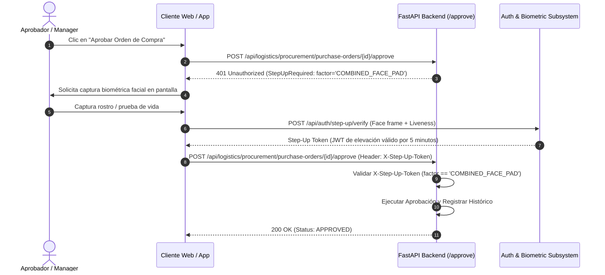

# 07 — Mapeo RBAC y Autenticación Step-Up (`COMBINED_FACE_PAD`)

---

## 1. Mapeo de Permisos RBAC en Órdenes de Compra

El acceso a los recursos de Órdenes de Compra está regido por la matriz de Control de Acceso Basado en Roles (RBAC):

| Permiso RBAC | Descripción de la Operación | Factores de Autenticación Requeridos |
| :--- | :--- | :--- |
| `logistics.purchase_orders.read` | Consultar listado y detalle de Órdenes de Compra. | Sesión Estándar (JWT) |
| `logistics.purchase_orders.create` | Generar borrador de OC o procesar adjudicación CCO. | Sesión Estándar (JWT) |
| `logistics.purchase_orders.update` | Modificar borrador de OC en estado `DRAFT` o `RETURNED_FOR_CHANGES`. | Sesión Estándar (JWT) |
| `logistics.purchase_orders.submit` | Solicitar aprobación (`submit_for_approval`). | Sesión Estándar (JWT) |
| **`logistics.purchase_orders.approve`** | **Aprobar formalmente una Orden de Compra.** | **Step-Up Mandatory: `COMBINED_FACE_PAD`** |
| `logistics.purchase_orders.reject` | Rechazar formalmente una Orden de Compra. | Sesión Estándar (JWT) |
| `logistics.purchase_orders.return` | Devolver Orden de Compra para modificaciones. | Sesión Estándar (JWT) |
| `logistics.purchase_orders.cancel` | Cancelar Orden de Compra en estado borrador o devuelta. | Sesión Estándar (JWT) |

---

## 2. Requerimiento Obligatorio de Step-Up Authentication

La acción de aprobar una Orden de Compra involucra un compromiso financiero directo para la empresa. Para evitar la suplantación de identidad mediante credenciales robadas o sesiones abandonadas, la plataforma exige **Autenticación Step-Up Obligatoria con Biometría Facial**.

### Factor Exigido: `COMBINED_FACE_PAD`
Consiste en la combinación de dos validaciones en tiempo real:
1. **Reconocimiento Facial Biométrico**: Verificación 1:1 del vector embedding facial del aprobador contra la plantilla inscrita.
2. **Detección de Ataque de Presentación (PAD - Liveness Detection)**: Algoritmo anti-spoofing que garantiza que el aprobador es una persona viva presente y no una fotografía, video o máscara 3D.

---

## 3. Diagrama de Secuencia del Flujo Step-Up Auth



---

## 4. Middleware / Decorador de Verificación Step-Up en Backend

```python
from fastapi import Depends, Header, HTTPException, status
from app.modules.logistics.procurement.purchase_orders.domain.errors.exceptions import PurchaseOrderApprovalRequired

def require_step_up_biometrics(
    x_step_up_token: str = Header(None, alias="X-Step-Up-Token")
) -> dict:
    if not x_step_up_token:
        raise HTTPException(
            status_code=status.HTTP_401_UNAUTHORIZED,
            detail={
                "code": "STEP_UP_AUTHENTICATION_REQUIRED",
                "required_factor": "COMBINED_FACE_PAD",
                "message": "La aprobación de Órdenes de Compra requiere verificación facial biométrica activa."
            }
        )
    
    # Decodificar y validar token de elevación
    step_up_claims = decode_and_verify_step_up_token(x_step_up_token)
    if step_up_claims.get("factor") != "COMBINED_FACE_PAD":
        raise HTTPException(
            status_code=status.HTTP_403_FORBIDDEN,
            detail="Factor de autenticación Step-Up insuficiente. Se requiere COMBINED_FACE_PAD."
        )
    
    return step_up_claims
```
