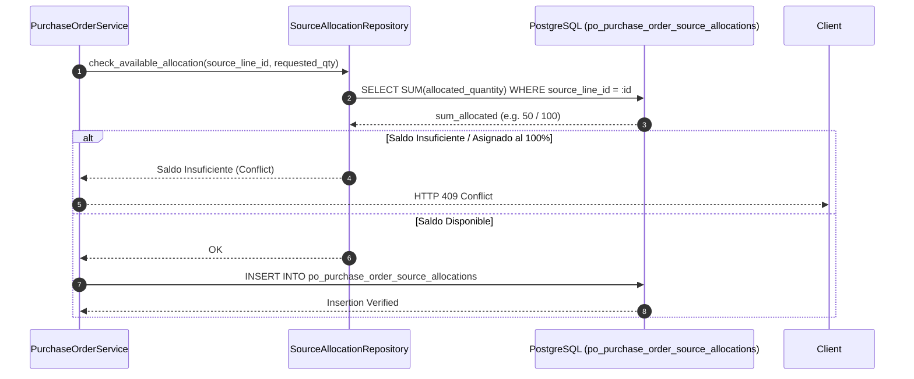

# 10 — Trazabilidad de Asignaciones de Fuentes (`po_purchase_order_source_allocations`)

---

## 1. Necesidad de Trazabilidad End-to-End

Para mantener una auditoría transparente y evitar la sobre-emisión de Órdenes de Compra sobre una misma necesidad aprobada, el sistema debe vincular de forma inmutable cada línea de una Orden de Compra con su documento de origen (Adjudicación CCO o Requisición de Compra).

El modelo **`PurchaseOrderSourceAllocationModel`** registra este vínculo en la tabla PostgreSQL `po_purchase_order_source_allocations`.

---

## 2. Estructura de la Tabla `po_purchase_order_source_allocations`

```sql
CREATE TABLE po_purchase_order_source_allocations (
    id UUID PRIMARY KEY DEFAULT gen_random_uuid(),
    purchase_order_line_id UUID NOT NULL REFERENCES po_purchase_order_lines(id) ON DELETE RESTRICT,
    source_type VARCHAR(32) NOT NULL, -- 'CCO_DECISION', 'REQUISITION'
    source_document_id UUID NOT NULL,
    source_line_id UUID NOT NULL,
    allocated_quantity NUMERIC(28, 10) NOT NULL,
    created_at TIMESTAMPTZ NOT NULL DEFAULT NOW(),
    
    CONSTRAINT ck_po_alloc_qty_positive CHECK (allocated_quantity > 0),
    CONSTRAINT uq_po_source_line_allocation UNIQUE (source_type, source_document_id, source_line_id, purchase_order_line_id)
);
```

---

## 3. Prevención de Doble Adjudicación (Conflicto HTTP 409)

Durante la generación de órdenes desde CCO, el sistema consulta los saldos de asignación acumulados:

$$\sum \text{allocated\_quantity} \le \text{source\_awarded\_quantity}$$

Si un intento de generación detecta que la cantidad a asignar excede el saldo pendiente de la decisión CCO origen o si la línea CCO ya fue consumida al 100% por otra Orden de Compra activa, el backend aborta la transacción retornando un código **HTTP 409 Conflict**:

```json
{
  "code": "DUPLICATE_SOURCE_ALLOCATION_CONFLICT",
  "message": "La línea de decisión CCO 'b78a9c12-...' ya cuenta con una Orden de Compra asignada por la cantidad total adjudicada.",
  "details": {
    "source_line_id": "b78a9c12-3456-7890-abcd-ef1234567890",
    "already_allocated_quantity": "100.0000000000",
    "requested_quantity": "100.0000000000"
  }
}
```

---

## 4. Flujo de Control de Asignaciones


